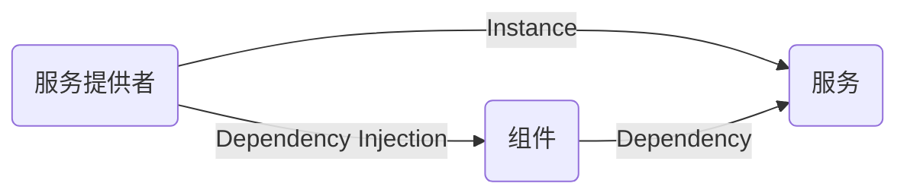
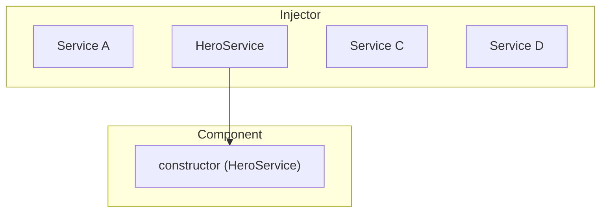

# 服务和注入

## Angular核心概念之六：服务和注入（DI）
依赖注入（DI）是 Angular 中的基本概念之一。DI 被装配进 Angular 框架，并允许带有 Angular 装饰器的类（例如组件、指令、管道和可注入对象）配置它们所需的依赖项。<br>

DI 系统中存在两个主要角色：依赖使用者和依赖提供者。<br>

Angular 使用一种称为 Injector 的抽象来促进依赖消费者和依赖提供者之间的互动。当有人请求依赖项时，注入器会检查其注册表以查看那里是否已有可用的实例。如果没有，就会创建一个新实例并将其存储在注册表中。Angular 会在应用的引导过程中创建一个应用范围的注入器（也称为“根”注入器），并会根据需要创建任何其它注入器。在大多数情况下，你都不需要手动创建注入器，但应该知道有这样一个连接提供者和消费者的层次。<br>

### 提供依赖项

假设有一个名为 HeroService 的类需要用作组件中的依赖项。<br>
第一步是添加@Injectable装饰器，以显示该类可以被注入。<br>
```typescript
@Injectable()
class HeroService {}
```
下一步是提供它，以便让其在 DI 中可用。可以在多种地方提供依赖项：<br>
* 在组件级别，使用 @Component 装饰器的 providers 字段。在这种情况下，HeroService 将可用于此组件的所有实例以及它的模板中使用的其他组件和指令。服务对象有属性，使用此方式。例如：<br>
  ```typescript
  @Component({
    standalone: true,
    selector: 'hero-list',
    template: '...',
    providers: [HeroService]
  })
  class HeroListComponent {}
  ```
  当你在组件级别注册提供者时，该组件的每个新实例都会获得一个新的服务实例。<br>
  >注：这样声明服务会使 HeroService 始终包含在应用程序中，即使该服务未被使用。<br>

* “优先选择”在应用程序根级别，允许将其注入应用程序中的其他类。这可以通过将 providedIn: 'root' 字段添加到 @Injectable 装饰器来实现：<br>
  ```typescript
  @Injectable({
    providedIn: 'root'
  })
  class HeroService {}
  ```
  当你在根级别提供服务时，Angular 会创建一个 HeroService 的共享实例，并将其注入到任何需要它的类中。在 @Injectable 元数据中注册提供者还允许 Angular 通过从已编译的应用程序中删除没用到的服务来优化应用程序，这个过程称为摇树优化（tree-shaking）。<br>

* 在应用程序根级别，使用ApplicationConfig<br>
  您可以使用 ApplicationConfig 的 providers 字段（传递给 bootstrapApplication 函数）在应用程序级别提供服务或其他 Injectable。<br>
  在下面的示例中，所有组件、指令和管道都可以使用HeroService<br>
  ```typescript
  export const appConfig: ApplicationConfig = {
      providers: [
        { provide: HeroService },
      ]
  };
  ```
  然后，在 ：main.ts<br>
  ```typescript
  bootstrapApplication(AppComponent, appConfig)
  ```
  > [!NOTE] 
  > 这样声明服务会使 HeroService 始终包含在应用程序中，即使该服务未被使用。<br>

* 基于 NgModule 的应用程序<br>
  基于 @NgModule 的应用程序使用 @NgModule 装饰器的 providers 字段来提供服务或其他在应用程序级别可用的 Injectable<br>
  模块中提供的服务可供该模块的所有声明或共享同一 ModuleInjector 的任何其他模块使用。 要了解所有边缘情况，请参阅Hierarchical injectors.<br>

  > [!NOTE] 
  > 这样声明服务会使 HeroService 始终包含在应用程序中，即使该服务未被使用。<br>

### 注入依赖项
注入依赖项的最常见方法是在类的构造函数中声明它。当 Angular 创建组件、指令或管道类的新实例时，它会通过查看构造函数的参数类型来确定该类需要哪些服务或其他依赖项。例如，如果 HeroListComponent 要用 HeroService，则构造函数可以如下所示：<br>
```typescript
@Component({ … })
class HeroListComponent {
  constructor(private service: HeroService) {}
}
```
另一种选择是使用inject方法:<br>
```typescript
@Component({ … })
class HeroListComponent {
  private service = inject(HeroService);
}
```
当 Angular 发现一个组件依赖于一项服务时，它会首先检查注入器中是否已有该服务的任何现有实例。如果所请求的服务实例尚不存在，注入器就会使用注册的提供者创建一个，并在将服务返回给 Angular 之前将其添加到注入器中。<br>

当所有请求的服务都已解析并返回时，Angular 就可以用这些服务实例为参数，调用该组件的构造函数。<br>


### 服务（Service）
Angular认为：组件是与用户交互的一种对象，其中的内容都应该与用户操作有关系的；与用户操作无关的内容都应该剥离出去，放在*服务对象*中，为组件服务；例如：日志记录、计时统计、数据库服务器的访问...
创建服务对象的步骤：
* 创建服务对象并指定提供者<br>
  ```typescript
  @Injectable({providedIn: 'root'})
  export class LogService{}
  ```
* 在组件中声明依赖，服务提供者就会自动注入进来，组件直接使用服务对象即可<br>
  ```typescript
  export class Component{
    constructor(log: LogService) {
      //此处的log变量就会被注入为LogService实例
    }
  }
  ```
#### 官方服务对象 HttpClient

执行 HTTP 请求。该服务作为可注入类提供，带有执行 HTTP 请求的方法。每个请求方法都有多个签名，并且返回类型会根据所调用的签名（主要的值是 observe 和 responseType）而有所不同。<br>
使用步骤：
* 导入HttpClientModule
  * 在Angular17及之前需要在主模块中导入HttpClient服务所在的模块
    ```typescript
    imports:[HttpClientModule]
    ```
  * 在Angular18以及之后，在providers中添加`provideHttpClient()`
    ```typescript
    // 独立组件引入依赖
    // app.config.ts
    import { provideHttpClient } from '@angular/common/http';
    export const appConfig: ApplicationConfig = {
    providers: [provideHttpClient()]
    };

    // 在模块中引入依赖
    // app.moudle.ts
    import { provideHttpClient } from '@angular/common/http';

    @NgModule({
      declarations: [
        AppComponent
      ],
      imports: [
        BrowserModule,
        AppRoutingModule
      ],
      providers: [
        provideHttpClient()
      ],
      bootstrap: [AppComponent]
    })
    export class AppModule { }
    ```
    HttpClient 是一个 Class Provider，我们需要在 appConfig 中提供。<br>
* 在需要使用异步请求的组件中声明依赖于HttpClient服务对象，就可以使用该对象发起异步请求了
  ```typescript
  http: HttpClient;
  constructor(http: HttpClient) {
    this.http = http;
  }
  ```
* 调用HttpClient实例实现异步请求
  ```typescript
  this.http.get(url).subscribe((res)=>{})
  ```
