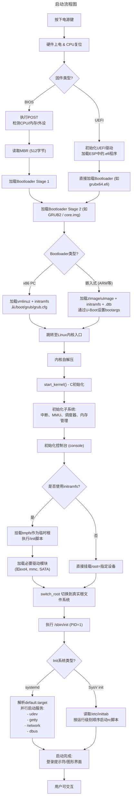
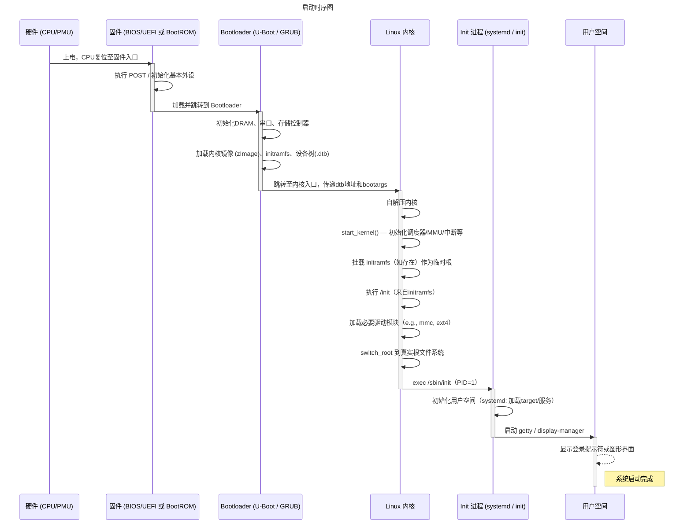
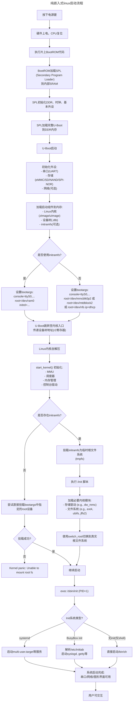

# Linux启动流程

Linux 系统从按下电源键到完全启动完成，涉及硬件初始化、固件引导、操作系统加载、内核初始化以及用户空间服务启动等多个阶段。以下是详细流程，适用于典型的 x86 架构嵌入式或通用 Linux 系统（以 BIOS/UEFI + GRUB + Linux 内核 + systemd 为例）：

---

## 一、硬件上电与固件阶段（Pre-OS）

1. **电源上电与硬件复位**
   - 按下电源键后，电源管理单元（PMU）向主板供电。
   - CPU 复位，从预定义地址（如 0xFFFFFFF0）开始执行指令。

2. **固件执行（BIOS 或 UEFI）**
   - **BIOS（传统）**：
     - 执行加电自检（POST, Power-On Self Test），检测关键硬件（CPU、内存、显卡等）。
     - 枚举并初始化基本外设（如串口、USB 控制器）。
     - 读取 CMOS 设置，确定启动设备顺序。
     - 从启动设备（如硬盘、SD 卡、eMMC、网络）读取 **MBR（主引导记录）** 的前 512 字节。
   - **UEFI（现代）**：
     - 初始化 UEFI 驱动，支持更多硬件和文件系统（如 FAT32）。
     - 从 EFI 系统分区（ESP）加载 **.efi** 格式的引导程序（如 `grubx64.efi`）。
     - 支持安全启动（Secure Boot）等安全机制。

---

## 二、引导加载程序阶段（Bootloader）

3. **加载第一阶段 Bootloader**
   - 在 BIOS 模式下，MBR 中的 446 字节代码（即 Stage 1 bootloader）被执行。
   - 该代码通常不足以加载完整内核，因此会加载 **第二阶段引导程序**（如 GRUB2 的 `core.img`）。

4. **GRUB2（或 U-Boot，在嵌入式系统中更常见）**
   - **GRUB2（x86 PC）**：
     - 加载配置文件（如 `/boot/grub/grub.cfg`）。
     - 显示启动菜单（可选）。
     - 加载 **Linux 内核镜像**（如 `vmlinuz`）和 **初始内存盘**（`initramfs` 或 `initrd`）到内存。
   - **U-Boot（嵌入式 ARM/MIPS 等）**：
     - 从 Flash、SD、eMMC 或网络（TFTP/NFS）加载内核和设备树（Device Tree Blob, `.dtb`）。
     - 设置启动参数（bootargs），如 `console=ttyS0,115200 root=/dev/mmcblk0p2`。

---

## 三、Linux 内核启动阶段

5. **内核解压与初始化（`head.S` → `start_kernel()`）**
   - 内核镜像通常是压缩的（如 `zImage` 或 `bzImage`），首先自解压。
   - 跳转到 `start_kernel()`（位于 `init/main.c`），开始 C 语言初始化。

6. **关键内核子系统初始化**
   - 设置中断描述符表（IDT）、页表（启用 MMU）、调度器、内存管理（slab/zoned buddy）、RCU。
   - 初始化控制台（console）驱动，允许内核打印日志。
   - 挂载 **根文件系统**：
     - 若使用 `initramfs`：将其作为临时根文件系统（tmpfs），执行其中的 `/init` 脚本。
     - `/init` 脚本负责加载必要驱动（如 SATA、NVMe、ext4 模块），然后 `switch_root` 切换到真正的根文件系统（如 `/dev/sda2`）。
     - 若无 `initramfs`，内核直接挂载 `root=` 指定的设备（需内置对应驱动）。

7. **启动用户空间第一个进程**
   - 内核调用 `run_init_process()`，尝试执行以下之一：
     - `/sbin/init`
     - `/etc/init`
     - `/bin/init`
     - `/bin/sh`（若前几个都失败）
   - 此进程 PID = 1，成为所有用户进程的祖先。

---

## 四、用户空间初始化（Init System）

8. **Init 系统启动（现代多为 systemd）**
   - **systemd（主流发行版）**：
     - 解析 `/etc/systemd/system/default.target`（通常链接到 `graphical.target` 或 `multi-user.target`）。
     - 并行启动依赖的服务（`.service` 单元），如：
       - `udev`：设备管理
       - `networkd` / `NetworkManager`：网络配置
       - `getty@tty1.service`：登录终端
       - `dbus`：进程间通信
     - 执行 `sysinit.target` → `basic.target` → `multi-user.target` 等阶段。
   - **SysV init（传统）**：
     - 读取 `/etc/inittab`，进入指定运行级别（如 3 或 5）。
     - 顺序执行 `/etc/rc.d/rc3.d/` 下的启动脚本（S 开头）。

9. **系统启动完成**
   - 登录提示符出现（文本或图形界面）。
   - 所有关键服务运行正常。
   - 用户可登录并执行命令。

---

## 补充说明（嵌入式场景）

- **无硬盘系统**：根文件系统可能位于 RAM（initramfs）、MTD Flash（JFFS2/UBIFS）或通过 NFS 挂载。
- **无 initramfs**：需将所有必要驱动编译进内核（`CONFIG_XXX=y` 而非 `=m`）。
- **设备树（Device Tree）**：ARM 等架构依赖 `.dtb` 文件描述硬件，由 Bootloader（如 U-Boot）传递给内核。
- **启动时间优化**：可通过裁剪内核、并行初始化、使用 `systemd-analyze` 分析瓶颈。

---

## 总结流程图（简化）

```text
电源上电
   ↓
BIOS/UEFI（POST + 启动设备选择）
   ↓
Bootloader（GRUB2 / U-Boot）
   ↓
加载 vmlinuz + initramfs + dtb（嵌入式）
   ↓
Linux 内核初始化（MMU、调度器、驱动）
   ↓
挂载根文件系统（通过 initramfs 或直接）
   ↓
启动 /sbin/init（PID=1）
   ↓
systemd 启动目标（target）和服务
   ↓
登录界面 / shell 提示符 → 启动完成
```

### 启动流程图


### 时序图

> [!NOTE]
> - **参与者（Participants）** 按启动顺序排列，体现控制权转移。
> - **`activate` / `deactivate`** 表示各组件的活跃生命周期。
> - **嵌入式特色**：明确包含 **设备树（.dtb）** 和 **initramfs** 的加载与使用，这是嵌入式 Linux 的关键环节。
> - **通用性保留**：若为 x86 系统，可将 `Bootloader` 视为 GRUB，`Firmware` 为 BIOS/UEFI，流程依然成立。
> - **关键动作**：如 `switch_root`、`exec /sbin/init`、`传递 bootargs` 等，均为启动链中的技术锚点。

### 纯嵌入式linux启动流程

纯嵌入式linux启动流程如下：


🔍 关键嵌入式特性说明：

| 组件 | 说明 |
|------|------|
| **BootROM + SPL** | 常见于 SoC（如 TI AM335x, NXP i.MX6/8, Allwinner），因 DDR 尚未初始化，需先运行小段代码（SPL）加载完整 U-Boot |
| **设备树 (.dtb)** | ARM 架构必需，描述硬件拓扑，由 U-Boot 传递给内核（通过 r2 寄存器） |
| **根文件系统位置** | 可为：<br>• eMMC/SD (`/dev/mmcblk0p2`)<br>• MTD Flash (`/dev/mtdblock2`, UBIFS/JFFS2)<br>• NFS（开发常用）<br>• initramfs（全内存系统） |
| **init 系统** | 嵌入式常用 BusyBox init（轻量），高端产品可能用 systemd |
| **无 initramfs 场景** | 要求所有根文件系统驱动必须编译进内核（`CONFIG_XXX=y`） |