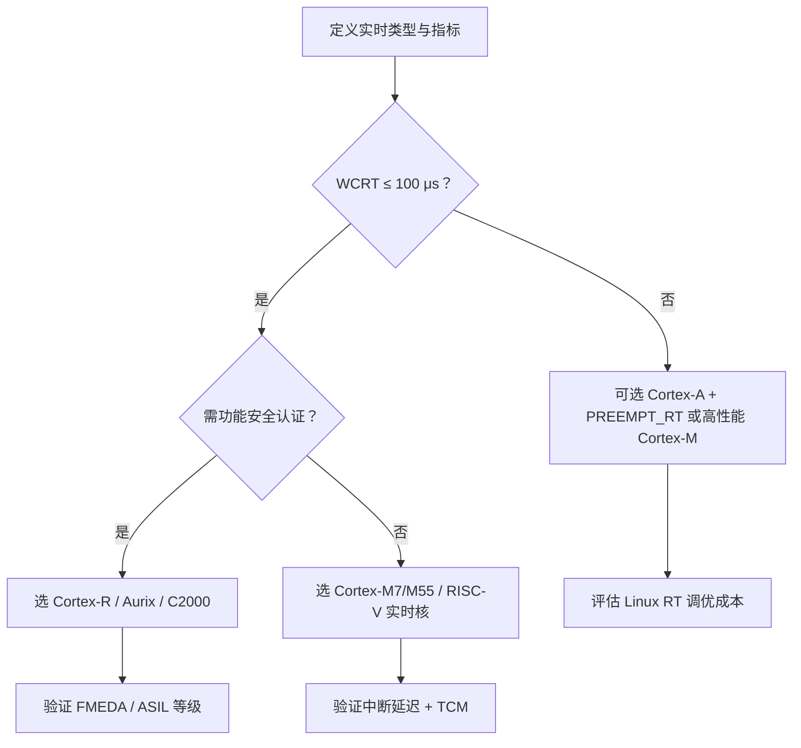
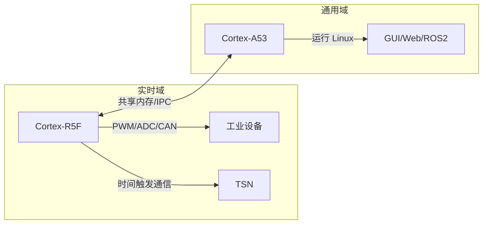

# 实时处理

> [!IMPORTANT]
> 本文由AI自动生成

## 实时处理说明

在嵌入式系统开发中，“实时处理”是指系统**在可预测的时间范围内对事件做出响应**。

---

### 实时处理的严格定义

> **实时系统（Real-Time System）**：
> 一个系统的正确性不仅取决于其逻辑输出是否正确，**还取决于该输出是否在规定的时间期限（Deadline）内完成**。

换言之：**“迟到的正确 = 错误”**。

---

### 实时系统的分类与要求差异

| 类型 | 定义 | 典型场景 | 核心要求 |
|------|------|--------|--------|
| **硬实时（Hard Real-Time）** | **绝对不允许错过截止时间**，miss = 系统失效 | 飞控、刹车控制、心脏起搏器 | ✅ **WCRT ≤ Deadline**<br>✅ **Deadline Miss Rate = 0**<br>✅ 可进行 WCET 分析 |
| **软实时（Soft Real-Time）** | 允许偶尔错过截止时间，但需“尽力而为” | 视频播放、语音通话、HMI 刷新 | ✅ 平均延迟低<br>✅ 抖动（Jitter）可控<br>✅ 高优先级任务优先调度 |
| **准硬实时（Firm Real-Time）** | 错过截止时间后，结果无价值，但不影响系统安全 | 雷达点云处理、工业视觉检测 | ✅ 低 miss rate（如 < 0.1%）<br>✅ 错过任务可丢弃 |

> 📌 **关键指标**：
> - **WCRT（Worst-Case Response Time）**：任务从就绪到完成的最大时间
> - **Jitter（抖动）**：响应时间的标准差或极差
> - **Deadline**：任务必须完成的最后时刻

---

### 实时处理的五大核心要求

#### 1. **时间可预测性（Temporal Predictability）**
- 系统行为（尤其是响应时间）必须**可建模、可分析、可验证**。
- **禁止**：不可控的动态行为（如动态内存分配、Cache 抖动、后台进程）。
- **必须**：静态任务集、确定性调度、无随机延迟源。

#### 2. **低且确定的中断延迟（Interrupt Latency）**
- **定义**：从中断发生到 ISR 开始执行的时间。
- **硬实时要求**：通常 **< 10 μs**（电机控制、伺服驱动）甚至 **< 1 μs**（光刻机）。
- **影响因素**：
  - CPU 是否可被中断（关中断区间长度）
  - 中断控制器优先级机制
  - Cache/TLB 状态

#### 3. **确定性任务调度（Deterministic Scheduling）**
- 调度器必须保证：
  - 高优先级任务**立即抢占**低优先级任务
  - 无优先级反转（需优先级继承协议，如 PI/PC）
  - 调度延迟可计算（如 RMS、EDF 算法）
- **禁止**：时间片轮转（RR）用于硬实时关键任务。

#### 4. **资源访问的确定性**
- **内存**：避免页错误（Page Fault）→ 使用静态分配或锁定内存
- **外设**：访问延迟固定（如使用 TCM 而非外部 SDRAM）
- **共享资源**：互斥机制必须有上限阻塞时间（如 O(1) 的信号量）

#### 5. **可验证性与可认证性**
- **WCET（最坏执行时间）分析**：通过静态分析工具（如 aiT、RapiTime）验证任务执行时间上限。
- **功能安全认证**：如 ISO 26262（汽车）、IEC 61508（工业）、DO-178C（航空）要求实时行为可证明。

---

### 实时性能验证方法

| 方法 | 适用场景 | 工具示例 |
|------|--------|--------|
| **理论分析** | 硬实时系统设计阶段 | Rate Monotonic Analysis (RMA), Response Time Analysis (RTA) |
| **静态 WCET 分析** | 安全关键系统认证 | AbsInt aiT, Rapita RapiTime |
| **动态压力测试** | 软/准硬实时验证 | `cyclictest`（Linux RT）, `latencytop`, 自定义高负载注入 |
| **硬件追踪** | 精确测量中断/任务延迟 | Lauterbach Trace32, SEGGER SystemView, ARM ETM |

> 🔧 **Linux 实时性测试示例**：
> ```bash
> # 使用 cyclictest 测试最坏延迟（需 PREEMPT_RT 内核）
> cyclictest -p99 -m -n -i1000 -l10000
> ```
> 输出解读：关注 **`Max Latency`**，硬实时要求其 ≤ Deadline（如 50 μs）。

---

### 工程实现中的关键约束

| 约束项 | 硬实时要求 | 软实时容忍度 |
|--------|-----------|-------------|
| **操作系统** | 专用 RTOS（FreeRTOS, VxWorks, Zephyr） | Linux + RT 补丁 |
| **编程语言** | C（禁用动态内存） | C/C++（谨慎使用 STL） |
| **内存管理** | 静态分配 + MPU 保护 | `mlockall()` + 堆监控 |
| **电源管理** | 禁用 DVFS、CPU 休眠 | 可启用，但需评估影响 |
| **调试机制** | 无侵入式追踪（ETM） | 可使用 ftrace/perf（但可能引入延迟） |

---

### 典型实时要求指标参考

| 应用领域 | 控制周期 | 最大允许延迟 | 抖动要求 |
|--------|--------|------------|--------|
| 伺服电机控制 | 100–500 μs | < 50 μs | < 5 μs |
| 汽车引擎点火 | 2–10 ms | < 100 μs | < 10 μs |
| 工业 PLC（IEC 61131-3） | 1–10 ms | < 1 ms | < 100 μs |
| 5G URLLC（用户面） | 0.5 ms | < 100 μs | < 20 μs |
| ROS2 实时控制节点 | 1–10 ms | < 500 μs | < 50 μs |

---

### 设计建议：如何满足实时要求？

1. **需求明确化**：量化 Deadline、WCRT、Jitter，而非模糊说“要实时”。
2. **架构分离**：硬实时任务与非实时任务物理或逻辑隔离（AMP、Hypervisor、协处理器）。
3. **避免通用 OS 陷阱**：Linux 不适合直接运行硬实时任务。
4. **全链路分析**：从传感器 → 中断 → ISR → 任务 → 执行器，每环节延迟需计入 WCRT。
5. **留有余量**：设计 WCRT ≤ 70% Deadline，应对温度、电压、老化等变化。

---

## 处理器选型标准

实时处理器选型是嵌入式系统开发中**决定系统可靠性、安全性与可认证性的关键决策**。基于**实时性需求分类、处理器架构特性、行业标准约束、成本与生态**四大维度，提供一套**系统化、可量化、可验证**的选型方法论，并辅以典型场景的选型实例。

---

### 选型前：明确实时需求（需求定义阶段）

#### 1.1 分类你的实时系统类型
| 类型 | 判定标准 | 示例 |
|------|--------|------|
| **硬实时（Hard RT）** | Deadline Miss = 系统失效/人身伤害 | 刹车控制器、飞行控制系统 |
| **准硬实时（Firm RT）** | Miss 后数据失效，但系统可恢复 | 工业视觉检测、雷达点云处理 |
| **软实时（Soft RT）** | 允许少量 Miss，重在平均性能 | 机器人上层规划、HMI 刷新 |

#### 1.2 量化关键指标（必须数值化！）
- **控制周期（T）**：如 1 ms、500 μs
- **最大响应延迟（WCRT）**：通常 ≤ 0.5T
- **抖动（Jitter）**：≤ 10% of WCRT
- **功能安全等级**：如 ISO 26262 ASIL-B/D、IEC 61508 SIL-2/3
- **通信接口**：CAN FD？EtherCAT？TSN？

> ✅ **输出**：一份《实时性能需求规格书》，例如：
> “**电机FOC控制，周期 100 μs，WCRT ≤ 50 μs，Jitter ≤ 5 μs，需支持 ASIL-B**”

---

### 核心选型维度与评估依据

#### 2.1 架构特性评估（决定能否满足 WCET）

| 特性 | 硬实时必要性 | 评估方法 |
|------|------------|--------|
| **中断延迟（Interrupt Latency）** | ⭐⭐⭐⭐⭐ | 查阅 TRM（技术参考手册），实测或仿真（如 Cycle-Accurate Model） |
| **是否支持 TCM（紧耦合内存）** | ⭐⭐⭐⭐ | 避免 Cache 抖动，确保指令/数据访问延迟固定 |
| **Cache 可关闭性** | ⭐⭐⭐⭐ | 硬实时系统常需禁用 Cache 以提升确定性 |
| **内存保护（MPU/MMU）** | ⭐⭐⭐ | 防止任务间干扰，ASIL/SIL 认证必需 |
| **ECC 内存支持** | ⭐⭐⭐⭐ | 防止单粒子翻转（SEU），安全关键系统强制要求 |
| **确定性流水线** | ⭐⭐⭐⭐ | 无乱序执行（In-Order），固定 MAC 周期（DSP） |

> 📊 **典型中断延迟对比**：
> - Cortex-M4：≈ 12 CPU cycles（@100 MHz → **120 ns**）
> - Cortex-R5F：≈ 8 cycles + GIC → **≈ 80 ns**
> - Cortex-A53 + GIC：**20–100 μs**（Linux 下）
> - RISC-V CV32E40P：≈ 15 cycles → **150 ns**

---

#### 2.2 功能安全与认证支持（合规性）

| 处理器类型 | 安全认证 | 适用等级 |
|----------|--------|--------|
| **Cortex-M**（如 S32K1） | ISO 26262 ASIL-B ready | 汽车非关键ECU |
| **Cortex-R**（如 TMS570, Aurix） | ASIL-D certified | 刹车、转向、电池管理 |
| **DSP**（如 C2000） | IEC 61508 SIL-3 ready | 工业驱动、电源 |
| **RISC-V**（如 NOEL-V） | ESA/ECSS-Q-ST-60-15C | 航天抗辐射 |
| **Cortex-A**（单独） | ❌ 无法通过 ASIL-C/D | 仅用于非安全域 |

> 🔒 **关键点**：若需功能安全认证，**必须选择厂商提供 FMEDA、安全手册、诊断库的芯片**。

---

#### 2.3 开发生态与工具链（影响开发效率）

| 评估项 | 说明 |
|-------|------|
| **RTOS 支持** | FreeRTOS、Zephyr、VxWorks 是否原生支持？ |
| **调试工具** | 是否支持 ETM（嵌入式追踪宏单元）、SWO？ |
| **WCET 分析工具** | 是否兼容 AbsInt aiT、Rapita？ |
| **编译器** | GCC/Clang 是否提供确定性优化（如 `-fno-builtin`）？ |

> 💡 **建议**：优先选择 **ARM CMSIS-Pack 或 RISC-V 相容平台**，降低 BSP 开发成本。

---

#### 2.4 成本与供货（商业可行性）

| 因素 | 硬实时系统特殊要求 |
|------|------------------|
| **长期供货** | 工业/汽车需 10–15 年供货保证 |
| **温度范围** | -40°C ~ +125°C（汽车 Grade 1） |
| **封装** | QFP/LQFP 便于维修 vs BGA 高密度 |
| **单价** | < $2（消费类） vs $5–$20（汽车/工业） |

---

### 选型决策矩阵（推荐流程）



---

### 典型场景选型实例

#### 场景 1：电动汽车 BMS（硬实时，ASIL-C）
- **需求**：Cell 电压采样周期 5 ms，故障响应 < 100 μs，ASIL-C
- **选型**：**Infineon Aurix TC375**（多核 Cortex-M7，锁步核，ASIL-D ready）
- **依据**：
  - 中断延迟：80 ns
  - 提供 SafeTcore 安全库
  - 支持 6 路独立 ADC（同步采样）
  - AEC-Q100 Grade 0

#### 场景 2：工业伺服驱动（硬实时，无认证）
- **需求**：FOC 控制周期 62.5 μs（16 kHz），PWM 分辨率 < 10 ns
- **选型**：**TI TMS320F28388D**（C28x DSP + CLA 协处理器）
- **依据**：
  - 单周期 32×32 MAC
  - PWM 分辨率达 **150 ps**
  - CLA 处理电机算法，主核处理通信
  - 无需 Cache，确定性高

#### 场景 3：智能工厂网关（准硬实时）
- **需求**：TSN 交换 + EtherCAT 主站 + HMI，控制周期 1 ms
- **选型**：**NXP S32G274A**（3× Cortex-M7 + 3× Cortex-A53）
- **依据**：
  - M7 核运行 Zephyr 处理 TSN/EtherCAT（WCRT < 50 μs）
  - A53 核运行 Linux 处理 Web/ROS2
  - 硬件防火墙隔离实时域

#### 场景 4：消费级无人机飞控（软实时）
- **需求**：姿态解算 1 kHz，图传 30 fps
- **选型**：**STM32H743**（Cortex-M7 @ 480 MHz）
- **依据**：
  - DTCM/ITCM 保证关键代码确定性
  - 成本 < $5
  - FreeRTOS + MPU 隔离任务

---

### 避坑指南：常见错误

| 错误做法 | 风险 | 正确做法 |
|--------|------|--------|
| 用 Raspberry Pi（Cortex-A）做电机控制 | 偶发延迟 > 1 ms，失控 | 用 STM32G4 或 ESP32-S3（M33） |
| 在硬实时任务中使用 malloc() | 堆碎片导致执行时间波动 | 全静态内存分配 + 对象池 |
| 忽略总线延迟（如访问外部 SDRAM） | 实际 WCRT 超预算 | 关键任务数据放 TCM/SRAM |
| 仅依赖 cyclictest 测试 | 无法覆盖最坏 case | 结合 WCET 静态分析 + 压力测试 |

---

## 实时处理器

在嵌入式实时系统领域，“实时处理器”通常指**具备高确定性、低延迟中断响应和可预测执行行为的处理器架构或具体芯片**，而非仅指 CPU 核心。从**处理器架构特性**和**典型商用芯片实例**两个层面，系统化列举并分析适用于硬实时与软实时场景的处理器。

---

### 实时处理器的核心特性

满足实时需求的处理器通常具备以下一项或多项特性：

| 特性 | 作用 | 典型实现 |
|------|------|---------|
| **低中断延迟** | 快速响应外部事件 | 硬件向量中断控制器（如 NVIC）、中断嵌套 |
| **确定性流水线** | 指令执行周期可预测 | 无乱序执行（in-order）、固定延迟乘法器 |
| **紧耦合存储器（TCM）** | 避免 Cache 不确定性 | ITCM/DTCM（指令/数据 TCM） |
| **内存保护单元（MPU）** | 任务隔离，防内存冲突 | ARMv7-M/v8-M MPU |
| **高精度定时器** | 精确任务调度 | SysTick、高级控制定时器（如 STM32 的 TIM1） |
| **多核异构支持** | 实时/非实时任务分离 | Cortex-R + Cortex-A 组合（如 TI AM64x） |

> [!WARNING]
> **Cache、MMU、乱序执行、动态频率调整（DVFS）等特性通常会损害实时确定性**，硬实时系统常选择无 Cache 或可禁用 Cache 的处理器。

---

### 典型实时处理器架构及代表芯片

#### 1. **ARM Cortex-M 系列（MCU，硬实时首选）**
- **适用场景**：工业控制、电机驱动、传感器节点、BMS
- **实时优势**：
  - 嵌套向量中断控制器（NVIC），中断延迟低至 **12 周期**
  - 无 Cache（或可选小 Cache），执行行为高度可预测
  - 支持 TCM（部分高端型号）
  - 低功耗，成本低

| 芯片型号 | 内核 | 主频 | 典型应用 | 实时特性 |
|--------|------|------|--------|--------|
| **STM32H743** | Cortex-M7 | 480 MHz | 高速工业控制 | I/D TCM（64+64KB），L1 Cache 可关闭 |
| **NXP S32K144** | Cortex-M4F | 112 MHz | 汽车 ECU | 满足 AEC-Q100，支持 ASIL-B |
| **TI TMS570LC4357** | Cortex-R5F | 300 MHz | 轨道交通、汽车安全 | 双核锁步（Lockstep），ECC 内存，**ISO 26262 ASIL-D** |
| **Infineon Aurix TC3xx** | 多核 Cortex-M7/R | 300 MHz | 电动汽车逆变器 | 6 核异构，硬件安全模块，**ASIL-D 认证** |

> ✅ **Cortex-R 系列特别说明**：
> ARM Cortex-R（如 R5F, R7, R8）专为**高可靠性硬实时**设计，广泛用于汽车、医疗、工业：
> - 支持 ECC 内存、内存保护
> - 确定性中断响应（< 100 ns）
> - 可选 TCM，避免 Cache 抖动

---

#### 2. **RISC-V 实时处理器（新兴选择）**
- **优势**：开源、可定制、无专利费
- **代表内核**：
  - **CV32E40P**（由 OpenHW Group 开发）：32 位，支持 PMP（物理内存保护），用于 IoT 实时控制
  - **NOEL-V**（航天级）：支持 LEON 扩展，用于卫星控制（抗辐射）
  - **AndesCore D25F/N25F**：带中断嵌套、低延迟响应，用于电机控制

| 芯片示例 | 内核 | 特点 |
|--------|------|------|
| **ESP32-C3** | RISC-V（32-bit） | 低功耗 Wi-Fi/BLE，中断延迟 ≈ 200 ns |
| **Kendryte K210** | 双核 RISC-V | 用于 AIoT，但实时性受限（无 TCM，有 Cache） |
| **Microchip PolarFire SoC** | 五核 RISC-V（含实时核） | 支持 Deterministic AI，硬实时 + Linux 混合 |

---

#### 3. **DSP 与专用实时处理器**
- **适用场景**：音频处理、雷达信号处理、电机 FOC 控制
- **特点**：单周期 MAC、零开销循环、硬件循环缓冲

| 处理器 | 代表芯片 | 实时能力 |
|--------|--------|--------|
| **TI C2000**（Piccolo/F28x） | TMS320F28379D | 200 MHz，CLA 协处理器加速控制算法，**PWM 分辨率 150 ps** |
| **Analog Devices SHARC** | ADSP-21569 | SIMD 架构，用于声呐、医疗成像，确定性流水线 |
| **NXP SPT（Signal Processing Toolbox）** | S32Z2 | 集成 DSP 指令，用于汽车雷达预处理 |

---

#### 4. **异构多核 SoC（实时 + 通用混合）**
用于需同时满足硬实时与高性能计算的场景（如智能驾驶、工业网关）：

| 芯片 | 实时核 | 通用核 | 典型架构 |
|------|--------|--------|--------|
| **TI AM64x** | 2× Cortex-R5F（锁步） | 2× Cortex-A53 | 实时控制 + Linux 应用 |
| **NXP S32G2** | 3× Cortex-M7 | 3× Cortex-A53 | 车载网关，TSN + 硬实时 |
| **Xilinx Zynq UltraScale+ MPSoC** | 2× Cortex-R5 | 4× Cortex-A53 + FPGA | FPGA 实现 μs 级确定性逻辑 |

> ✅ **关键优势**：通过硬件隔离（如 firewalls、QoS）确保实时核不受 Linux 域干扰。

---

### 不推荐用于硬实时的处理器（常见误区）

| 处理器类型 | 问题 |
|----------|------|
| **通用 x86 CPU（如 Intel Core i7）** | 乱序执行、大 Cache、SMI 中断不可控，WCET 无法分析 |
| **Cortex-A 系列（单独使用）** | 依赖 MMU/Cache，Linux 下中断延迟高且抖动大 |
| **带大 Cache 且不可关闭的 MCU** | Cache miss 导致执行时间波动，WCET 估计保守 |

> 💡 **例外**：Cortex-A 若运行**裸机程序**或**实时 Hypervisor**（如 Jailhouse），可提升确定性，但复杂度高。

---

## Cortex-A不适合实时的理由

将 **ARM Cortex-A 系列处理器** 用于实时系统是一个**高风险、高复杂度**的工程决策。本文从**架构本质、实时性能瓶颈、可行改造路径及适用边界**四个维度，给出客观、严谨的技术评估。

---

### ortex-A 的架构特性与实时性冲突

Cortex-A 系列（如 A53、A72、A78）是为**高性能通用计算**设计的，其核心特性与硬实时需求存在根本矛盾：

| 特性 | 对实时性的影响 | 说明 |
|------|----------------|------|
| **多级 Cache（L1/L2/L3）** | ⚠️ **严重损害确定性** | Cache miss 导致指令/数据访问延迟波动（几周期 → 数百周期），WCET（最坏执行时间）无法准确建模 |
| **乱序执行（Out-of-Order）** | ⚠️ 执行时序不可预测 | 指令完成顺序与程序顺序不一致，难以静态分析执行路径时间 |
| **MMU + 虚拟内存** | ⚠️ 页错误（Page Fault）引入毫秒级延迟 | 即使 `mlockall()` 锁定内存，TLB miss 仍可能造成微秒级抖动 |
| **动态电压频率调整（DVFS）** | ⚠️ 时钟频率动态变化 | 任务执行时间随负载波动，违反时间可预测性原则 |
| **复杂中断控制器（GIC）** | ⚠️ 中断延迟高且不稳定 | GIC 的优先级仲裁、亲和性设置增加延迟，典型值 **20–100 μs**（远高于 Cortex-M/R） |

> 📌 **实测数据参考（Cortex-A53 @ 1.2GHz, Linux）**：
> - 最佳中断延迟：≈ 15 μs
> - 偶发延迟峰值：**> 500 μs**（因内核锁、RCU、SoftIRQ、电源管理等）
> - 上下文切换：≈ 30–80 μs

---

### 能否用于实时？——分级评估

#### ✅ **软实时（Soft Real-Time）：可行（需调优）**
- **场景**：HMI、音视频流、机器人上层规划（控制周期 ≥ 10 ms）
- **措施**：
  - 启用 `PREEMPT_RT` 补丁（全内核抢占）
  - 使用 `SCHED_FIFO` 调度策略 + 最高优先级
  - `mlockall()` 锁定内存，禁用 swap
  - 关闭 CPU 休眠（`cpuidle`）、DVFS（固定频率）
  - 隔离 CPU 核（`isolcpus`），将实时任务绑定到专用核
- **性能**：99% 响应 < 50 μs，但**无法保证 100% 满足硬截止时间**

#### ⚠️ **准硬实时（Firm Real-Time）：极限可行（高成本）**
- **场景**：工业网关、5G 小基站（控制周期 1–5 ms）
- **必须采用**：
  - **双系统架构**：Cortex-A 跑 Linux，另配 Cortex-M/R 或 FPGA 处理硬实时任务
  - **实时协处理器**：如 TI AM64x 的 R5F 核、NXP S32G 的 M7 核
  - **Hypervisor 隔离**：如 ACRN、Jailhouse，将实时任务运行在轻量 VM 中
- **单靠 Cortex-A + Linux 无法可靠满足**

#### ❌ **硬实时（Hard Real-Time）：不可行**
- **定义**：要求 **WCRT ≤ Deadline 且 Deadline Miss = 0**
- **原因**：
  - 内核路径不可控（即使 PREEMPT_RT 仍存在不可抢占区）
  - 无法通过 **IEC 61508 / ISO 26262** 等功能安全认证
  - Cache/TLB 行为使 WCET 分析结果过于保守（需过度降频）

> 🔒 **行业共识**：汽车功能安全标准 **ISO 26262** 明确要求 ASIL-C/D 级别 ECU **不得使用通用 OS（如 Linux）处理安全关键任务**。

---

### 提升 Cortex-A 实时性的工程手段（局限性明确）

| 措施 | 效果 | 局限性 |
|------|------|--------|
| **PREEMPT_RT 补丁** | 减少内核不可抢占区 | 仍无法消除 GIC、驱动、RCU 引入的延迟 |
| **CPU 隔离（isolcpus）** | 避免通用任务干扰 | 仅减少调度干扰，不解决 Cache/内存子系统不确定性 |
| **禁用 Cache/MMU** | 理论上提升确定性 | **实际不可行**：Linux 依赖 MMU，无 Cache 时性能暴跌 10 倍以上 |
| **实时内核替代** | 如 Xenomai、RTAI | 需双内核架构，维护复杂，生态弱 |
| **用户空间驱动（UIO/PF_RING）** | 减少内核路径 | 无法处理中断上半部，延迟仍受内核影响 |

> 💡 **现实结论**：即便极致调优，Cortex-A 在 Linux 下的**最坏-case 延迟仍难以控制在 100 μs 以内**，且无法保证 100% 确定性。

---

### 正确使用 Cortex-A 的架构模式（推荐）

若需高性能 + 实时性，应采用**异构架构**，而非强求 Cortex-A 单核兼顾：



**典型芯片支持**：
- **TI AM64x**：2× Cortex-R5F（锁步，ASIL-D ready） + 2× Cortex-A53
- **NXP S32G2**：3× Cortex-M7（实时） + 3× Cortex-A53（应用）
- **Xilinx Zynq MPSoC**：2× Cortex-R5 + 4× Cortex-A53 + FPGA（可实现 ns 级确定性）

---

### 结论

> **Cortex-A 单独作为硬实时处理器使用是不合适的**。
> 其架构本质决定了它无法提供硬实时所需的**时间确定性与可验证性**。
> 正确做法是：**在异构系统中将 Cortex-A 限定于非实时域**，硬实时任务交由专用实时核（Cortex-R/M、DSP 或 FPGA）处理。

