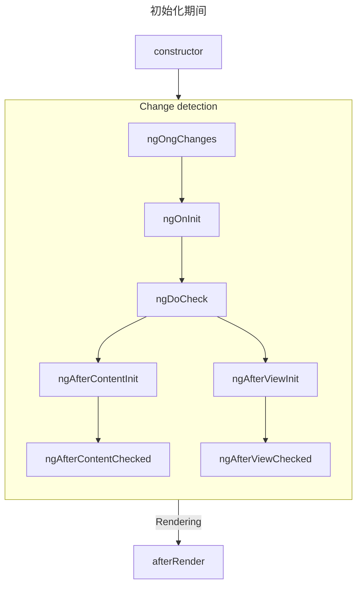
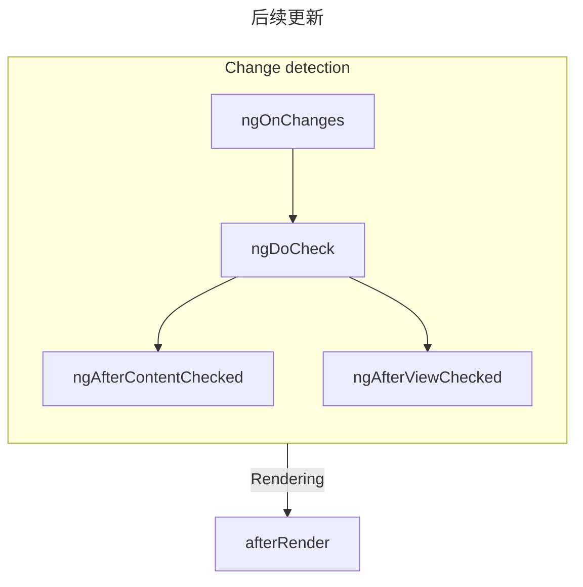

# Angular组件

## Angular核心概念之二：组件（component）
component：是一段可以反复使用的页面片段如页头、轮播、手风琴...<br>
组件（component）=模板（Template）+脚本（Script）+样式（Style）<br>
在NG中任何一个*非独立组件*都必须声明在模块中，*独立组件*不用在模块中声明。*独立组件*是在Angular14引入的，使用时需要注意版本。<br>
1. 创建组件class<br>

   ```typescript
   @Component({
       selector: 'myc01',
       template: '<h2></h2>'
   })

   export class MyC01Component{}
   ```
2. 在某个模块中注册组件class

   ```typescript
   //app.module.ts
   declaration: [
     AppComponent, 
     MyC01Component
   ]
   ```
3. 使用已经注册过的组件

   ```html
   <myc01></myc01>
   ```
Angular提供的创建组件的简化工具，下面两种都行：<br>
```
ng g component 组件名
npx ng g component 组件名
```
nodejs 官方安装的工具：
* npm: 第三方模块的维护工具
* npx: 第三方可执行文件的执行工具

### 组件的生命周期
组件的 生命周期是指发生在组件创建和销毁之间的一系列步骤。每个步骤代表 Angular 渲染组件并随时间检查更新的不同部分的过程。<br>

当 Angular 实例化组件类并渲染组件视图及其子视图时，组件实例的生命周期就开始了。生命周期一直伴随着变更检测，Angular 会检查数据绑定属性何时发生变化，并按需更新视图和组件实例。当 Angular 销毁组件实例并从 DOM 中移除它渲染的模板时，生命周期就结束了。当 Angular 在执行过程中创建、更新和销毁实例时，指令就有了类似的生命周期。<br>

你的应用可以使用生命周期钩子方法来触发组件或指令生命周期中的关键事件，以初始化新实例，需要时启动变更检测，在变更检测过程中响应更新，并在删除实例之前进行清理。<br>

#### 响应生命周期事件<br>
可以通过实现一个或多个 Angular core 库中定义的生命周期钩子接口来响应组件或指令生命周期中的事件。这些钩子让你有机会在适当的时候对组件或指令实例进行操作，比如 Angular 创建、更新或销毁这个实例时。<br>

每个接口都有唯一的一个钩子方法，它们的名字是由接口名再加上 ng 前缀构成的。比如，OnInit 接口的钩子方法叫做 ngOnInit()。如果你在组件或指令类中实现了这个方法，Angular 就会在首次检查完组件或指令的输入属性后，紧接着调用它。<br>
```typescript
@Directive({selector: '[appPeekABoo]'})
export class PeekABooDirective implements OnInit {
  constructor(private logger: LoggerService) { }

  // implement OnInit's `ngOnInit` method
  ngOnInit() {
    this.logIt('OnInit');
  }

  logIt(msg: string) {
    this.logger.log(`#${nextId++} ${msg}`);
  }
}
```
你不必实现所有生命周期钩子，只要实现你需要的那些就可以了。<br>

#### 生命周期的顺序
当你的应用通过调用构造函数来实例化一个组件或指令时，Angular 就会调用那个在该实例生命周期的适当位置实现了的那些钩子方法。<br>

|阶段|方法|总结|
|:---|:---|:---|
|创建|constructor|	标准 JavaScript 类构造函数 。在 Angular 实例化组件时运行。|
|Change|ngOnInit|在 Angular 初始化所有组件输入后运行一次。|
|检测|ngOnChanges|每次组件输入发生变化时运行。|
||ngDoCheck|每次检查此组件是否有变化时运行。|
||ngAfterViewInit|在组件的 视图 初始化后运行一次。|
||ngAfterContentInit|在组件的 内容 初始化后运行一次。|
||ngAfterViewChecked|每次检查组件视图是否有变化时运行。|
||ngAfterContentChecked|每次检查此组件内容是否有变化时运行。|
|渲染|afterNextRender|当所有组件都已渲染到 DOM 时运行一次。|
||afterRender|每次所有组件都渲染到 DOM 时运行。|
|销毁|ngOnDestroy|在组件被销毁前运行一次。|

Angular 会按以下顺序执行钩子方法。可以用它来执行以下类型的操作。<br>
* ngOnInit()<br>
  `ngOnInit` 方法在 Angular 初始化所有组件输入为初始值后运行。组件的 `ngOnInit` 仅运行一次。<br>

  此步骤发生在组件自身的模板初始化 之前。这意味着你可以基于组件的初始输入值更新其状态。<br>

* ngOnChanges()<br>
  `ngOnChanges` 方法在任何组件输入发生变化后运行。<br>

  此步骤发生在组件自身的模板检测 之前。这意味着你可以基于组件的初始输入值更新其状态。<br>

  在初始化期间，第一个 `ngOnChanges` 会在 `ngOnInit` 之前运行。<br>

  检查变化<br>
  `ngOnChanges `方法接受一个 `SimpleChanges` 参数。这个对象是一个 Record，将每个组件输入名称映射到一个 `SimpleChange` 对象。每个 `SimpleChange` 包含输入的前一个值、当前值以及一个标志，指示这是该输入第一次变化。<br>
  ```typescript
  @Component({
  /* ... */
  })
  export class UserProfile {
    @Input() name: string = '';
    ngOnChanges(changes: SimpleChanges) {
      for (const inputName in changes) {
        const inputValues = changes[inputName];
        console.log(`Previous ${inputName} == ${inputValues.previousValue}`);
        console.log(`Current ${inputName} == ${inputValues.currentValue}`);
        console.log(`Is first ${inputName} change == ${inputValues.firstChange}`);
      }
    }
  }
  ```
  如果你为任何输入属性提供了 `alias`， `SimpleChanges` 记录仍然使用 TypeScript 属性名称作为键，而不是别名。<br>

* ngOnDestroy<br>
  ngOnDestroy 方法在组件销毁之前运行一次。当组件不再显示在页面上时，Angular 会销毁组件，比如被 NgIf 隐藏或导航到另一个页面。<br>

  DestroyRef<br>
  作为 `ngOnDestroy` 方法的替代，你可以注入一个 `DestroyRef` 实例。你可以通过调用 `DestroyRef` 的 `onDestroy` 方法注册一个回调，以在组件销毁时调用。<br>
  ```typescript
  @Component({
  /* ... */
  })
  export class UserProfile {
    constructor(private destroyRef: DestroyRef) {
      destroyRef.onDestroy(() => {
        console.log('UserProfile destruction');
      });
    }
  }
  ```
  你可以将 `DestroyRef` 实例传递给组件外的函数或类。如果你有其他代码需要在组件销毁时运行一些清理行为，可以使用这种模式。<br>

  你也可以使用 `DestroyRef` 将设置代码与清理代码保持接近，而不是将所有清理代码放在 `ngOnDestroy` 方法中。<br>
* ngDoCheck<br>
  `ngDoCheck` 方法在 Angular 每次检查组件模板的变化之前运行。<br>

  你可以使用这个生命周期钩子手动检查 Angular 正常变更检测之外的状态变化，手动更新组件的状态。<br>

  这个方法运行非常频繁，会显著影响页面性能。尽量避免定义这个钩子，只有在没有其他选择时才使用。<br>

  在初始化期间，第一个 `ngDoCheck` 会在 `ngOnInit` 之后运行。<br>
* ngAfterViewInit<br>
  `ngAfterContentInit` 方法在组件内部嵌套的所有子元素（其 内容）初始化后运行一次。<br>
  你可以使用此生命周期钩子来读取 内容查询的结果。虽然可以访问这些查询的已初始化状态，但尝试在此方法中更改任何状态会导致 ExpressionChangedAfterItHasBeenCheckedError.<br>
* ngAfterViewChecked<br>
  `ngAfterViewChecked` 方法在组件模板（其 视图）中的子元素每次被检查变化时运行。<br>
  这个方法运行非常频繁，会显著影响页面性能。尽量避免定义这个钩子，只有在没有其他选择时才使用。<br>
  虽然可以在此处访问 视图查询的更新状态，但尝试在此方法中更改任何状态会导致 ExpressionChangedAfterItHasBeenCheckedError。<br>
* ngAfterContentChecked<br>
  `ngAfterContentChecked` 方法在组件内部嵌套的子元素（其 内容）每次被检查变化时运行。<br>
  这个方法运行非常频繁，会显著影响页面性能。尽量避免定义这个钩子，只有在没有其他选择时才使用。<br>
  虽然可以在此处访问 内容查询的更新状态，但尝试在此方法中更改任何状态会导致 ExpressionChangedAfterItHasBeenCheckedError。<br>
* afterRender 和 afterNextRender<br>
  `afterRender` 和 `afterNextRender` 函数允许你注册一个 渲染回调，在 Angular 完成将 所有组件渲染到 DOM 后调用。<br>
  这些函数与本指南中描述的其他生命周期钩子不同。它们不是类方法，而是接受回调的独立函数。渲染回调的执行不绑定到任何特定组件实例，而是应用范围的钩子。<br>
  你可以使用渲染回调来执行手动 DOM 操作。请参见 在 Angular 中使用 DOM API以获取有关操作 DOM 的指导。<br>

  渲染回调不会在服务器端渲染或构建时预渲染期间运行。<br>

  afterRender 阶段
  使用 `afterRender` 或 `afterNextRender` 时，可以选择性地指定一个 phase。该阶段让你可以控制 DOM 操作的顺序，在 写操作之前进行 读操作，以最小化 布局抖动。<br>
  ```typescript
  import {Component, ElementRef, afterNextRender, AfterRenderPhase} from '@angular/core';
  @Component({...})
  export class UserProfile {
    private elementHeight = 0;
    constructor(elementRef: ElementRef) {
      const nativeElement = elementRef.nativeElement;
      // Use the `Write` phase to write to a geometric property.
      afterNextRender(() => {
        nativeElement.style.padding = computePadding();
      }, {phase: AfterRenderPhase.Write});
      // Use the `Read` phase to read geometric properties after all writes have occurred.
      afterNextRender(() => {
        this.elementHeight = nativeElement.getBoundingClientRect().height;
      }, {phase: AfterRenderPhase.Read});
    }
  }
  ```
  有四个阶段，按以下顺序运行：<br>
  |阶段|说明|
  |:---|:---|
  |`EarlyRead`|使用此阶段读取任何会影响布局的 DOM 属性和样式（严格必要的后续计算）。如有可能，避免使用此阶段，优选 `Write` 和 `Read` 阶段。|
  |`MixedReadWrite`|默认阶段。用于需要同时读取和写入会影响布局的属性和样式的任何操作。如有可能，避免使用此阶段，优选明确的 `Write` 和 `Read` 阶段。|
  |`Write`|	使用此阶段写入会影响布局的 DOM 属性和样式。|
  |`Write`|使用此阶段来读取任何影响布局的 DOM 属性。|

Lifecycle 接口<br>
Angular 为每个生命周期方法提供了一个 TypeScript 接口。你可以选择性地导入并 实现 这些接口，以确保你的实现没有任何拼写错误或拼写错误。<br>

每个接口的名称与对应的方法名称相同，不包含 `ng` 前缀。例如， `ngOnInit` 的接口是 `OnInit`。<br>

执行顺序<br>
以下图表显示 Angular 生命周期钩子的执行顺序。<br>



指令排序<br>
当你在一个元素上放置一个或多个指令与组件一起，无论是在模板中还是使用 `hostDirectives` 属性，框架不保证在单个元素上的组件和指令之间的任何生命周期钩子的顺序。永远不要依赖于观察到的顺序，因为这在后续版本的 Angular 中可能会发生变化。

### 组件父子之间信息传递
父组件向子组件传递数据，子组件向父组件传递数据，子组件向子组件传递数据，父组件向父组件传递数据。<br>
* 父向子传递
  父组件通过“子组件的自定义属性”向下传递数据给子组件
  * 父组件创建数据，parent.ts<br>
    ```typescript
    public userName = '张三';
    ```
  * 父组件将自己的数据绑定给子组件的属性，parent.html<br>
    ```html
    <child2-component [child2Name]="userName"></child2-component>
    ```
  * 子组件定义扩展属性，child2.ts<br>
    ```typescript
    // 声明为输入属性
    @Input()
    public child2Name: string;
    ```
  * 子组件使用自定义属性，child2.html<br>
    ```html
    <p>{{child2Name}}</p>
    ```

* 子向父传递
  子组件通过触发特定的事件（其中携带者数据），向上传递数据给父组件（父组件提供事件处理方法）<br>
  * child1.ts<br>
    自定义事件发射器--输出型<br>
    ```typescript
    @Output()
    public child1Event = new EventEmitter();

    // 在特定时刻发射事件
    this.child1Event.emit('子组件向父组件传递数据');
    ```
  * parent.html<br>
    ```html
    <child1-component (child1Event)="parentEvent($event)"></child1-component>
    ```
  * parent.ts<br>
    ```typescript
    public parentEvent(event: string) {
      // event 为子组件向父组件传递的数据
      console.log(event);
    }
    ```

父子组件传递数据的简便方法：父亲直接使用子组件的引用<br>
使用#为子组件声明识别符<br>
```html
<div #child1></div>
<child2-component #child2></child2-component>
```
```typescript
@ViewChild('child1', {static: true})
public child1: ElementRef;

@ViewChild('child2', {static: true})
public child2: ElementRef;
```
> [!TIP]
> ViewChild装饰器用于将子组件识别符与某个属性关联起来，第一个参数必须是已经存在的子组件识别符（不带#），第二个参数static与指定该组件是否为“静态组件”--不会时有时无的组件<br>

> [!NOTE]
> 通过“ViewChild-视图子组件“方式，父组件可以获得任一子组件中的任意数据--一定程度上违反了”最少知识法则“<br>
