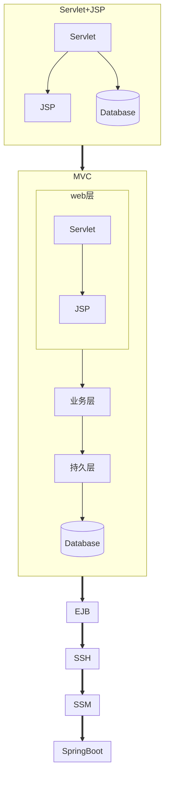
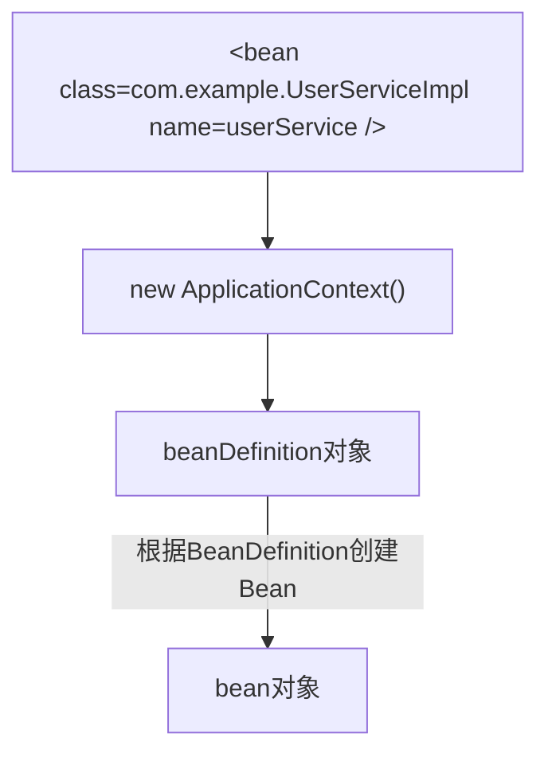

# 问题记录

**01. 什么是Spring？**
Spring有很多含义，Spring本身是一个生态体系，体系内的应用都是建立在Spring框架之上的，比如SpringMVC、SpringBoot、SpringCloud等。

**02. Java Web架构演变过程**
- Servlet+JSP+JavaBean
  Servlet+JSP+JavaBean是Java Web的经典三层架构，其中Servlet和JSP是表现层，JavaBean是业务层，数据库是持久层。<br>
- MVC三层架构
  web跳转页面（M Model=POJO V View=JSP，C Controller-servlet），service业务逻辑判断，dao数据库查询<br>
- EJB三层架构
  EJB是重量级框架，使用时过多的接口和依赖，侵入性强使用比较麻烦<br>
- Spring Struts2 Hibernate
  - web Struts2
  - service 
  - dao Hibernate
- Spring SpringMVC MyBatis
  - web SpringMVC
  - service
  - dao MyBatis
- SpringBoot
  搭建SSM框架需要大量XML配置文件



**03. 脱离SpringFramework，理解下IoC/DI是什么？**
IoC/DI是Spring框架的核心概念，IoC（Inversion of Control）是控制反转，DI（Dependency Injection）是依赖注入。<br>
- IoC：Inversion of Control
  控制（对象被创建的权利）被反转<br>
  - 未使用IoC时<br>
    程序员自己创建对象，程序员自己管理对象的创建，程序员自己管理对象的销毁。耦合性高（再小的代码变更都很有可能引起BUG）。
    ```java
    UserService(new UserDao())
    ```
  - IoC控制反转
    反转控制，反转对象创建权，让Spring框架来创建对象，让Spring框架来管理对象的创建，让Spring框架来管理对象的销毁。
- DI：Dependency Injection
  依赖注入，依赖被注入到对象中，对象之间解耦合，耦合性低，代码维护简单。统一管理对象。

**04. Spring各个版本的区别**
- 依赖的注册方式
  - Spring 1.x：依赖的注册方式：<br>
    XML配置文件注册依赖，通过`<bean>`标签注册依赖。
  - Spring 2.5：<br>
    依赖的注册方式：XML配置文件注册依赖，通过@Component注解注册依赖。
  - Spring 3.1：<br>
    依赖的注册方式：XML配置文件注册依赖，通过@ComponentScan注解注册依赖。
    
**05. 什么是Bean？**
被Spring容器管理的对象，称为Bean。
类想要被Spring容器管理，必须满足两个条件：
- 类必须被Spring容器所加载，即必须被Spring容器所扫描。
- 类必须被Spring容器所识别，即必须被Spring容器所加载。

在Spring容器中，配置Bean的方式：
- Spring容器会根据XML配置文件，创建Bean对象，并管理Bean的生命周期。
  ```xml
  <bean id="userService" class="com.itheima.service.impl.UserServiceImpl">
  ```
- Spring容器会根据注解，创建Bean对象，并管理Bean的生命周期。
  ```java
  @Component("userService")
  public class UserServiceImpl implements UserService {}
  ```
  配置类，用于扫描包，并注册Bean。
  ```java
  @ComponentScan("com.itheima.service.impl")
  public class AppConfig {}
  ```

Bean实例化过程：


FactoryBean：

