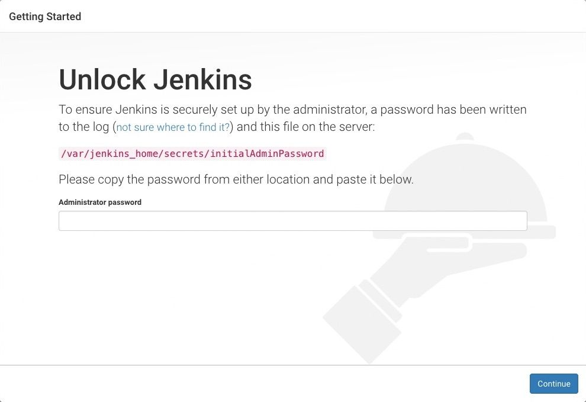
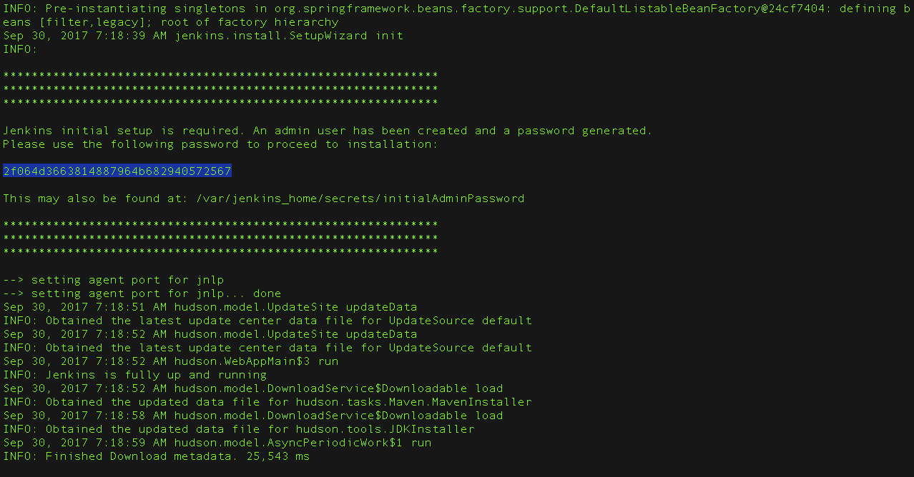

# 1.1 Docker容器安装jenkins

## 先决条件

最低硬件要求：
- 256MB 运行内存 RAM；
- 1GB 的磁盘空间（但如果作为Docker容器运行Jenkins，建议最小为10GB）。

为小团队推荐的硬件配置：
- 4GB 以上的运行内存 RAM;
- 50GB 以上的磁盘空间。

全面的硬件建议：
- 硬件：请参阅[硬件建议](https://www.jenkins.io/doc/book/scaling/hardware-recommendations)页面

软件要求：

- Java：请参阅 [Java 要求](https://www.jenkins.io/doc/book/platform-information/support-policy-java/) 页面；
- Web 浏览器：请参阅 [Web 浏览器兼容性](https://www.jenkins.io/doc/administration/requirements/web-browsers/) 页面;
- 对于 Windows 操作系统：[Windows 支持政策](https://www.jenkins.io/doc/administration/requirements/windows/);
- 对于 Linux 操作系统：[Linux 支持政策](https://www.jenkins.io/doc/book/platform-information/support-policy-linux/);
- 对于 Servlet 容器： [Servlet 容器支持政策](https://www.jenkins.io/doc/book/platform-information/support-policy-servlet-containers/)。

[Docker Compose示例](#docker-compose-示例)

## 下载和运行 Docker 中的 Jenkins

有好几个 Jenkins 的 Docker 镜像可以使用。

推荐使用的 Docker 镜像是官方的 [`jenkins/jenkins` 镜像](https://hub.docker.com/r/jenkins/jenkins/)（来自 [Docker Hub 资源库](https://hub.docker.com/)）。这个镜像包含 Jenkins 当前的长期支持（LTS）版本（可用于生产）。但是这个镜像里面没有 docker CLI，也没有捆绑常用的 Blue Ocean 插件和功能。这意味着，如果你想使用 Jenkins 和 Docker 的全部功能，你或许要通过下面描述的安装过程。

> [!NOTE] 
> 每次发布新的 Jenkins Docker 版本时，都会发布一个新的 `jenkins/jenkins` 镜像。你可以在 [标签页](https://hub.docker.com/r/jenkins/jenkins/tags/) 上看到以前发布的 `jenkins/jenkins` 镜像的版本列表。

### 在 macOS 和 Linux 上

1. 打开一个终端窗口;

2. 使用以下的 [`docker network create`](https://docs.docker.com/engine/reference/commandline/network_create/) 命令在 Docker 中创建一个 [桥接网络](https://docs.docker.com/network/bridge/)：

   ```bash
   $ sudo docker network create jenkins
   ```

3. 为了在 Jenkins 节点内执行 Docker 命令，使用以下的 `docker run` 命令下载并运行 [`docker:dind`](https://docs.docker.com/engine/reference/run/) Docker 镜像：

   ```bash
   $ sudo docker run \
     --name jenkins-docker \ ❶
     --rm \ ❷
     --detach \ ❸
     --privileged \ ❹
     --network jenkins \ ❺
     --network-alias docker \ ❺
     --env DOCKER_TLS_CERTDIR=/certs \ ❼
     --volume jenkins-docker-certs:/certs/client \ ❽
     --volume jenkins-data:/var/jenkins_home \ ❾
     --publish 2376:2376 \ ❿
     docker:dind \ ⓫
     --storage-driver overlay2 ⓬
   ```

   ❶（可选的）`--name jenkins-docer` 命令行标志，指定运行镜像时要使用的 Docker 容器名称。默认情况下，Docker 将为该容器生成一个唯一的名称；

   ❷（可选的）`--rm` 命令行开关，关闭时自动删除 Docker 容器（Docker 镜像的实例）；

   ❸（可选的） `--detach` 命令行开关，在后台运行 Docker 容器。稍后可以通过运行 `docker stop jenkins-docker` 停止此实例；

   ❹ `--privileged` 命令行开关，在 Docker 中运行 Docker 目前需要特权访问才能正常运行。较新的 Linux 内核版本可能会放宽此要求；

   ❺ `--network jenkins` 命令行参数，这与前面步骤中创建的网络相对应；

   ❻ `--network alias docker` 命令行参数，使 Docker 容器中的 Docker 在 `jenkins` 网络中作为主机名 `docker` 可用；

   ❼ `--env DOCKER_TLS_CERTDIR=/certs` 命令行参数，在 Docker 服务器中启用 TLS。由于使用了特权容器，因此建议这样做，尽管他需要使用下面会描述的共享卷。此环境变量控制管理 Docker TLS 证书的根目录；

   ❽ `--volume jenkins-docker-certs:/certs/client` 命令行参数，将容器内的 `/certs/client` 目录映射到上面创建的名为 `jenkins-docker-certs` 的 Docker 卷；

   ❾ `--volume jenkins-data:/var/jenkins_home` 命令行参数，将容器内的 `/var/jenkins_home` 目录映射到名为 `jenkins-data` 的 Docker 卷。这将允许由该 Docker 容器的 Docker 守护进程控制的其他 Docker 容器从 Jenkins 挂载数据；

   ❿（可选的）`--publish 2376:2376` 命令行参数，在主机上暴露 Docker 守护程序端口。这对于在主机上执行 docker 命令以控制此内部 Docker 守护进程很有用；

   ⓫ `docker:dind` 命令行参数，`docker:dind` 镜像本身。这个镜像可以在运行前通过以下命令下载：`docker image pull docker:dind`；

   ⓬ Docker 卷的存储驱动。参见 ["Docker存储驱动"](https://docs.docker.com/storage/storagedriver/select-storage-driver)，了解支持的选项。

   > [!NOTE]
   > 如果复制和粘贴上面的命令片段不起作用，请尝试复制和粘贴下面的无注释版本：

   ```bash
   $ sudo docker run --name jenkins-docker --rm --detach \
     --privileged --network jenkins --network-alias docker \
     --env DOCKER_TLS_CERTDIR=/certs \
     --volume jenkins-docker-certs:/certs/client \
     --volume jenkins-data:/var/jenkins_home \
     --publish 2376:2376 \
     docker:dind --storage-driver overlay2
   ```

4. 通过执行以下两个步骤，定制官方 Jenkins Docker 镜像：

   a. 使用以下内容创建 Dockerfile：

   ```dockerfile
   FROM jenkins/jenkins:2.504.1-jdk21
   USER root
   RUN apt-get update && apt-get install -y lsb-release ca-certificates curl && \
       install -m 0755 -d /etc/apt/keyrings && \
       curl -fsSL https://download.docker.com/linux/debian/gpg -o /etc/apt/keyrings/docker.asc && \
       chmod a+r /etc/apt/keyrings/docker.asc && \
       echo "deb [arch=$(dpkg --print-architecture) signed-by=/etc/apt/keyrings/docker.asc] \
       https://download.docker.com/linux/debian $(. /etc/os-release && echo \"$VERSION_CODENAME\") stable" \
       | tee /etc/apt/sources.list.d/docker.list > /dev/null && \
       apt-get update && apt-get install -y docker-ce-cli && \
       apt-get clean && rm -rf /var/lib/apt/lists/*
   USER jenkins
   RUN jenkins-plugin-cli --plugins "blueocean docker-workflow json-path-api"
   ```

   b. 从这个 Docker 文件构建一个新的 docker 镜像，并给这个镜像起一个有意义的名字，例如 `"myjenkins-blueocean：2.504.1-1"`：

   ```bash
   $ sudo docker build -t myjenkins-blueocean:2.504.1-1 .
   ```

请记住，如果以前没有做过，上述过程将自动下载官方的 Jenkins Docker 镜像。

5. 使用以下 `docker run` 命令在 Docker 中作为容器运行咱们自己的 `myjenkins-blueocean:2.504.1-1` 镜像：

   ```bash
   $ sudo docker run \
     --name jenkins-blueocean \ ❶
     --restart=on-failure \ ❷
     --detach \ ❸
     --network jenkins \ ❹
     --env DOCKER_HOST=tcp://docker:2376 \ ❺
     --env DOCKER_CERT_PATH=/certs/client \ 
     --env DOCKER_TLS_VERIFY=1 \ 
     --publish 8080:8080 \ ❻
     --publish 50000:50000 \ ❼
     --volume jenkins-data:/var/jenkins_home \ ❽
     --volume jenkins-docker-certs:/certs/client:ro \ ❾
     myjenkins-blueocean:2.504.1-1 ❿
   ```

   ❶（可选的） `--name jenkins-blueocean` 命令行参数，指定 Docker 镜像的这个实例的 Docker 容器名称；

   ❷ `--restart=on-failure` 命令行开关，如果容器停止了，总是要重新启动他。如果他被手动停止，则只有当 Docker 守护进程重新启动或容器本身被手动重新启动时，他才会被重新启动；

   ❸（可选的） `--detach` 命令行开关，在后台运行当前的容器（即 "detached" 模式）并输出容器的 ID。如果你不指定这个选项，那么这个容器的运行 Docker 日志会在终端窗口中输出；

   ❹ `--network jenkins` 命令行参数，将这个容器连接到前面步骤中定义的 `jenkins` 网络。这使得上一步骤中的Docker 守护程序通过主机名 `docker` 对这个 Jenkins 容器可用；

   ❺ `--env DOCKER_HOST=tcp://docker:2376 --env DOCKER_CERT_PAT=/certs/client --env DOCKER_TLS_VERIFY=1` 命令行参数，指定由 `docker`、`docker-compose` 和其他 Docker 工具使用的环境变量，以连接到上一步的 Docker 守护进程；

   ❻ `--publish 8080:8080` 命令行参数，将当前容器的 `8080` 端口映射（即 "发布"）到主机上的 `8080` 端口。第一个数字代表主机上的端口，而最后一个数字代表容器的端口。因此，如果你为这个选项指定了 `-p 49000:8080`，那么咱们将通过 `49000` 端口访问主机上的 Jenkins；

   ❼（可选的） `--publish 50000:50000` 命令行参数，将当前容器的 `50000` 端口映射到主机上的 `50000` 端口。只有当你在其他机器上设置了一个或多个入站的 Jenkins 代理，而这些代理又与你的 `jenkins-blueocean` 容器（Jenkins "控制器"）交互时，这才是必要的。入站的 Jenkins 代理默认通过 TCP `50000` 端口与 Jenkins 控制器通信。你可以通过 [安全，Security](https://www.jenkins.io/doc/book/managing/security/) 页面在你的 Jenkins 控制器上改变这个端口号。如果你想把你的 Jenkins 控制器的 **入站 Jenkins 代理的 TCP 端口** 改为`51000`（比如），那么你需要重新运行 Jenkins （通过这个 `docker run ...` 命令）并以类似 `--publish 52000:51000` 的命令行参数，指定这个 "发布" 选项，其中最后一个值与 Jenkins 控制器上的这个变化值一致，第一个值是承载 Jenkins 控制器的机器上的端口号。入站的 Jenkins 代理在该端口（本例中为 `52000`）与 Jenkins 控制器通信。注意，[WebSocket 代理](https://www.jenkins.io/blog/2020/02/02/web-socket/) 不需要这种配置；

   ❽ `--volume jenkins-data:/var/jenkins_home` 命令行参数，将容器中的 `/var/jenkins_home` 目录映射到名为 `jenkins-data` 的 [Docker 卷](https://docs.docker.com/engine/admin/volumes/volumes/)。除了将 `/var/jenkins_home` 目录映射到 Docker 卷之外，咱们还可以将此目录映射到计算机本地文件系统上的一个目录。例如，指定选项 `--volume $HOME/jenkins:/var/jenkins_home` 会将容器的 `/var/jenkins_home` 目录映射到本地计算机上 `$HOME` 目录中的 `jenkins` 子目录，通常是 `/Users/<your-username>/jenkins` 或 `/home/<你的用户名>/jenkins`。注意，如果你改变了这个源卷或目录，上面的 `docker:dind` 容器的卷需要更新以与之匹配；

   ❾ 将 `/certs/client` 目录映射到先前创建的 `jenkins-docker-certs` 卷。连接到 Docker 守护进程所需的 TLS 客户端证书现在可以在 `DOCKER_CERT_PATH` 环境变量指定的路径中找到。

   ❿ `myjenkins-blueocean:2.504.1-1` 在上一步中构建的 Docker 映像的名称。

   > [!NOTE]
   > 如果复制和粘贴上面的命令片段不起作用，请尝试复制和粘贴这里的无注释版本：

   ```bash
   $ sudo docker run --name jenkins-blueocean --restart=on-failure --detach \
     --network jenkins --env DOCKER_HOST=tcp://docker:2376 \
     --env DOCKER_CERT_PATH=/certs/client --env DOCKER_TLS_VERIFY=1 \
     --publish 8080:8080 --publish 50000:50000 \
     --volume jenkins-data:/var/jenkins_home \
     --volume jenkins-docker-certs:/certs/client:ro \
     myjenkins-blueocean:2.504.1-1
   ```

6. 继续进行 [安装后的设置向导](https://www.jenkins.io/doc/book/installing/docker/#setup-wizard)。


### 在 Windows 系统上

Jenkins 项目提供的是 Linux 容器镜像，而不是 Windows 容器镜像。请确保您的 Docker for Windows 安装配置为运行 Linux 容器而不是 Windows 容器。有关 [切换到 Linux 容器](https://docs.docker.com/docker-for-windows/#switch-between-windows-and-linux-containers) 的说明，请参阅 Docker 文档。一旦配置为运行 Linux 容器，步骤如下：

1. 打开一个命令提示符窗口，与上面的 [macOS 和 Linux](#在-macos-和-linux-上) 指示类似，做以下工作：

2. 在 Docker 中创建一个桥接网络；

   ```bash
   $ sudo docker network create jenkins
   ```

3. 运行一个 `docker:dind` Docker 镜像；

   ```bash
   $ sudo docker run --name jenkins-docker --rm --detach ^
     --privileged --network jenkins --network-alias docker ^
     --env DOCKER_TLS_CERTDIR=/certs ^
     --volume jenkins-docker-certs:/certs/client ^
     --volume jenkins-data:/var/jenkins_home ^
     --publish 2376:2376 ^
     docker:dind
   ```

4. 通过执行以下两个步骤，定制官方 Jenkins Docker 镜像：

   - 使用以下内容创建 Dockerfile：
     ```dockerfile
     FROM jenkins/jenkins:2.504.1-jdk21
     USER root
     RUN apt-get update && apt-get install -y lsb-release
     RUN curl -fsSLo /usr/share/keyrings/docker-archive-keyring.asc \
       https://download.docker.com/linux/debian/gpg
     RUN echo "deb [arch=$(dpkg --print-architecture) \
       signed-by=/usr/share/keyrings/docker-archive-keyring.asc] \
       https://download.docker.com/linux/debian \
       $(lsb_release -cs) stable" > /etc/apt/sources.list.d/docker.list
     RUN apt-get update && apt-get install -y docker-ce-cli
     USER jenkins
     RUN jenkins-plugin-cli --plugins "blueocean docker-workflow json-path-api"
     ```

   - 从这个 Docker 文件建立一个新的 docker 镜像，并给这个镜像起一个有意义的名字，例如 "myjenkins-blueocean：2.504.1-1"：
     ```bash
     $ sudo docker build -t myjenkins-blueocean:2.504.1-1 .
     ```

   请记住，如果以前没有做过，上述过程将自动下载官方的 Jenkins Docker 镜像。

5. 使用以下 `docker run` 命令在 Docker 中作为容器运行你自己的 `myjenkins-blueocean:2.504.1-1` 镜像：

   ```bash
   $ sudo docker run --name jenkins-blueocean --restart=on-failure --detach ^
     --network jenkins --env DOCKER_HOST=tcp://docker:2376 ^
     --env DOCKER_CERT_PATH=/certs/client --env DOCKER_TLS_VERIFY=1 ^
     --volume jenkins-data:/var/jenkins_home ^
     --volume jenkins-docker-certs:/certs/client:ro ^
     --publish 8080:8080 --publish 50000:50000 myjenkins-blueocean:2.504.1-1
   ```

6. 继续进行 [安装后的设置向导](https://www.jenkins.io/doc/book/installing/docker/#setup-wizard)。

## 访问 Docker 容器

如果你有一些 Docker 方面的经验，并且你希望或需要通过终端/命令提示符使用 `docker exec` 命令来访问你的 Docker 容器，你可以在 `docker exec` 命令中添加一个选项，如 `--name jenkins-tutorialdocker exec`。这将访问名为 "jenkins-tutorial" 的 Jenkins Docker 容器。

这意味着你可以使用 `docker exec` 命令访问你的 docker 容器（通过单独的终端/命令提示符窗口）：
```bash
$sudo docker exec -it jenkins-blueocean bash
```

### 访问 Docker 日志

咱们可能需要访问 Jenkins 控制台日志，例如，在作为 [安装后设置向导](#安装后设置向导) 一部分的 [解锁 Jenkins](#解锁-Jenkins) 时。

Jenkins 控制台日志可以通过执行 `docker run ...` 命令的终端/命令提示窗口轻松访问。如果需要的话，咱们也可以通过咱们容器的 [Docker 日志](https://docs.docker.com/engine/reference/commandline/logs/)，使用以下命令访问 Jenkins 控制台日志：

```bash
$ sudo docker logs <docker-container-name>
```

`<docker-container-name>` 可以通过 `docker ps` 命令获取。

### 访问 Jenkins 主目录

咱们可能需要访问 Jenkins 主目录，例如，检查 `workspage` 子目录中 Jenkins 构建的详细信息。

如果咱们把 Jenkins 主目录（`/var/jenkins_home`）映射到咱们机器的本地文件系统上（即在 [上面](#下载和运行-docker-中的-jenkins) 的 `docker run ...` 命令中），那么咱们就可以通过咱们机器的常规终端/命令提示符访问该目录的内容。

否则，如果咱们在 `docker run ...` 命令中指定了 `--volume jenkins-data:/var/jenkins_home` 选项，咱们可以通过容器的终端/命令提示符使用 `docker container exec` 命令访问 Jenkins 主目录的内容：

```bash
$ sudo docker container exec -it <docker-container-name> bash
```

[如上](#访问-docker-日志) 所述，`<docker-container-name>` 可以通过 `docker container ls` 命令获得。如果你在上面的 `docker container run ...` 命令中指定了 `--name jenkins-blueocean` 选项（参见 [访问 Jenkins/Blue Ocean Docker容器](#访问-docker-容器)），咱们可以简单地使用 `docker container exec` 命令：

```bash
$ sudo docker container exec -it jenkins-blueocean bash
```

## 安装后设置向导

在使用上述程序之一（使用 Jenkins Operator 的安装除外）下载、安装和运行 Jenkins 后，安装后的设置向导开始。

这个设置向导带咱们完成几个快速的 "一次性" 步骤，以解锁 Jenkins、使用插件对其进行定制，并创建第一个管理员用户，咱们可以通过他继续访问 Jenkins。

### 解锁 Jenkins

当咱们首次访问新的 Jenkins 实例时，系统会要求咱们使用自动生成的密码解锁他。

1. 浏览到 `http://localhost:8080`（或咱们在安装 Jenkins 时为其配置的那个端口），然后等待 **Unlock Jenkins** 页面出现。

   

2. 从 Jenkins 控制台的日志输出，复制自动生成的字母数字密码（在两组星号之间）。

   

   > [!NOTE]
   > 命令：`sudo cat /var/lib/jenkins/secrets/initialAdminPassword` 将在控制台打印密码；
   > 如果你在 Docker 中使用官方的`jenkins/jenkins` 镜像运行 Jenkins，你可以使用 `sudo docker exec ${CONTAINER_ID 或 CONTAINER_NAME} cat /var/jenkins_home/secrets/initialAdminPassword` 来在控制台中打印密码，而不必进入容器。

3. 在 **Unlock Jenkins** 页面上，将此密码粘贴到 **Administrator password** 字段中，然后单击 **Continue**。

   > [!NOTE]
   > Jenkins 控制台日志指出了还可以获得该密码的位置（在 Jenkins 主目录中）。在新安装的 Jenkins 上必须在设置向导中输入这个密码，然后才能访问 Jenkins 的主用户界面。如果你碰巧跳过了安装向导中的后续用户创建步骤，这个密码也可以作为默认的管理员账户密码（用户名为 "admin"）。

4. 更换国内镜像源

   在浏览器中输入 `http://IP:PORT/manage/pluginManager/advanced` 将 ` https://updates.jenkins.io/update-center.json` 替换为 `https://mirrors.huaweicloud.com/jenkins/updates/update-center.json`（也可选择其他镜像源）。点击`Submit`。

   在浏览器中输入 `http://IP:PORT/restart` 点击Are you sure you want to restart Jenkins? 后面的`Yes`按钮来重启Jenkins。

   > [!NOTE]
   > 上面的**IP**和**PORT**，请根据实际情况填写。

### 使用插件定制 Jenkins

[解锁 Jenkins](#解锁-jenkins) 后，会出现 **Customize Jenkins** 页面。作为初始设置的一部分，咱们可以在此处安装任意数量的有用插件。

点击给出的两个选项之一：

- **Install suggested plugins** - 安装建议的插件集，这些插件是基于最常见的使用情况；
- **Select plugins to install** - 选择最初要安装哪一组插件。当你第一次访问插件选择页面时，建议的插件被默认选择。

> [!NOTE]
> 如果咱们不确定需要什么插件，就选择 **Install suggested plugins**。咱们可以在以后的时间点，通过 Jenkins 中的 [Manage Jenkins]() > [Plugins]() 页面安装（或删除）额外的 Jenkins 插件。

安装向导会显示正在配置的 Jenkins 及咱们选择的一组正在安装的 Jenkins 插件的进度。此过程可能需要几分钟时间。

### 创建首个管理员用户

最后，在 [使用插件自定义 Jenkins](#使用插件定制-jenkins) 后，Jenkins 会要求您创建第一个管理员用户。

1. 当 **Create First Admin User** 页面出现时，请在相应字段中指定管理员用户的详细信息，然后单击 **Save and Finish**；

2. 当出现 **Jenkins is ready** 的页面时，点击 **Start using Jenkins**。
  
   > [!NOTE]
   > 此页面可能表明 **Jenkins 几乎准备就绪！** 相反，如果是这样，请单击 **Restart**；
   > 如果一分钟后页面没有自动刷新，请使用你的网络浏览器手动刷新页面。

3. 如果需要，使用咱们刚刚创建的用户的凭据登录到 Jenkins，咱们就可以开始使用 Jenkins 了！

## 更新 Jenkins

参考：[New Jenkins Container And Update Jenkins (Docker)](https://jimkang.medium.com/how-to-start-a-new-jenkins-container-and-update-jenkins-with-docker-cf628aa495e9)


1. 得到新版 Jenkins WAR 文件的具体下载地址；

比如：`https://mirrors.tuna.tsinghua.edu.cn/jenkins/war/2.407/jenkins.war`


2. 登入 Jenkins 所在的 Docker 容器；


```console
# 以 `-u 0` 来使用主机的 root 账号
docker container exec -u 0 -it jenkins-blueocean bash
```

3. 使用第 1 步中所拷贝的 URI 地址，下载更新；

```console
curl https://mirrors.tuna.tsinghua.edu.cn/jenkins/war/2.407/jenkins.war -o jenkins.war
```

4. 将其移动到正确位置；

```console
mv ./jenkins.war /usr/share/jenkins
```

> 注意：可以先 `cp /usr/share/jenkins/jenkins.war /usr/share/jenkins/jenkins.war.bakup` 备份一下。


5. 修改 `jenkins.war` 的权限；

```console
chown jenkins:jenkins /usr/share/jenkins/jenkins.war
```

6. 退出容器并重启该容器。

```console
# 退出容器（在容器里）
exit

# 重启该容器（从咱们的服务器）
docker container restart jenkins-blueocean
```

## Docker Compose 示例

`docker-compose.yml`
```yaml
version: '3.6'
services: 
  jenkins: 
    image: docker.mybacc.com/jenkins/jenkins:lts-jdk17
    container_name: jenkins
    privileged: true
    restart: always
    user: '${UID}:${GID}'
    environment:
      - UID=${UID}
      - GID=${GID}
    ports:
      - '8080:8080'
      - '50000:50000'
        #registry-mirrors:
        #- https://docker.mybacc.com
    volumes: 
       - '/srv/jenkins/data:/var/jenkins_home'

        #  ssh-agent: 
        # image: jenkins/ssh-agent
  #    environment: 
  #    JENKINS_AGENT_SSH_PUBKEY: ''
  # ports: 
  #    - '2200:22'
```

启动：
```bash
$ $ sudo UID=$(id -u) GID=$(id -g) docker compose up -d
```

查看密码：
```bash
$ cat /srv/jenkins/data/secrets/initialAdminPassword
```
