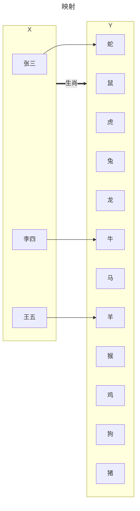
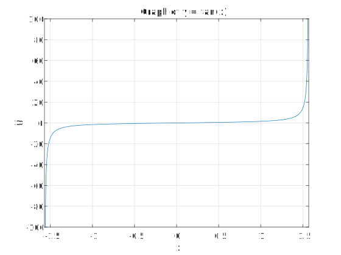
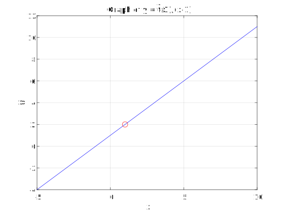
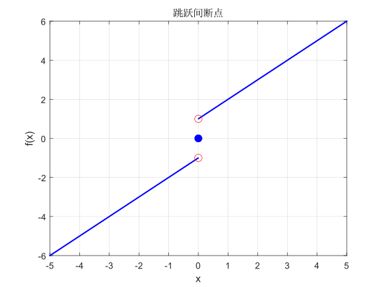

# 1 函数与极限

## 1.1 映射与函数

### 1.1.1 映射的概念

**定义：设 *X*、*Y* 是两个非空集合，如果存在一个法则 $f$，使得对 *X* 中每个元素 $x$，按法则 $f$，在 *Y* 中在唯一确定的元素 $y$ 与之对应，则称 $f$ 为从 *X* 到 *Y* 的映射，记作 $f：X→Y$**

$y$ 称为 $x$（在映射 $f$ 下）的像，并记作 $f(x)$，即 $y=f(x)$。
$x$ 称为 $y$ 的原像。

集合 *X* 称为映射 $f$ 的定义域，记作 $D_f$，即 $D_f=X$；<br/>
*X* 中所有元素的作斫组成的集合称为映射 $f$ 的值域，记作 $R_f$ 或 $f(X)$，即 $R_f=f(X)=\{ f(x)|x\in X \}$。

> [!TIP]
> 构成一个映射必须具备以下三个要素：集合 *X*，即定义域 $D_f=X$；集合 *Y*，即值域的范围：$R_f \subset Y$；对应法则 $f$，使对每个 $x\in X$，有唯一确定的 $y=f(x)$ 与之对应。<br/>
> 对每个 $x\in X$，元素 $x$ 的像 $y$ 是唯一的；而对每一个 $y\in R_f$，元素 $y$ 的原像不一定是唯一的；映射 $f$ 的值域 $R_f$ 是 $Y$ 的一个子集，即 $R_f \subset Y$，不一定 $R_f = Y$。


> [!NOTE]
> 上图中两个集合之间的法则是生肖。

### 1.1.2 映射的分类

- 单射：*X* 中任意两个不同元素 $x_1\neq x_2$，它们的像 $f(x_1)\neq f(x_2)$，则称 $f$ 为 *X* 到 *Y* 的单射。
  ```mermaid
  ---
  title: 单射
  ---
  flowchart LR
    subgraph X
      A["张三"]
      B["李四"]
      C["王五"]
    end

    subgraph Y
      E["牛"]
      I["蛇"]
      J["马"]
      K["羊"]
    end
    A --> I
    B --> E
    C --> K
    X ==生肖==> Y
  ```
- 满射：若 $R_f = Y$，即 *Y* 中任一元素 $y$ 都是 *X* 中某元素的像， 则称 $f$ 为 *X* 到 *Y* 上的映射或满射。
  ```mermaid
  ---
  title: 映射
  ---
  flowchart LR
    subgraph X
      A["张三"]
      B["李四"]
      C["王五"]
    end

    subgraph Y
      E["牛"]
      I["蛇"]
    end
    A --> I
    B --> E
    C --> I
    X ==生肖==> Y
  ```
- 双射：若映射 $f$ 是单射且满射，则称 $f$ 为一一映射或双射。
  ```mermaid
  ---
  title: 映射
  ---
  flowchart LR
    subgraph X
      A["张三"]
      B["李四"]
      C["王五"]
    end

    subgraph Y
      E["牛"]
      I["蛇"]
      K["羊"]
    end
    A --> I
    B --> E
    C --> K
    X ==生肖==> Y
  ```

### 1.1.3 逆映射下复合映射

TODO

### 1.1.4 函数的概念

**定义：设数集 $D\subset R$，则称映射 $f:D\to R$ 为定义 $D$ 上的函数，通常简记为 $y=f(x),x\in D$。**

$x$ 称为自变量，$y$ 称为因变量，$D$ 称为定义域，记作 $D_f$，即 $D_f=D$。<br/>
函数定义中，对每个 $x\in D$，按对应法则 $f$，总有唯一确定的值 $y$ 与之对应，这个值称为函数 $f$ 在 $x$ 处的函数值，记作 $f(x)$，即 $y=f(x)$。<br/>
因变量 $y$ 与自变量 $x$ 之间的这种依赖关系，通常称为函数关系。<br/>
函数值 $f(x)$ 的全体斫构成的集合称为函数 $f$ 的值域，记作 $R_f$ 或 $f(D)$，即 $R_f=f(D)=\{ y|y=f(x),x\in D \}$。

### 1.1.5 函数的定义域

- 对有实际背景的函数，根据实际背景中变量的实际意义确定。
  例如，在自由落体运动中，设物体下落的时间为 $t$，下落的距离为 $s$，开始下落的时刻 $t=0$，落地的时刻 $t=T$，则 $s$ 与 $t$ 之间的函数关系是<br/>
  $s=\frac{1}{2}gt^2, t\in [0,T]$

  这个函数的定义域就是区间 $[0,T]$。

- 对抽象地用算式表达的函数，通常约定这种函数的定义是使得算式有意义的一切实数组成的集合，这种定义域称为函数的**自然定义域**。
  > [!NOTE]
  > 在这种约定之下，一般的算式表达的函数可用“$y=f(x)$”来表达，而不必再表出 $D_f$。

  例如，函数 $y=\sqrt{1-x^2}$ 的定义域是闭区间 $[-1,1]$，函数 $y=\frac{1}{\sqrt{1-x^2}}$ 的定义域是开区间 $(-1,1)$。


### 1.1.6 函数的表示法

- 表格法

  | $x$ | $y$ |
  | --- | --- |
  | 0   | 5   |
  | 1   | 2   |
  | 6   | 3   |
  | 7   | 7   |

- 图形法
  
  

- 解析法

  $y=|x|$

### 1.1.7 特殊函数

- 符号函数
  $y=\operatorname{sgn} x=\begin{cases}
  1, & x>0, \\
  0, & x=0, \\
  -1, & x<0
  \end{cases}$

- 取整函数
  $y=[x]$

  

  > [!NOTE]
  > 取不超过自变量的最大整数。

- 狄利克雷函数
  $y=D(x)=\begin{cases}
  1, & x\in\mathbb{Q}, \\
  0, & x\in\mathbb{R} \setminus \mathbb{Q}
  \end{cases}$

  > [!NOTE]
  > $\mathbb{Q}$ 表示有理数，$\mathbb{R}$ 表示实数，$\mathbb{R}\setminus\mathbb{Q}$ 表示无理数。

### 1.1.8 函数的特性

#### 1.1.8.1 函数的有界性

设函数 $f(x)$ 的定义域为 $D$，数集 $X\subset D$。

- 如果存在数$K_1$，使得 $f(x)\leq K_1$，对任一 $x\in X$都成立，则称函数 $f(x)$ 在 $X$ 上有**上界**，而 $k_1$ 称为函数 $f(x)$ 在 $X$ 上的一个上界。
  > [!TIP]
  > 任何大于 $K_1$ 的值都是函数 $f(x)$ 在 $X$ 上的上界，所以函数 $f(x)$ 的上界有无数个。

- 如果存在数$K_2$，使得 $K_2\geq f(x)$，对任一 $x\in X$都成立，则称函数 $f(x)$ 在 $X$ 上有**下界**，而 $k_2$ 称为函数 $f(x)$ 在 $X$ 上的一个下界。
  > [!TIP]
  > 任何小于 $K_2$ 的值都是函数 $f(x)$ 在 $X$ 上的下界，所以函数 $f(x)$ 的下界有无数个。

- 如果存在正数 $M$，使得 $|f(x)|\leq M$，对任一 $x\in X$都成立，则称函数 $f(x)$ 在 $X$ 上**有界**，如果这样的 $M$ 不存在，就称函数 $f(x)$ 在 $X$ 上**无界**。

> [!TIP]
> 函数 $f(x)$ 在 $X$ 上有界的充分必要条件是它在 $X$ 上既有上界，又有下界。

#### 1.1.8.2 函数的单调性

设函数 $f(x)$ 的定义域为 $D$，区间 $I\subset D$。

- 如果对于区间 $I$ 上任意两点 $x_1$ 及 $x_2$，当 $x_1<x_2$ 时，恒有 $f(x_1)<f(x_2)$，则称函数 $f(x)$ 在区间 $I$ 上单调递增。
  

- 如果对于区间 $I$ 上任意两点 $x_1$ 及 $x_2$，当 $x_1<x_2$ 时，恒有 $f(x_1)>f(x_2)$，则称函数 $f(x)$ 在区间 $I$ 上单调递减。
  

> [!TIP]
> 单调递增函数和单调递减函数统称为**单调函数**。

#### 1.1.8.3 函数的奇偶性

设函数 $f(x)$ 的定义域 $D$ 关于原点对称。

- 如果对于任一 $x\in D$，$f(-x)=f(x)$ 恒成立，则称函数 $f(x)$ 为**偶函数**。
  

- 如果对于任一 $x\in D$，$f(-x)=-f(x)$ 恒成立，则称函数 $f(x)$ 为**奇函数**。
  

#### 1.1.8.4 函数的周期性

设函数 $f(x)$ 的定义域为 $D$，如果存在一个正数 $l$，使得对于任一 $x\in D$ 有 $(x\pm l)\in D$，且 $f(x+l)=f(x)$恒成立，则称 $f(x)$ 为**周期函数**，$l$ 称为 $f(x)$ 的周期，通常我们说周期函数的周期是指**最小正周期**。


> [!NOTE]
> 狄利克雷函数是周期函数，任何正有理数 $r$ 都是它的周期。因为不存在最小的正有理数，所以不存在最小的正周期。

### 1.1.9 反函数与复合函数

- **反函数**

  设函数 $f:D\to f(D)$ 是单射，则它存在逆映射 $f^{-1}:f(D)\to D$，称此映射 $f^{-1}$ 为函数 $f$ 的反函数。<br/>

  按此定义，对每个 $y\in f(D)$，有唯一的 $x\in D$ 使得 $f(x)=y$，于是有 $f^{-1}(y)=x$。也就是说，反函数 $f^{-1}$ 的对应法则是免全由函数 $f$ 的对应法则所决定的。

  例如，$y=2x+1$ 是直接函数，它的反函数为 $x=\frac{y-1}{2}$，反函数的自变量为 $y$，因变量为 $x$（变量改变）。将反函数的自变量符号改为 $x$，因变量符号改为 $y$，则得到 $y=\frac{x-1}{2}$（方程改变）。

  

  > [!NOTE]
  > 相对于反函数 $y=f^{-1}(x)$ 来说，原来的函数 $y=f(x)$ 称为**直接函数**。把直接函数 $y=f(x)$ 和它的反函数 $y=f^{-1}(x)$ 的图形画在同一坐标平面上，这两个图形关于直线 $y=x$ 是对称的

- **复合函数**

  设函数 $y=f(u)$ 的定义域为 $D_f$，函数 $u=g(x)$ 的定义域为 $D_g$，且其值域 $R_g\subset D_f$，则由下式确定的函数 $y=f[g(x)],x\in D_g$ 称为由函数 $u=g(x)$ 与函数 $y=f(u)$ 构成的**复合函数**，它的定义域为 $D_g$，变量 $u$ 称为中间变量。

  函数 $g$ 与函数 $f$ 构成的复合函数，按“先 $g$ 后 $f$”的次序复合的函数，通常记为 $f\circ g$，即 $f(\circ g)(x)=f[g(x)]$。

  > [!TIP]
  > $g$ 与 $f$ 能构成复合函数 $f\circ g$的条件是：函数 $g$ 的值域 $R_g$ 必须含在函数 $f$ 的定义域 $D_f$ 内，即 $R_g\subset D_f$，否则不能构成复合函数。

### 1.1.10 初等函数

#### 1.1.10.1 基本初等函数

- 幂函数：$y=x^\mu$（$\mu\in\mathbb{R}$ 是常数）
- 指数函数：$y=a^x$（$a>0$ 且 $a\neq 1$ ）
- 对数函数：$y=\log_a(x)$（$a>0$ 且 $a\neq 1$，特别当$a=e$ 时，记为 $y=\ln x$）
- 三角函数：$y=\sin x$，$y=\cos x$，$y=\tan x$ 等
- 反三角函数：$y=\arcsin x$，$y=\arccos x$，$y=\arctan x$ 等

#### 1.1.10.2 初等函数

由常数和基本初等经过有限次的四则运算和有限次的函数复合步骤所构成并可用一个式子表示的函数，称为**初等函数**。

例如：$y=\sqrt{1-x^2}$，$y=\sin^2x$，$y=\sqrt{\cot{\frac{x}{2}}}$

> [!IMPORTANT]
> 性质：初等函数在定义区间上连续

以 $e$ 为底的指数函数 $y=e^x$ 和 $y=e^{-x}$ 所产生的双曲函数以及它们的反函数——反双曲函数：
**双曲正弦** $\sinh x=\frac{e^x-e^{-x}}{2}$

**双曲余弦** $\cosh x=\frac{e^x+e^{-x}}{2}$

**双曲正切** $\tanh x=\frac{\sinh x}{\cosh x}=\frac{e^x-e^{-x}}{e^x+e^{-x}}$

> [!NOTE]
> 双曲正弦的定义域为 $(-\infty,\infty)$；它是奇函数，它的图形通过原点且关于原点对称。在区间 $(-\infty,\infty)$ 内它是单调递增的。当 $x$ 的绝对值很大时，它的图形在第一象限内接近于曲线 $y=\frac{1}{2}e^x$；在第三象限内接近于曲线 $y=-\frac{1}{2}e^{-x}$。

根据双曲函数的定义，可证下列四个公式：
$$
\begin{align}
\sinh (x+y) &= \sinh x\cosh y+\cosh x\sinh y \tag{1} \\
\sinh (x-y) &= \sinh x\cosh y-\cosh x\sinh y \tag{2} \\
\cosh (x+y) &= \cosh x\cosh y+\sinh x\sinh y \tag{3} \\
\cosh (x-y) &= \cosh x\cosh y-\sinh x\sinh y \tag{4}
\end{align}
$$

$\operatorname{arsinh}(x) = \ln\left(x + \sqrt{x^2 + 1}\right)$

**反双曲正弦** $y=\operatorname{arsinh} x$ <br/>
**反双曲余弦** $y=\operatorname{arcosh} x$ <br/>
**反双曲正切** $y=\operatorname{artanh} x$

### 1.1.11 函数的运算

设函数 $f(x)$，$g(x)$ 的定义域依次为 $D_1$，$D_2$，$D=D_1\cap D_2\neq \emptyset$，则我们可以定义这两个函数的下列运算：

乘（除） $f\times g$：$(f\times g)(x)=f(x)\times g(x),x\in D$

和（差）$f\pm g$：$(f\pm g)(x)=f(x)\pm g(x),x\in D$

积 $f\bullet g$：$(f\bullet g)(x)=f(x)\bullet g(x),x\in D$

商 $\frac{f}{g}$：$(\frac{f}{g})(x)=\frac{f(x)}{g(x)},x\in D\setminus \{x|g(x)=0,x\in D\}$

## 1.2 数列的极限

### 1.2.1 数列的极限的定义

数列的概念：如果按照某一法则，对每个 $n\in \mathbb{N^+}$，对应一个确定的实数 $x_n$，这些实数 $x_n$ 按照下标 $n$ 从小到大排列得到的一个序列 $x_1,x_2,x_3,\ldots,x_n,\dots$ ，就叫做**数列**，简记为数列 $\{x_n\}$。

数列中的每一个数叫做数列的项，第 $n$ 项为 $x_n$ 叫做数列的**一般项**。

**定义：设 $\{x_n\}$ 为一个数列，如果存在一个常数 $a$，对于任意给定的正数 $\varepsilon$（不论它多么小），总存在正整数 $\mathbb{N}$，使得当 $n>N$ 时，不等式** 
$$
|x_n-a|<\varepsilon
$$ 
**都成立，那么就称常数 $a$ 是数列 $\{x_n\}$ 的极限，或者称数列 $\{x_n\}$ 收敛于 $a$，记为**
$$
\lim\limits_{n\to \infty} x_n=a,
$$
**或** 
$$
x_n\to a(n\to \infty)
$$

$$
\lim\limits_{n\to \infty} x_n=a\Leftrightarrow \forall \varepsilon>0,\exists N\in \mathbb{N^+}, 当 n>N 时, 总有 |x_n-a|<\varepsilon
$$

如果不存在这样的常数 $a$，则说数列 $\{x_n\}$ 没有极限，或者说数列 $\{x_n\}$ 是发散的，习惯也说 $\lim\limits_{n\to \infty} x_n$ 不存在。

> [!NOTE]
> 正整数 $\varepsilon$ 可以任意给定是很重要的，因为只有这样，不等式 $|x_n-a|<\varepsilon$ 才能表达出 $x_n$ 与 $a$ 无限接近的意思。<br/>
> 定义中的正整数 $N$ 是与任意给定的正整 $\varepsilon$ 有关的，它随着 $\varepsilon$ 的给定而选定。

> [!CAUTION]
> 数列的极限是指当 $n$ 接近于 $\infty$ 时，数列的项与给定常数 $a$ 无限接近，而不是指数列的上界或下界。

例子：
- $3,3,3,3,\ldots,3$ 的数列的极限是 $3$
- $2,3,7,6,3,\ldots,3$ 的数列的极限是 $3$
- $1,\frac{2}{3},\frac{3}{5},\frac{n}{2n-1},\ldots$ 的数列的极限是 $\frac{1}{2}$
  $$
  \begin{align}
  |\frac{n}{2n-1}-\frac{1}{2}| &= |\frac{n-0.5}{2n-1}+\frac{0.5}{2n-1}-\frac{1}{2}| \\
  &= \frac{1}{4n-2}
  \end{align}
  $$
  当 $n\to \infty$ 时，有$\frac{1}{4n-2} < 任何正数$<br/>
  当 $\varepsilon=\frac{1}{10}$ 时，有 $N=3$，当 $n>N$ 时，有 $\frac{1}{4n-2} < \frac{1}{10}$<br/>
  当 $\varepsilon=\frac{1}{10000}$ 时，有 $N=4000$，当 $n>N$ 时，有 $\frac{1}{4n-2} < \frac{1}{10000}$<br/>
  当 $\varepsilon=\frac{1}{1\times 10^{11}}$ 时，有 $N=5\times 10^{10}$，当 $n>N$ 时，有 $\frac{1}{4n-2} < \frac{1}{1\times 10^{11}}$<br/>
  

> [!TIP]
> 无条件小于任何正数的数是0（绝对0）<br/>
> 有条件（$n\to \infty$ 时）小于任何正数的数是0（相对0）

### 1.2.2 收敛数列的性质

- **定理一（极限的唯一性）：如果数列 $\{x_n\}$ 收敛，那么它的极限唯一**

- **定理二（收敛数列的有界性）：如果数列 $\{x_n\}$ 收敛，那么数列 $\{x_n\}$ 一定是有界的**
> [!NOTE]
> 如果数列 $\{x_n\}$ 无界，那么 $\{x_n\}$ 一定发散<br/>
> 有界数列不一定收敛，如 $\{(-1)^{n+1}\}$

- **定理三（收敛数列的保号性）：如果数列 $\lim\limits_{n\to \infty} x_n=a$，且 $a > 0$（或 $a < 0$），那么存在正整数 $N>0$，当 $n>N$ 时，都有 $x_n>0$（或 $x_n<0$）。**

  **推论**：如果数列 $\{x_n\}$ 从某项起有 $x_n\geq 0$（或 $x_n\leq 0$），且 $\lim\limits_{n\to \infty} x_n=a$，那么 $a\geq 0$（或 $a\leq 0$）
  
  > [!NOTE]
  > 数列每一项都大于0，数列的极限也可能等于0

  在数列 $\{x_n\}$ 中任意抽取无限多项并保持这些项在原数列 $\{x_n\}$ 就的先后顺序不，这样得到的一个数列称为原数列 $\{x_n\}$的<u>子数列</u>（或<u>子列</u>）**<br/>
  $$
  x_{n_1},x_{n_2},x_{n_3},\dots,x_{n_k},\dots
  $$
  数列 $\{x_{n_k}\}$ 就是数列 $\{x_n\}$ 的子数列
  > [!TIP]
  > 在子数列 $\{x_{n_k}\}$ 中，一般项 $x_{n_k}$ 是第 $k$ 项，而 $x_{n_k}$ 在原数列 $\{x_n\}$ 中对应的项是第 $n_k$ 项，显然 $n_k\geq k$

- **定理四（收敛数列与其子数列间的关系）：如果数列 $\{x_n\}$ 收敛于 $a$，那么它的任意子数列也收敛，且极限也是 $a$**

  > [!NOTE]
  > 如果数列 $\{x_n\}$ 有两个子数列收敛于不同的极限，那么数列 $\{x_n\}$ 一定是发散的

> [!IMPORTANT]
> 收敛 $\Rightarrow$ 有界<br/>
> 收敛 $\nLeftarrow$ 有界<br/>
> 发散 $\nRightarrow$ 无界<br/>
> 发散 $\Leftarrow$ 无界<br/>

## 1.3 函数的极限

### 1.3.1 函数极限的定义

函数极限的一般概念：在自变量的某个变化过程中，如果对应的函数值无限接近于某个确定的数，那么这个确定的数就叫做在这一变化过程中函数的极限。

> [!NOTE]
> ➀自变量 $x$ 任意地接近于有限值 $x_0$ 或者说趋于有限值 $x_0$（记作 $x\to x_0$）时，对应的函数值 $f(x)$ 的变化情形<br/>
> ➁自变量 $x$ 的绝对值 $|x|$ 无限增大即趋于无穷大（记作 $x\to \infty$）时，对应的函数值 $f(x)$ 的变化情形

#### 1.3.1.1 自变量趋于有限值时函数的极限

**定义：设函数 $f(x)$ 在点 $x_0$ 的某一去心邻域内有定义。如果存在常数 $A$，对于任意给定的正数 $\varepsilon$（不论它多么小），总存在正数 $\delta$，使得当 $x$ 满足不等式 $0<|x-x_0|<\delta$ 时，对应的函数值 $f(x)$ 都满足不等式**
$$
|f(x)-A|<\varepsilon,
$$
**那么常数 $A$ 就叫做<u>函数 $f(x)$ 当 $x\to x_0$ 时的极限</u>，记作**
$$ 
\lim\limits_{x\to x_0} f(x)=A 或 f(x)\to A(当x\to x_0)
$$

- **左极限**
  
  $x$ 仅从 $x_0$ 的左侧趋于 $x_0$（记作 $x\to {x_0}^-$）的情形，$x$ 在 $x_0$ 的左侧，$x<x_0$。在$\lim\limits_{x\to x_0} f(x)=A$ 的定义中，把 $0<|x-x_0|<\delta$ 改为 $x_0-\delta <x<x_0$，那么 $A$ 就叫做函数 $f(x)$ 当 $x\to x_0$ 时的<u>左极限</u>，记作
  $$ 
  \lim\limits_{x\to {x_0}^-} f(x)=A 或 f({x_0}^-)=A
  $$

- **右极限**
  
  $x$ 仅从 $x_0$ 的右侧趋于 $x_0$（记作 $x\to {x_0}^+$）的情形，$x$ 在 $x_0$ 的右侧，$x>x_0$。在$\lim\limits_{x\to x_0} f(x)=A$ 的定义中，把 $0<|x-x_0|<\delta$ 改为 $x_0<x<x_0+\delta$，那么 $A$ 就叫做函数 $f(x)$ 当 $x\to x_0$ 时的<u>右极限</u>，记作
  $$
  \lim\limits_{x\to {x_0}^+} f(x)=A 或 f({x_0}^+)=A
  $$

  左极限和右极限统称为<u>单侧极限</u>

  > [!TIP]
  > 函数 $f(x)$ 当 $x\to x_0$ 时极限存在的充分必要条件是左极限及右极限各自都存在且相等，即
  > $$ 
  > f({x_0}^-)=f({x_0}^+)
  > $$
  > 因此，即使 $f({x_0}^-)$ 和 $f({x_0}^+)$ 都存在，但若不相等，则函数 $f(x)$ 当 $x\to x_0$ 也不存在

#### 1.3.1.2 自变量趋于无穷大时函数的极限

如果在 $x\to \infty$ 的过程中，对应的函数值 $f(x)$ 无限接近于确定的数值 $A$，那么 $A$ 就叫做函数 $f(x)$ 当 $x\to \infty$ 时的极限。

**定义：设函数 $f(x)$ 当 $|x|$ 大于某一正数时有定义。如果存在常数 $A$，对于任意给定的正数 $\varepsilon$（不论它多么小），总存在着正数 $X$，使得当 $x$ 满足不等式 $|x|>X$ 时，对应的函数值 $f(x)$ 都满足不等式**
$$ 
|f(x)-A|<\varepsilon,
$$
**那么常数 $A$ 就叫做<u>函数 $f(x)$ 当 $x\to \infty$ 时的极限</u>，记作**
$$ 
\lim\limits_{x\to \infty} f(x)=A 或 f(x)\to A(当x\to \infty)
$$

### 1.3.2 函数极限的性质

- **定理一（函数极限的唯一性） 如果 $\lim\limits_{x\to x_0} f(x)$ 存在，那么这极限唯一**

- **定理二（函数极限的局部有限性） 如果 $\lim\limits_{x\to x_0} f(x)=A$，那么存在常数 $M>0$ 和 $\delta>0$，使得当 $0<|x-x_0|<\delta$ 时，$|f(x)|\leqslant M$**

- **定理三（函数极限的局部保号性） 如果 $\lim\limits_{x\to x_0} f(x)=A$，且 $A>0$（或 $A<0$），那么存在常数 $\delta>0$，使得当 $0<|x-x_0|<\delta$ 时，有 $f(x)>0$（或 $f(x)<0$）**

- **定理三$^\prime$ 如果 $\lim\limits_{x\to x_0} f(x)=A$（$A\neq 0$），那么就存在着 $x_0$ 的某一去心邻域 $\mathring{U}(x_0)$，当 $x\in \mathring{U}(x_0)$ 时，就有$|f(x)|>\frac{|A|}{2}$**

  **推论** 如果在 $x_0$ 的某去心邻域内 $f(x)\geqslant 0$（或 $f(x)\leqslant 0$），而且 $\lim\limits_{x\to x_0} f(x)=A$，那么 $A\geqslant 0$（或 $A\leqslant 0$）

- **定理四（函数极限与数列极限的关系） 如果极限 $\lim\limits_{x\to x_0} f(x)$ 存在，$\{x_n\}$ 为函数 $f(x)$ 的定义域内任一收敛于 $x_0$ 的数列，且满足：$x_n\neq x_0$（$n\in \mathbb{N^+}$），那么相应的函数值数列 $\{f(x_n)\}$ 必收敛，且 $\lim\limits_{n\to \infty} f(x_n)=\lim\limits_{x\to x_0} f(x)$。**

## 1.4 无穷大与无穷小

### 1.4.1 无穷小

**定义一 如果函数 $f(x)$ 当 $x\to x_0$（或 $x\to \infty$）时的极限为零，那么称函数 $f(x)$ 为当 $x\to x_0$（或 $x\to \infty$）时的无穷小**

> [!NOTE]
> 除零以外的任何常数都不是无穷小

> [!TIP]
> 以零为极限的数列 $\{x_n\}$ 称为 $n\to \infty$ 的无穷小

**定理一 在自变量的同一变化过程 $x\to x_0$（或 $x\to \infty$）中，函数 $f(x)$ 具有极限 $A$ 的充分必要条件是 $f(x)=A+\alpha$，其中 $\alpha$ 是无穷小**

### 1.4.2 无穷大

如果当 $x\to x_0$（或 $x\to \infty$）时，对应的函数值的绝对值 $|f(x)|$ 无限增大，就称函数 $f(x)$ 为当 $x\to x_0$（或 $x\to \infty$）时的无穷大

**定义二 设函数 $f(x)$ 在 $x_0$ 的某一去心邻域内有定义（或 $|x|$ 大于某一正数时有定义）。如果对于任意给定的正数 $M$（不论它多么大），总存在正数 $\delta$（或正数 $X$），只要 $x$ 适合不等式 $0<|x-x_0|<\delta$（或$|x|>X$），对应的函数值 $f(x)$ 总满足不等式**
$$
|f(x)|>M,
$$
**则称函数 $f(x)$ 为当 $x\to x_0$（或 $x\to \infty$）时的无穷大**

> [!CAUTION]
> 当 $x\to x_0$（或 $x\to \infty$）时的无穷大的函数 $f(x)$ 按函数极限定义来说，极限是不存在的。但为了便于叙述函数的这一性态，我们也说“函数的极限是无穷大”，并记作
> $$
> \lim\limits_{x\to x_0} f(x)=\infty
> $$
> 或
> $$
> \lim\limits_{x\to \infty} f(x)=\infty
> $$

无穷大（$\infty$）不是数，不可与很大的数混为一谈。

> [!IMPORTANT]
> ➀无穷大不是很大的数，它是描述函数的一种状态<br/>
> ➁函数为无穷大，必定无界，反之不真

如果 $\lim\limits_{x\to x_0} f(x)=\infty$，那么直线 $x=x_0$ 是函数 $y=f(x)$ 的图形的<u>铅直渐近线</u>

**定理二 在自变量的同一变化过程中，如果 $f(x)$ 为无穷大，则 $\frac{1}{f(x)}$ 为无穷小【反之，如果 $f(x)$ 为无穷小，且 $f(x)\neq 0$，则 $\frac{1}{f(x)}$ 为无穷大**

## 1.5 极限运算法则

> [!TIP]
> 在下面的讨论中，以号“$\lim$”<u>下面没有标明自变量的变化过程</u>，实际上，下面的定理对 $x\to x_0$ 及 $x\to \infty$ 都是成立的。

**定理一 有限个无穷小的和也是无穷小。**

> [!NOTE]
> 无限个无穷小之和不一定是无穷小。

**定理二 有界函数与无穷小的乘积是无穷小。**

**推论一 常数与无穷小的乘积是无穷小。**
**推论二 有限个无穷小的乘积也是无穷小。**

**定理三 如果 $\lim f(x)=A,\lim g(x)=B$，那么**

- $\lim [f(x)\pm g(x)]=\lim f(x)\pm \lim g(x)=A\pm B$；

- $\lim [f(x)\cdot g(x)]=\lim f(x)\cdot \lim g(x)=A\cdot B$；

- **若又有 $B\neq 0$,则**
  $$
  \lim \frac{f(x)}{g(x)}=\frac{\lim f(x)}{\lim g(x)}= \frac{A}{B}
  $$

**推论一 如果 $lim f(x)$ 存在，而 $c$ 为常数，则**
$$
\lim [f(x)\cdot c]=c\lim f(x)
$$

**推论二 如果 $lim f(x)$ 存在，而 $n$ 是正整数，则**
$$
\lim [f(x)]^n=[\lim f(x)]^n
$$

**定理四 设有数列 $\{x\}$ 和 $\{y\}$。如果**
$$
\lim\limits_{n\to \infty} x_n=A, \lim\limits_{n\to \infty} y_n=B,
$$

**那么，**

- $\lim\limits_{n\to \infty} (x_n\pm y_n)=A\pm B$；

- $\lim\limits_{n\to \infty} [x_n\cdot y_n]=A\cdot B$；

- **当 $y_n \neq 0$（$n=1,2,3,\cdots$）且 $B\neq 0$ 时，$\lim\limits_{n\to \infty} \frac{x_n}{y_n}=\frac{A}{B}$。**

**推论一：**
$$
\lim [c\cdot f(x)]=c\lim f(x),(c为整数)
$$

**推论二：**
$$
\lim [f(x)]^n=[\lim f(x)]^n,(n为正整数)
$$

> [!TIP]
> 数列是特殊的函数。

**定理五 如果 $\varphi (x)\geqslant \psi (x)$， 而 $\lim \varphi (x)=a,\lim \psi (x)=b$，那么 $a\geqslant b$。**

**定理六（复合函数的极限运算法则） 设函数 $y=f[g(x)]$ 是由函数 $u=g(x)$ 与函数 $y=f(u)$ 复合而成，$f[g(x)]$ 在点 $x_0$ 的某去心邻域内有定义，若 $\lim\limits_{x\to x_0} g(x)=u_0,\lim\limits_{u\to u_0} f(u)=A$，且存在 ${\delta}_0> 0$，当 $x\in \mathring{U}(x_0,{\delta}_0)$ 时，有 $g(x)\neq u_0$，则**
$$
\lim\limits_{x\to x_0} f[g(x)]=\lim\limits_{u\to u_0} f(u)=A
$$

**定理七 设 $\lim \varphi (x)=a$，且 $x$ 满足 $0<|x-x_0|<\delta$ 时，$\varphi (x)\neq a$，又有 $\lim\limits_{u\to a} f(u)=A$，则有**
$$
\lim\limits_{x\to x_0} f[\varphi (x)]=\lim\limits_{u\to a} f(u)=A
$$

## 1.6 极限存在准则

例子：
$$
\lim\limits_{x\to 0} \frac{\sin x}{x}=1, \\
\lim\limits_{x\to \infty} (1+\frac{1}{x})^x=e
$$

**准则 Ⅰ 如果数列 $\{x_n\}$、$\{y_n\}$ 及 $\{z_n\}$ 满足下列条件：**

- 从某项起，即 $\exists n_0\in mathbb{N}$，当 $n>n_0$ 时，有
  $$
  y_n\leqslant x_n\leqslant z_n
  $$

- $\lim\limits_{n\to \infty} y_n=a,\quad \lim\limits_{n\to \infty} z_n=a$

**那么数列 $\{x_n\}$ 的极限存在，且 $\lim\limits_{n\to \infty} x_n=a$**

**准则 Ⅰ$^\prime$ 如果**

- 当 $x\in \mathring{U}(x_0,r)$（或 $|x|>M$）时，
  $$
  g(x)\leqslant f(x)\leqslant h(x)
  $$

- $\lim\limits_{x\to x_0 \atop (x\to \infty)} g(x)=A,\lim\limits_{x\to x_0 \atop (x\to \infty)} h(x)=A$，

**那么 $\lim\limits_{x\to x_0} f(x)$ 存在且等于 $A$**

> [!NOTE]
> 准则 Ⅰ 及准则 Ⅰ$^\prime$ 称为<u>夹逼准则</u>

**准则 Ⅱ 单调有界数列必有极限。**

如果数列 $\{x_n\}$ 满足条件：
$$
x_1\leqslant x_2\leqslant x_3\leqslant \cdots \leqslant x_n\leqslant x_{n+1}\leqslant x_{n+2}\leqslant \cdots
$$
就称数列 $\{x_n\}$ 是<u>单调增加的</u>。

如果数列 $\{x_n\}$ 满足条件：
$$
x_n\geqslant x_{n+1}\geqslant x_{n+2}\geqslant \cdots \geqslant x_{n+k}\geqslant x_{n+k+1}\geqslant \cdots
$$
就称数列 $\{x_n\}$ 是<u>单调减少的</u>。

单调增加和单调减少的数列统称为<u>单调数列</u>。

> [!NOTE]
> 这里的单调数列是广义的，就是说，在条件中也包括相等的情形。以后称单调数列都是指这种<u>广义的单调数列</u>。

**准则 Ⅱ$^\prime$ 设函数 $f(x)$ 在点 $x_0$ 的某个左邻域内单调并且有界，则 $f(x)$ 在 $x_0$ 的左极限 $f({x_0}^-)$ 必定存在。**

**柯西（Cauchy）极限存准则 数列 $\{x_n\}$ 收敛的充分必要条件是：对于任意给定的正数 $\varepsilon$，存在着这样的正整数 $N$，使得当 $m>N,n>N$ 时，就有**
$$
|x_n-x_m|<\varepsilon
$$

## 1.7 无穷小的比较

**定义：**

- **如果 $\lim \frac{\beta}{\alpha}=0$，就说 $\beta$ 是比 $\alpha$ <u>高阶的无穷小</u>，记作 $\beta =o(\alpha)$；**

- **如果 $\lim \frac{\beta}{\alpha}=\infty$，就说 $\beta$ 是比 $\alpha$ <u>低阶的无穷小</u>。**

- **如果 $\lim \frac{\beta}{\alpha}=c\neq 0$，就说 $\beta$ 与 $\alpha$ <u>同阶无穷小</u>。**

- **如果 $\lim \frac{\beta}{\alpha^k}=c\neq 0,k>0$，就说 $\beta$ 是关于 $\alpha$ 的<u>$k$阶无穷小</u>。**

- **如果 $\lim \frac{\beta}{\alpha}=1$，就说 $\beta$ 与 $\alpha$ 是<u>等价无穷小</u>，记作 $\beta \sim \alpha$。**

**定理一 $\beta$ 与 $\alpha$ 是等阶无穷小的充分必要条件为**

$$
\beta=\alpha +o(\alpha)
$$

**定理二 设 $\alpha \sim \alpha^\prime$，$\beta \sim \beta^\prime$，且 $\lim \frac{\beta^\prime}{\alpha^\prime}$，存在，则**

$$
\lim \frac{\beta}{\alpha}=\lim \frac{\beta^\prime}{\alpha^\prime}
$$

> [!NOTE]
> 求两个无穷小之比的极限时，分子及分母都可用等价无穷小来代替。因此，如果用来代替的无穷小选得适当的话，可以使计算简化。

## 1.8 函数的连续性与间断点

### 1.8.1 函数的连续性

设变量 $u$ 从它的一个初值 $u_1$ 变到终值 $u_2$，终值与初值的差 $u_2-u_1$ 就叫做变量 $u$ 的<u>增量</u>，记作 $\Delta u$，即：
$$
\Delta u=u_2-u_1
$$

增量 $\Delta u$ 可以是正的，也可以是负的。在 $\Delta u$ 为正的情形，变量 $u$ 从 $u_1$ 变到 $u_2=u_1+\Delta u$ 时是增大的；当 $\Delta u$ 为负时，变量 $u$ 是减小的。

> [!NOTE]
> 记号 $\Delta u$ 并不是表示某个量 $\Delta$ 与变量 $\alpha$ 的乘积，而是一个整体不可分割的记号。

**定义 设函数 $y=f(x)$ 在点 $x_0$ 的某一邻域内有定义，如果**
$$
\lim\limits_{\Delta x\to 0} \Delta y=\lim\limits_{\Delta x\to 0} [f(x_0+\Delta x)-f(x_0)]=0,
$$
**那么就称函数 $y=f(x)$ 在点 $x_0$ 连续。**

**设函数 $y=f(x)$ 在点 $x_0$ 的某一邻域内有定义，如果**
$$
\lim\limits_{x\to x_0} f(x)=f(x_0),
$$
**那么就称函数 $f(x)$ 在点 $x_0$ 连续。**

上述定义用“$\varepsilon \, - \, \delta$”表述：

$f(x)$ 在点 $x_0$ 连续 $\Leftrightarrow$ $\forall \varepsilon >0$，$\exists \delta >0$，当 $|x-x_0|<\delta$ 时，有 $|f(x)-f(x_0)|<\varepsilon$。

如果 $\lim\limits_{x\to {x_0}^-} f(x)=f({x_0}^-)$ 存在且等于 $f(x_0)$，即
$$
f({x_0}^-)=f(x_0),
$$
就说函数 $f(x)$ 在点 $x_0$ <u>左连续</u>。

如果 $\lim\limits_{x\to {x_0}^+} f(x)=f({x_0}^+)$ 存在且等于 $f(x_0)$，即
$$
f({x_0}^+)=f(x_0),
$$
就说函数 $f(x)$ 在点 $x_0$ <u>右连续</u>。

在区间上每一点都连续的函数， 叫做<u>在该区间上的连续函数</u>，或者说<u>函数在该区间上连续</u>。如果区间包括端点，那么函数在右端点连续是指左连续，在左端点连续是指右连续。

> [!TIP]
> 连续函数的图形是一条连续而不间断的曲线。

如果 $f(x)$ 是有理整函数（多项式），则对于任意的实数 $x_0$，都有 $\lim\limits_{x\to x_0} f(x)=f(x_0)$，因此有理整函数在区间 $(-\infty,+\infty)$ 内是连续的。对于有理分式函数 $F(x)=\frac{P(x)}{Q(x)}$，只要 $Q(x)\neq 0$,就有 $\lim\limits_{x\to x_0} F(x)=F(x_0)$，因此有理分式函数在其定义域内的每一点都是连续的。

### 1.8.2 函数的间断点

设函数 $f(x)$ 在点 $x_0$ 的某去心邻域内有定义。在此前提下，如果函数 $f(x)$ 有下列三种情形之一：

- 在 $x=x_0$ 没有定义；

- 虽在 $x=x_0$ 有定义，但 $\lim\limits_{x\to x_0} f(x)$ 不存在；

- 虽在 $x=x_0$ 有定义，且 $\lim\limits_{x\to x_0} f(x)$ 存在，但 $\lim\limits_{x\to x_0} f(x)\neq f(x_0)$,

则称函数 $f(x)$ 在点 $x_0$ 不连续，而点 $x_0$ 称为函数 $f(x)$ 的<u>不连续点</u>或<u>间断点</u>。

- 无穷间断点

  正切函数 $y=\tan x$ 在 $x=\frac{\pi}{2}$ 处没有定义，所以点 $x=\frac{\pi}{2}$ 是函数 $tanx$ 的间断点。因
  $$
  \lim\limits_{x\to \frac{\pi}{2}} \tan x= \infty,
  $$
  我们称 $x=\frac{\pi}{2}$ 为函数 $\tan x$ 的无穷间断点。
  
  
- 振荡间断点
  
  函数 $y=\sin \frac{1}{x}$ 在点 $x=0$ 处没有定义，所以点 $x\to 0$ 时，函数值在 $-1$ 与 $+1$ 之间变动无限多次，所以点 $x=0$ 称为函数 $\sin \frac{1}{x}$ 的振荡间断点。
  

- 可去间断点

  函数 $y=\frac{x^2-1}{x-1}$ 在点 $x=1$ 处没有定义，所以函数在点 $x=1$ 为不连续。但这里
  $$
  \lim\limits_{x\to 1} \frac{x^2-1}{x-1}=\lim\limits_{x\to 1} (x+1)=2,
  $$
  如果补充定义：令 $x=1$ 时 $y=2$，则所给函数在 $x=1$ 处为连续。所以 $x=1$ 称为该函数的可去间断点。
  

- 跳跃间断点
  
  函数
  $$
  \begin{align}
  y &={\begin{cases}
  x-1 & x<0, \\
  0 & x=0, \\
  x+1 & x>0.
  \end{cases}
  }
  \end{align}
  $$
  这里，当 $x\to 0$ 时，
  $$
  \begin{align}
  \lim\limits_{x\to 0^-} f(x)&=\lim\limits_{x\to 0^-} (x-1)=-1, \\
  \lim\limits_{x\to 0^+} f(x)&=\lim\limits_{x\to 0^+} (x+1)=1
  \end{align}
  $$
  左极限与右极限虽都存在，但不相等，故极限 $\lim\limits_{x\to 0} f(x)$ 不存在，所以点 $x=0$ 是函数 $f(x)$ 的间断点。因 $y=f(x)$ 的图形在 $x=0$ 处产生跳跃现象，我们称 $x=0$ 为函数 $f(x)$ 的跳跃间断点。

  

> [!NOTE]
> 如果 $x_0$ 是函数 $f(x)$ 的间断点，但左极限 $f({x_0}^-)$ 及右极限 $f({x_0}^+)$ 都存在，那么 $x_0$ 称为函数 $f(x)$ 的<u>第一类间断点</u>。不是第一类间断点的任何间断点，称为<u>第二类间断点</u>。
>
> 第一类间断点中，左、右极限相等者称为可去间断点，左、右极限不相等者称为跳跃间断点。
>
> 无穷间断点和振荡间断点显然是第二类间断点。

## 1.9 连续函数的运算与初等函数的连续性

### 1.9.1 连续函数的和、差、积、商的连续性

**定理一 设函数 $f(x)$ 和 $g(x)$ 在点 $x_0$ 连续，则它们的和（差）$f\pm g$、积 $f\cdot g$ 及商 $\frac{f}{g}$（当 $g(x)\neq 0$ 时）都在点 $x_0$ 连续。**

### 1.9.2 反函数与复合函数的连续性

**定理二 如果函数 $y=f(x)$ 在区间 $I_x$ 上单调增加（或单调减少）且连续，那么它的反函数 $x=f^{-1}(y)$ 也在对应的区间 $I_y=\{y|y=f(x),x\in I_x\}$ 上单调增加（或单调减少）且连续。**

**定理三 设函数 $y=f[g(x)]$ 由函数 $u=g(x)$ 与函数 $y=f(u)$ 复合而成，$\mathring{U}(x_0)\subset D_{f\circ g}$。若 $\lim\limits_{x\to x_0} g(x)=u_0$，而函数 $y=f(u)$ 在 $u=u_0$ 连续，则**
$$
\begin{align}
\lim\limits_{x\to x_0} f[g(x)]&=\lim\limits_{u\to u_0} f(u)=f(u_0). \tag{1} \\
\lim\limits_{x\to x_0} f[g(x)]&=f[\lim\limits_{x\to x_0} g(x)]. \tag{2}
\end{align}
$$

**定理四 设函数 $y=f[g(x)]$ 由函数 $u=g(x)$ 与函数 $y=f(u)$ 复合而成，$U(x_0)\subset D_{f\circ g}$。若函数 $u=g(x)$ 在 $x=x_0$ 处连续，且 $g(x_0)=u_0$，而函数 $y=f(u)$ 在 $u=u_0$ 处连续，则复合函数 $y=f[g(x)]$ 在 $x=x_0$ 处也连续。**

### 1.9.3 初等函数的连续性

**基本初等函数在它们的定义域内都是连续的。**

**一切初等函数在其定义域内都是连续的。**

## 1.10 闭区间上连续函数的性质

### 1.10.1 有界性与最大值最小值定理

对于在区间 $I$ 上有定义的函数 $f(x)$，如果有 $x_0\in I$，使得对于任一 $x\in I$ 都有
$$
f(x)\leqslant f(x_0) \quad (\text{或} f(x)\geqslant f(x_0)),
$$
则称 $f(x_0)$ 是函数 $f(x)$ 在区间 $I$ 上的<u>最大值（最小值）</u>。

**定理一（有界性与最大值最小值定理） 在闭区间上连续的函数在该区间上有界且一定能取它的最大值和最小值。**

> [!NOTE]
> 如果函数在开区间内连续，或函数在闭区间到有间断点，那么函数在区间上不一定有界，也不一定有最大值或最小值。

**推论 在闭区间上连续的函数在该区间上有界。**

### 1.10.2 零点定理和介值定理

如果 $x_0$ 使 $f(x_0)=0$，则 $x_0$ 称为函数 $f(x)$ 的<u>零点</u>。

**定理 二（零点定理） 设函数 $f(x)$ 在闭区间 $[a,b]$ 上连续，且 $f(a)$ 与 $f(b)$ 异号（即 $f(a)\cdot f(b)<0$），那么在开区间 $(a,b)$ 内至少有一点 $\xi$，使**
$$
f(\xi)=0.
$$

**定理 三（介值定理） 设函数 $f(x)$ 在闭区间 $[a,b]$ 上连续，且在这区间的端点取不同的函数值**
$$
f(a)=A \quad \text{及} \quad f(b)=B,
$$
**那么，对于 $A$ 和 $B$ 之间的任意一个数 $C$，在开区间 $(a,b)$ 内至少有一点 $\xi$，使得**
$$
f(\xi)=C \quad (a<\xi<b).
$$

> [!NOTE]
> 几何意义：连续曲线弧 $y=f(x)$ 与水平直线 $y=C$ 至少相交于一点。

**推论 在闭区间上连续的函数必取得介于最大值 $M$ 与最小值 $m$ 之间的任何值。**

### 1.10.3 一致连续性

存在着只与 $\varepsilon$ 有关，而对区间 $I$ 上任何点 $x_0$ 都能适用的正数 $\delta$，即对任何 $x_0\in I$，只要 $|x-x_0|<\delta$，就有 $|f(x)-f(x_0)|<\varepsilon$。如果函数 $f(x)$ 在区间 $I$ 上能使这种情形发生，就说函数 $f(x)$ 在区间 $I$ 上是<u>一致连续</u>的。**

**定义 设函数 $f(x)$ 在闭区间 $I$ 上有定义。如果对于任意给定的正数 $\varepsilon$，总存在着正数 $\delta$，使得对于区间 $I$ 上的任意两点 $x_1$、$x_2$，当 $|x_1-x_2|<\delta$ 时，就有**
$$
|f(x_1)-f(x_2)|<\varepsilon,
$$
**那么称函数 $f(x)$ 在区间 $I$ 上是一致连续的。**

> [!NOTE]
> 如果函数 $f(x)$ 在区间 $I$ 上一致连续的，那么 $f(x)$ 在 $I$ 上也是连续的。但反过来不一定成立。

**定理四 （一致连续性定理） 如果函数 $f(x)$ 在闭区间 $[a,b]$ 上连续，那么它在该区间上一致连续。**
