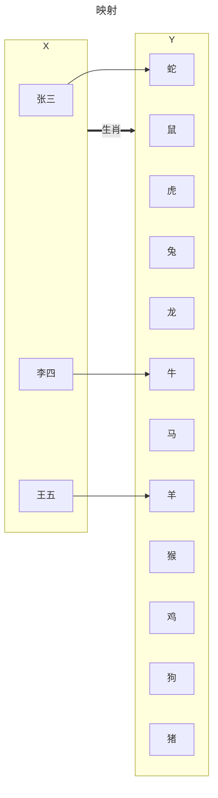

# 1 函数与极限

## 1.1 映射与函数

### 1.1.1 映射的概念

**定义：设 *X*、*Y* 是两个非空集合，如果存在一个法则 $f$，使得对 *X* 中每个元素 $x$，按法则 $f$，在 *Y* 中在唯一确定的元素 $y$ 与之对应，则称 $f$ 为从 *X* 到 *Y* 的映射，记作 $f：X→Y$**

$y$ 称为 $x$（在映射 $f$ 下）的像，并记作 $f(x)$，即 $y=f(x)$。
$x$ 称为 $y$ 的原像。

集合 *X* 称为映射 $f$ 的定义域，记作 $D_f$，即 $D_f=X$；<br/>
*X* 中所有元素的作斫组成的集合称为映射 $f$ 的值域，记作 $R_f$ 或 $f(X)$，即 $R_f=f(X)=\{ f(x)|x\in X \}$。

> [!TIP]
> 构成一个映射必须具备以下三个要素：集合 *X*，即定义域 $D_f=X$；集合 *Y*，即值域的范围：$R_f \subset Y$；对应法则 $f$，使对每个 $x\in X$，有唯一确定的 $y=f(x)$ 与之对应。<br/>
> 对每个 $x\in X$，元素 $x$ 的像 $y$ 是唯一的；而对每一个 $y\in R_f$，元素 $y$ 的原像不一定是唯一的；映射 $f$ 的值域 $R_f$ 是 $Y$ 的一个子集，即 $R_f \subset Y$，不一定 $R_f = Y$。


> [!NOTE]
> 上图中两个集合之间的法则是生肖。

### 1.1.2 映射的分类

- 单射：*X* 中任意两个不同元素 $x_1\neq x_2$，它们的像 $f(x_1)\neq f(x_2)$，则称 $f$ 为 *X* 到 *Y* 的单射。
  ```mermaid
  ---
  title: 单射
  ---
  flowchart LR
    subgraph X
      A["张三"]
      B["李四"]
      C["王五"]
    end

    subgraph Y
      E["牛"]
      I["蛇"]
      J["马"]
      K["羊"]
    end
    A --> I
    B --> E
    C --> K
    X ==生肖==> Y
  ```
- 满射：若 $R_f = Y$，即 *Y* 中任一元素 $y$ 都是 *X* 中某元素的像， 则称 $f$ 为 *X* 到 *Y* 上的映射或满射。
  ```mermaid
  ---
  title: 映射
  ---
  flowchart LR
    subgraph X
      A["张三"]
      B["李四"]
      C["王五"]
    end

    subgraph Y
      E["牛"]
      I["蛇"]
    end
    A --> I
    B --> E
    C --> I
    X ==生肖==> Y
  ```
- 双射：若映射 $f$ 是单射且满射，则称 $f$ 为一一映射或双射。
  ```mermaid
  ---
  title: 映射
  ---
  flowchart LR
    subgraph X
      A["张三"]
      B["李四"]
      C["王五"]
    end

    subgraph Y
      E["牛"]
      I["蛇"]
      K["羊"]
    end
    A --> I
    B --> E
    C --> K
    X ==生肖==> Y
  ```

### 1.1.3 逆映射下复合映射

TODO

## 1.2 数列的极限

## 1.3 函数的极限

## 1.4 无穷大与无穷小

## 1.5 极限运算法则

## 1.6 极限存在准则

## 1.7 无穷小的比较

## 1.8 函数的连续性与间断点

## 1.9 连续函数的运算与初等函数的连续性

## 1.10 闭区间上连续函数的性质