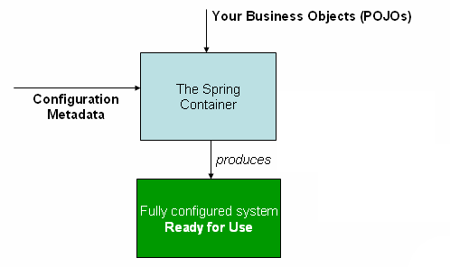

# 2.1  Spring IoC 容器

## 2.1 IoC（Inversion of Control）容器和Beans

IoC（Inversion of Control）容器是一个容器，它管理对象生命周期，并通过依赖注入的方式来注入对象之间的依赖关系。<br>
在 Spring 中，构成应用程序主干并由 Spring IoC 容器管理的对象称为 Bean。bean 是由 Spring IoC 容器实例化、组装和管理的对象。否则，Bean 只是应用程序中的众多对象之一。Bean 以及它们之间的依赖关系反映在容器使用的配置元数据中。<br>

`org.springframework.beans` 和 `org.springframework.context` 包是 Spring Framework IoC 容器的基础。`BeanFactory` 接口提供了一种高级配置机制，能够管理任何类型的对象。`ApplicationContext` 是 `BeanFactory` 的子接口。它包括：
- 更容易与 Spring 的 AOP 功能集成<br>
- 信息资源处理（用于国际化）<br>
- 事件发布和监听<br>
- 应用层特定上下文，如web应用程序中使用的 `WebApplicationContext`<br>

简而言之，`BeanFactory` 提供了配置框架和基本功能，而 `ApplicationContext` 则添加了更多企业特定功能。`ApplicationContext` 是 `BeanFactory` 的完整超集，在本章中仅用于描述 Spring 的 IoC 容器。有关使用 `BeanFactory` 代替 `ApplicationContext` 的更多信息，请参阅 BeanFactory API 章节。<br>

### 2.1.1 IoC容器概览

`org.springframework.context.ApplicationContext` 接口代表了 Spring 的 IoC 容器，它负责实例化、配置和组装 bean。容器通过读取配置元数据来获取需要实例化、配置和组装的组件的指令。配置元数据可以通过注解的组件类、带有工厂方法的配置类，或者外部的 XML 文件或 Groovy 脚本来表示。无论使用哪种格式，你都可以通过这些配置来构建你的应用程序，并定义这些组件之间丰富的依赖关系。<br>

`ApplicationContext` 接口的几种实现是 Spring 核心框架的一部分。在独立应用程序中，通常创建 `AnnotationConfigApplicationContext` 或 `ClassPathXmlApplicationContext` 的实例来使用。<br>

在大多数应用场景中，并不需要显式的用户代码来实例化一个或多个 Spring IoC 容器的实例。例如，在普通的 Web 应用场景中，只需在应用程序的 `web.xml` 文件中配置一个简单的样板 Web 描述符 XML 即可（参见 [Web 应用程序的便捷 ApplicationContext 实例化](#)）。而在 Spring Boot 场景中，应用程序上下文会根据通用的设置约定隐式地为你启动。<br>

下图展示了 Spring 工作原理的高级视图。你的应用程序类与配置元数据相结合，这样在 `ApplicationContext` 被创建并初始化之后，你就拥有了一个完全配置好且可执行的系统或应用程序。<br>



#### 2.1.1.1 配置元数据
如上图所示，Spring IoC 容器使用某种形式的配置元数据。此配置元数据表示您（作为应用程序开发人员）如何告诉 Spring 容器实例化、配置和组装应用程序中的组件。<br>

Spring IoC 容器本身与实际编写此配置元数据的格式完全解耦。如今，许多开发人员选择 [基于 Java 的配置](https://docs.spring.io/spring-framework/reference/core/beans/java.html) 来构建他们的 Spring 应用程序<br>

- [基于注解的配置](https://docs.spring.io/spring-framework/reference/core/beans/annotation-config.html)：在应用程序的组件类上使用基于注解的配置元数据定义 Bean。<br>

- 基于 Java 的配置：使用基于 Java 的配置类在应用程序类外部定义 Bean。要使用这些功能，请参阅 [@Configuration](https://docs.spring.io/spring-framework/docs/6.2.3/javadoc-api/org/springframework/context/annotation/Configuration.html)、[@Bean](https://docs.spring.io/spring-framework/docs/6.2.3/javadoc-api/org/springframework/context/annotation/Bean.html)、[@Import](https://docs.spring.io/spring-framework/docs/6.2.3/javadoc-api/org/springframework/context/annotation/Import.html) 和 [@DependsOn](https://docs.spring.io/spring-framework/docs/6.2.3/javadoc-api/org/springframework/context/annotation/DependsOn.html) 注解。<br>

Spring 配置至少包含一个，通常包含多个 Bean 定义，容器必须管理这些定义。基于 Java 的配置通常在 `@Configuration` 类中使用 `@Bean` 注解的方法，每个方法对应一个 Bean 定义。<br>

这些 Bean 定义对应于构成应用程序的实际对象。通常，您定义服务层对象、持久层对象（如存储库或数据访问对象 (DAO)）、表示层对象（如 Web 控制器）、基础架构对象（如 `JPA EntityManagerFactory`）、JMS 队列等等。通常，不会在容器中配置细粒度的域对象，因为创建和加载域对象通常是存储库和业务逻辑的职责。<br>

##### 2.1.1.1.1 XML 作为外部配置 DSL

基于 XML 的配置元数据将这些 Bean 配置为顶级 `<beans/>` 元素内的 `<bean/>` 元素。以下示例显示了基于 XML 的配置元数据的基本结构<br>
```xml
<?xml version="1.0" encoding="UTF-8"?>
<beans xmlns="http://www.springframework.org/schema/beans"
  xmlns:xsi="http://www.w3.org/2001/XMLSchema-instance"
  xsi:schemaLocation="http://www.springframework.org/schema/beans
    https://www.springframework.org/schema/beans/spring-beans.xsd">

  <bean id[^1]="..." class[^2]="...">
    <!-- collaborators and configuration for this bean go here -->
  </bean>

  <bean id="..." class="...">
    <!-- collaborators and configuration for this bean go here -->
  </bean>

  <!-- more bean definitions go here -->

</beans>
```
[^1]: `id` 属性是一个字符串，用于标识单个 Bean 定义。<br>
[^2]: `class` 属性定义 Bean 的类型，并使用完全限定的类名。<br>

`id` 属性的值可用于引用协作对象。此示例中未显示引用协作对象的 XML。有关更多信息，请参阅 [依赖项](https://docs.spring.io/spring-framework/reference/core/beans/dependencies.html)。<br>

要实例化容器，需要将 XML 资源文件的路径或路径提供给 `ClassPathXmlApplicationContext` 构造函数，以便让容器从各种外部资源加载配置元数据，例如本地文件系统、Java `CLASSPATH` 等。<br>
```java
ApplicationContext context = new ClassPathXmlApplicationContext("services.xml", "daos.xml");
```

>在您了解了 Spring 的 IoC 容器之后，您可能希望进一步了解 Spring 的 `Resource` 抽象（如 [资源](https://docs.spring.io/spring-framework/reference/core/resources.html) 中所述），它提供了一种方便的机制，用于从 URI 语法中定义的位置读取 InputStream。特别是，`Resource` 路径用于构建应用程序上下文，如 [应用程序上下文和资源路径](https://docs.spring.io/spring-framework/reference/core/resources.html#resources-app-ctx) 中所述。<br>

以下示例显示了服务层对象 (`services.xml`) 配置文件
```xml
<?xml version="1.0" encoding="UTF-8"?>
<beans xmlns="http://www.springframework.org/schema/beans"
  xmlns:xsi="http://www.w3.org/2001/XMLSchema-instance"
  xsi:schemaLocation="http://www.springframework.org/schema/beans
    https://www.springframework.org/schema/beans/spring-beans.xsd">

  <!-- services -->

  <bean id="petStore" class="org.springframework.samples.jpetstore.services.PetStoreServiceImpl">
    <property name="accountDao" ref="accountDao"/>
    <property name="itemDao" ref="itemDao"/>
    <!-- additional collaborators and configuration for this bean go here -->
  </bean>

  <!-- more bean definitions for services go here -->

</beans>
```

以下示例显示了数据访问对象 `daos.xml` 文件
```xml
<?xml version="1.0" encoding="UTF-8"?>
<beans xmlns="http://www.springframework.org/schema/beans"
  xmlns:xsi="http://www.w3.org/2001/XMLSchema-instance"
  xsi:schemaLocation="http://www.springframework.org/schema/beans
    https://www.springframework.org/schema/beans/spring-beans.xsd">

  <bean id="accountDao"
    class="org.springframework.samples.jpetstore.dao.jpa.JpaAccountDao">
    <!-- additional collaborators and configuration for this bean go here -->
  </bean>

  <bean id="itemDao" class="org.springframework.samples.jpetstore.dao.jpa.JpaItemDao">
    <!-- additional collaborators and configuration for this bean go here -->
  </bean>

  <!-- more bean definitions for data access objects go here -->

</beans>
```

在前面的示例中，服务层由 `PetStoreServiceImpl` 类和两种类型的数据访问对象 `JpaAccountDao` 和 `JpaItemDao` 组成（基于 JPA 对象关系映射标准）。`property name` 元素引用 JavaBean 属性的名称，ref 元素引用另一个 Bean 定义的名称。`id` 和 `ref` 元素之间的这种关联表达了协作对象之间的依赖关系。有关配置对象依赖关系的详细信息，请参阅 [依赖项](https://docs.spring.io/spring-framework/reference/core/beans/dependencies.html)。<br>

##### 2.1.1.1.2 组合基于 XML 的配置元数据

将 Bean 定义跨越多个 XML 文件可能很有用。通常，每个单独的 XML 配置文件表示体系结构中的逻辑层或模块。<br>

您可以使用 `ClassPathXmlApplicationContext` 构造函数从 XML 片段加载 Bean 定义。此构造函数采用多个 Resource 位置，如 上一节 中所示。或者，使用 `<import/>` 元素的一个或多个实例从另一个文件或文件加载 Bean 定义。以下示例演示了如何执行此操作<br>
```xml
<beans>
  <import resource="services.xml"/>
  <import resource="resources/messageSource.xml"/>
  <import resource="/resources/themeSource.xml"/>

  <bean id="bean1" class="..."/>
  <bean id="bean2" class="..."/>
</beans>
```

在前面的示例中，外部 Bean 定义从三个文件加载：`services.xml`、`messageSource.xml` 和 `themeSource.xml`。所有位置路径都相对于执行导入的文件，因此 `services.xml` 必须与执行导入的文件位于同一目录或类路径位置，而 `messageSource.xml` 和 `themeSource.xml` 必须位于导入文件位置下的 `resources` 位置。如您所见，开头的斜杠将被忽略。但是，鉴于这些路径是相对的，最好根本不使用斜杠。根据 Spring 架构，被导入的文件的内容（包括顶级 `<beans/>` 元素）必须是有效的 XML Bean 定义。<br>

>注意：可以使用相对路径“`../`”引用父目录中的文件，但这不建议这样做。这样做会创建对应用程序外部文件的依赖关系。特别是，不建议对 `classpath: URL` 使用此引用（例如，`classpath:../services.xml`），因为运行时解析过程会选择“最近的”类路径根，然后查看其父目录。类路径配置更改可能导致选择不同的错误目录。<br>
您可以始终使用完全限定的资源位置代替相对路径：例如，`file:C:/config/services.xml` 或 `classpath:/config/services.xml`。但是，请注意，您正在将应用程序的配置与特定的绝对位置耦合。通常，最好为这些绝对位置保留一个间接层——例如，通过在运行时相对于 JVM 系统属性解析的“`${…​}`”占位符。<br>

命名空间本身提供了 `import` 指令功能。除了普通 Bean 定义之外，Spring 提供的 XML 命名空间选择中还提供了其他配置功能——例如，`context` 和 `util` 命名空间。<br>

##### 2.1.1.1.3 Groovy Bean 定义 DSL

作为外部化配置元数据的另一个示例，Bean 定义也可以用 Spring 的 Groovy Bean 定义 DSL 表示，如 Grails 框架中所知。通常，此类配置位于“.groovy”文件中，结构如下例所示<br>
```groovy
beans {
  dataSource(BasicDataSource) {
    driverClassName = "org.hsqldb.jdbcDriver"
    url = "jdbc:hsqldb:mem:grailsDB"
    username = "sa"
    password = ""
    settings = [mynew:"setting"]
  }
  sessionFactory(SessionFactory) {
    dataSource = dataSource
  }
  myService(MyService) {
    nestedBean = { AnotherBean bean ->
      dataSource = dataSource
    }
  }
}
```

这种配置风格在很大程度上等同于 XML Bean 定义，甚至支持 Spring 的 XML 配置命名空间。它还允许通过 `importBeans` 指令导入 XML Bean 定义文件。<br>

#### 2.1.1.2 使用容器

`ApplicationContext` 是高级工厂的接口，能够维护不同 Bean 及其依赖项的注册表。通过使用 `T getBean(String name, Class<T> requiredType)` 方法，您可以检索 Bean 的实例。<br>

`ApplicationContext` 允许您读取 Bean 定义并访问它们，如下例所示<br>
```java
// create and configure beans
ApplicationContext context = new ClassPathXmlApplicationContext("services.xml", "daos.xml");

// retrieve configured instance
PetStoreService service = context.getBean("petStore", PetStoreService.class);

// use configured instance
List<String> userList = service.getUsernameList();
```

使用 Groovy 配置，引导过程看起来非常相似。它具有不同的上下文实现类，该类支持 Groovy（但也理解 XML Bean 定义）。以下示例显示了 Groovy 配置<br>
```java
ApplicationContext context = new GenericGroovyApplicationContext("services.groovy", "daos.groovy");
```

最灵活的变体是 `GenericApplicationContext` 结合读取器委托——例如，对于 XML 文件使用 `XmlBeanDefinitionReader`，如下例所示<br>
```java
GenericApplicationContext context = new GenericApplicationContext();
new XmlBeanDefinitionReader(context).loadBeanDefinitions("services.xml", "daos.xml");
context.refresh();
```

您也可以使用 `GroovyBeanDefinitionReader` 用于 Groovy 文件，如下例所示<br>
```java
GenericApplicationContext context = new GenericApplicationContext();
new GroovyBeanDefinitionReader(context).loadBeanDefinitions("services.groovy", "daos.groovy");
context.refresh();
```

您可以在同一个 `ApplicationContext` 上混合和匹配这些读取器委托，从不同的配置源读取 Bean 定义。<br>

然后，您可以使用 `getBean` 检索 Bean 的实例。`ApplicationContext` 接口有一些其他方法可以检索 Bean，但理想情况下，您的应用程序代码永远不应该使用它们。实际上，您的应用程序代码根本不应该调用 `getBean()` 方法，因此根本不应该依赖于 Spring API。例如，Spring 与 Web 框架的集成为各种 Web 框架组件（如控制器和 JSF 托管 Bean）提供了依赖注入，允许您通过元数据（如自动装配注解）声明对特定 Bean 的依赖关系。<br>

### 2.1.2 Bean概览

Spring IoC 容器管理一个或多个 Bean。这些 Bean 使用您提供给容器的配置元数据创建（例如，以 XML `<bean/>` 定义的形式）。

在容器本身中，这些 Bean 定义表示为`BeanDefinition` 对象，其中包含（除其他信息外）以下元数据：

包限定类名：通常是正在定义的 Bean 的实际实现类。

Bean 行为配置元素，说明 Bean 应如何在容器中运行（范围、生命周期回调等）。

Bean 完成其工作所需的其它 Bean 的引用。这些引用也称为协作者或依赖项。

在新建对象中设置的其他配置设置——例如，管理连接池的 Bean 中池的大小限制或要使用的连接数。

此元数据转换为构成每个 Bean 定义的一组属性。下表描述这些属性：<br>
|属性|解释于…|
|:---|:---|
|类|[实例化 Bean](https://docs.spring.io/spring-framework/reference/core/beans/definition.html#beans-factory-class)|
|名称|[命名 Bean](https://docs.spring.io/spring-framework/reference/core/beans/definition.html#beans-beanname)|
|范围|[Bean作用域](https://docs.spring.io/spring-framework/reference/core/beans/factory-scopes.html)|
|构造函数参数|[依赖注入](https://docs.spring.io/spring-framework/reference/core/beans/dependencies/factory-collaborators.html)|
|属性|[依赖注入](https://docs.spring.io/spring-framework/reference/core/beans/dependencies/factory-collaborators.html)|
|自动装配模式|[自动装配协作者](https://docs.spring.io/spring-framework/reference/core/beans/dependencies/factory-autowire.html)|
|延迟初始化模式|[延迟初始化Bean](https://docs.spring.io/spring-framework/reference/core/beans/dependencies/factory-lazy-init.html)|
|初始化方法|[初始化回调](https://docs.spring.io/spring-framework/reference/core/beans/factory-nature.html#beans-factory-lifecycle-initializingbean)|
|销毁方法|[销毁回调](https://docs.spring.io/spring-framework/reference/core/beans/factory-nature.html#beans-factory-lifecycle-disposablebean)|

除了包含有关如何创建特定 Bean 的信息的 Bean 定义外，`ApplicationContext` 实现还允许注册在容器外部（由用户）创建的现有对象。这是通过通过`getBeanFactory()` 方法访问 `ApplicationContext` 的 `BeanFactory` 来完成的，该方法返回`DefaultListableBeanFactory` 实现。`DefaultListableBeanFactory` 通过`registerSingleton(..)` 和`registerBeanDefinition(..)` 方法支持此注册。但是，典型的应用程序仅使用通过常规 Bean 定义元数据定义的 Bean。<br>

>注意：Bean 元数据和手动提供的单例实例需要尽早注册，以便容器在自动装配和其他内省步骤期间正确地推断它们。虽然在某种程度上支持覆盖现有元数据和现有单例实例，但运行时注册新 Bean（与对工厂的实时访问同时）并未正式支持，并且可能导致并发访问异常、Bean 容器中的状态不一致或两者兼而有之。<br>

#### 2.1.2.1 ~~重写Bean~~

当使用已分配的标识符注册 Bean 时，会发生 Bean 重写。虽然可以重写 Bean，但这会使配置更难阅读。<br>

>警告：Bean 重写将在未来的版本中被弃用。<br>

要完全禁用 Bean 重写，可以在刷新`ApplicationContext` 之前将其`allowBeanDefinitionOverriding`标志设置为`false`。在这种设置中，如果使用 Bean 重写，则会抛出异常。<br>

默认情况下，容器会以INFO级别记录每次尝试重写 Bean 的情况，以便您可以相应地调整配置。虽然不推荐，但您可以通过将`allowBeanDefinitionOverriding`标志设置为`true`来取消这些日志的输出。<br>

如果使用 Java 配置，只要@Bean方法的返回类型与该 Bean 类匹配，相应的`@Bean`方法始终会默默地用与 Bean 组件名称相同的组件名称覆盖扫描到的 Bean 类。这意味着容器将调用@Bean工厂方法，而不是 Bean 类上的任何预先声明的构造函数。<br>

>注意：我们承认在测试场景中重写 Bean 很方便，并且从 Spring Framework 6.2 开始对此提供了明确的支持。请参阅[本节](https://docs.spring.io/spring-framework/reference/testing/testcontext-framework/bean-overriding.html)了解更多详细信息。<br>

#### 2.1.2.2 命名 Bean

每个 Bean 都有一个或多个标识符。这些标识符在托管 Bean 的容器中必须唯一。Bean 通常只有一个标识符。但是，如果它需要多个标识符，则额外的标识符可以被视为别名。<br>

在基于 XML 的配置元数据中，您可以使用`id`属性、`name`属性或两者来指定 Bean 标识符。`id`属性允许您精确指定一个`id`。按照惯例，这些名称是字母数字的（`'myBean'`、`'someService'` 等），但它们也可以包含特殊字符。如果您想为 Bean 引入其他别名，您也可以在name属性中指定它们，用逗号 (`,`)、分号 (`;`) 或空格分隔。虽然`id`属性定义为`xsd:string`类型，但 Bean 的`id`唯一性由容器强制执行，而不是由 XML 解析器强制执行。<br>

您不需要为 Bean 提供`name`或`id`。如果您没有显式提供`name`或`id`，容器将为该 Bean 生成一个唯一的名称。但是，如果您想通过名称引用该 Bean，通过使用`ref`元素或服务定位器样式查找，则必须提供名称。不提供名称的动机与使用[内部 Bean](https://docs.spring.io/spring-framework/reference/core/beans/dependencies/factory-properties-detailed.html#beans-inner-beans)和[自动装配协作者](https://docs.spring.io/spring-framework/reference/core/beans/dependencies/factory-autowire.html)有关。<br>

>##### 2.1.2.2.1 Bean 命名约定
>约定是在命名 Bean 时使用标准 Java 约定作为实例字段名称。也就是说，Bean 名称以小写字母开头，然后使用驼峰命名法。此类名称的示例包括`accountManager`、`accountService`、`userDao`、`loginController`等等。<br>
>一致地命名 Bean 使您的配置更易于阅读和理解。此外，如果您使用 Spring AOP，则在根据名称应用建议到一组 Bean 时，这将非常有帮助。

>注意：使用类路径中的组件扫描，Spring 为未命名的组件生成 Bean 名称，遵循前面描述的规则：基本上，采用简单的类名并将它的第一个字符转换为小写。但是，在（不常见）特殊情况下，如果存在多个字符并且第一个和第二个字符都是大写，则会保留原始大小写。这些规则与`java.beans.Introspector.decapitalize`（Spring 在此处使用）中定义的规则相同。<br>

##### 2.1.2.2.2 在 Bean 定义之外为 Bean 设置别名

在 Bean 定义本身中，您可以通过结合使用`id`属性指定的一个名称和`name`属性中的任意数量的其他名称来为 Bean 提供多个名称。这些名称可以是同一个 Bean 的等效别名，并且对某些情况有用，例如让应用程序中的每个组件都使用特定于该组件本身的 Bean 名称来引用公共依赖项。<br>

然而，仅仅指定 bean 实际定义所在的所有别名并不总是足够的。有时需要为在其他地方定义的 bean 引入别名。在大型系统中，配置分散在各个子系统中，每个子系统都有自己的一组对象定义，这种情况很常见。在基于 XML 的配置元数据中，可以使用`<alias/>` 元素来实现此目的。以下示例演示了如何操作。<br>
```xml
<alias name="fromName" alias="toName"/>
```

在这种情况下，名为`fromName` 的 bean（在同一个容器中）在使用此别名定义后，也可以被称为`toName`。<br>

例如，子系统 A 的配置元数据可能将数据源称为`subsystemA-dataSource`。子系统 B 的配置元数据可能将数据源称为`subsystemB-dataSource`。在组合使用这两个子系统的主应用程序时，主应用程序将数据源称为`myApp-dataSource`。为了使所有三个名称都指向同一个对象，可以将以下别名定义添加到配置元数据中。<br>
```xml
<alias name="myApp-dataSource" alias="subsystemA-dataSource"/>
<alias name="myApp-dataSource" alias="subsystemB-dataSource"/>
```
现在，每个组件和主应用程序都可以通过一个唯一且保证不会与任何其他定义冲突的名称（有效地创建命名空间）来引用 dataSource，但它们都引用同一个 bean。<br>

>##### Java 配置
>如果使用 Java 配置，则可以使用`@Bean` 注解来提供别名。有关详细信息，请参阅[使用`@Bean` 注解](https://docs.spring.io/spring-framework/reference/core/beans/java/bean-annotation.html)。<br>

#### 2.1.2.3 实例化 Bean

bean 定义本质上是创建一个或多个对象的配方。容器在被请求时查看命名 bean 的配方，并使用该 bean 定义封装的配置元数据来创建（或获取）实际对象。<br>

如果使用基于 XML 的配置元数据，则在`<bean/>` 元素的`class` 属性中指定要实例化的对象类型（或类）。此`class` 属性（在内部，它是`BeanDefinition` 实例上的`Class` 属性）通常是必需的。（有关例外情况，请参阅[使用实例工厂方法实例化](https://docs.spring.io/spring-framework/reference/core/beans/definition.html#beans-factory-class-instance-factory-method) 和[Bean 定义继承](https://docs.spring.io/spring-framework/reference/core/beans/child-bean-definitions.html)。）您可以通过两种方式之一使用`Class` 属性。<br>

通常，在容器本身通过反射调用其构造函数直接创建 bean 的情况下指定要构造的 bean 类，这有点类似于使用`new` 运算符的 Java 代码。<br>

在不太常见的情况下，指定包含要调用以创建 bean 的`static` 工厂方法的实际类。从调用`static` 工厂方法返回的对象类型可能是同一个类或完全不同的类。<br>

>##### 嵌套类名
>如果要为嵌套类配置 bean 定义，可以使用嵌套类的二进制名称或源名称。<br>
>例如，如果在`com.example` 包中有一个名为`SomeThing` 的类，并且这个`SomeThing` 类有一个名为`OtherThing` 的`static` 嵌套类，则它们可以用美元符号 (`$`) 或点 (`.`) 分隔。因此，bean 定义中`class `属性的值将是`com.example.SomeThing$OtherThing` 或`com.example.SomeThing.OtherThing`。<br>

##### 2.1.2.3.1 使用构造函数实例化

当通过构造函数方法创建 bean 时，Spring 可以使用和兼容所有普通类。也就是说，正在开发的类不需要实现任何特定接口或以特定方式进行编码。只需指定 bean 类就足够了。但是，根据为此特定 bean 使用的 IoC 类型，您可能需要一个默认（空）构造函数。<br>

Spring IoC 容器可以管理您想要管理的几乎任何类。它不限于管理真正的 JavaBean。大多数 Spring 用户更喜欢实际的 JavaBean，它们只有一个默认（无参数）构造函数和根据容器中的属性建模的适当的 setter 和 getter。您也可以在容器中使用更奇特的非 bean 风格的类。例如，如果您需要使用绝对不符合 JavaBean 规范的旧版连接池，Spring 也可以管理它。<br>

使用基于 XML 的配置元数据，您可以按如下方式指定 bean 类。<br>
```xml
<bean id="exampleBean" class="examples.ExampleBean"/>

<bean name="anotherExample" class="examples.ExampleBeanTwo"/>
```

有关向构造函数提供参数（如果需要）以及在构造对象后设置对象实例属性的机制的详细信息，请参阅[注入依赖项](https://docs.spring.io/spring-framework/reference/core/beans/dependencies/factory-collaborators.html)。<br>

>在构造函数参数的情况下，容器可以在多个重载构造函数中选择相应的构造函数。也就是说，为了避免歧义，建议尽可能保持构造函数签名简单明了。<br>

##### 2.1.2.3.2 使用静态工厂方法实例化

在定义使用静态工厂方法创建的 bean 时，使用`class` 属性指定包含`static` 工厂方法的类，并使用名为`factory-method` 的属性指定工厂方法本身的名称。您应该能够调用此方法（使用可选参数，如下所述）并返回一个活动对象，随后将其视为通过构造函数创建的对象。这种 bean 定义的一种用途是调用旧版代码中的`static` 工厂。<br>

以下 bean 定义指定将通过调用工厂方法来创建 bean。该定义没有指定返回对象的类型（类），而是指定包含工厂方法的类。在此示例中，`createInstance()` 方法必须是`static` 方法。以下示例显示了如何指定工厂方法。<br>
```xml
<bean id="clientService"
  class="examples.ClientService"
  factory-method="createInstance"/>
```

以下示例显示了一个与前面的 bean 定义一起使用的类。<br>
```java
public class ClientService {
  private static ClientService clientService = new ClientService();
  private ClientService() {}

  public static ClientService createInstance() {
    return clientService;
  }
}
```

有关向工厂方法提供（可选）参数以及从工厂返回对象后设置对象实例属性的机制的详细信息，请参阅[依赖项和配置详解](https://docs.spring.io/spring-framework/reference/core/beans/dependencies/factory-properties-detailed.html)。<br>

>注意：在工厂方法参数的情况下，容器可以在同名多个重载方法中选择相应的方法。也就是说，为了避免歧义，建议尽可能保持工厂方法签名简单明了。<br>

>提示：工厂方法重载的一个典型问题案例是 `Mockito` 及其许多`mock` 方法的重载。选择尽可能具体的`mock` 变体。
>```xml
><bean id="clientService" class="org.mockito.Mockito" factory-method="mock">
>	<constructor-arg type="java.lang.Class" value="examples.ClientService"/>
>	<constructor-arg type="java.lang.String" value="clientService"/>
></bean>
>```

##### 2.1.2.3.3 使用实例工厂方法实例化

与通过[静态工厂方法](https://docs.spring.io/spring-framework/reference/core/beans/definition.html#beans-factory-class-static-factory-method) 实例化类似，使用实例工厂方法实例化会调用容器中现有 bean 的非静态方法来创建一个新的 bean。要使用此机制，请将`class` 属性留空，并在`factory-bean` 属性中指定当前（或父级或祖先）容器中包含要调用以创建对象的实例方法的 bean 的名称。使用`factory-method` 属性设置工厂方法本身的名称。以下示例显示了如何配置这样的 bean。<br>
```xml
<!-- the factory bean, which contains a method called createClientServiceInstance() -->
<bean id="serviceLocator" class="examples.DefaultServiceLocator">
  <!-- inject any dependencies required by this locator bean -->
</bean>

<!-- the bean to be created via the factory bean -->
<bean id="clientService"
  factory-bean="serviceLocator"
  factory-method="createClientServiceInstance"/>
```

以下示例显示了相应的类。<br>
```java
public class DefaultServiceLocator {

  private static ClientService clientService = new ClientServiceImpl();

  public ClientService createClientServiceInstance() {
    return clientService;
  }
}
```

一个工厂类还可以包含多个工厂方法，如下例所示。<br>
```xml
<bean id="serviceLocator" class="examples.DefaultServiceLocator">
  <!-- inject any dependencies required by this locator bean -->
</bean>

<bean id="clientService"
  factory-bean="serviceLocator"
  factory-method="createClientServiceInstance"/>

<bean id="accountService"
  factory-bean="serviceLocator"
  factory-method="createAccountServiceInstance"/>
```

以下示例显示了相应的类。<br>
```java
public class DefaultServiceLocator {

  private static ClientService clientService = new ClientServiceImpl();

  private static AccountService accountService = new AccountServiceImpl();

  public ClientService createClientServiceInstance() {
    return clientService;
  }

  public AccountService createAccountServiceInstance() {
    return accountService;
  }
}
```

此方法表明工厂 bean 本身可以通过依赖注入 (DI) 进行管理和配置。请参阅[依赖项和配置详解](https://docs.spring.io/spring-framework/reference/core/beans/dependencies/factory-properties-detailed.html)。<br>

>注意：在 Spring 文档中，“工厂 bean”是指在 Spring 容器中配置的 bean，它通过[实例](https://docs.spring.io/spring-framework/reference/core/beans/definition.html#beans-factory-class-instance-factory-method)或[静态](https://docs.spring.io/spring-framework/reference/core/beans/definition.html#beans-factory-class-static-factory-method)工厂方法创建对象。相反，`FactoryBean`（注意大写）是指 Spring 特定的[`FactoryBean`](https://docs.spring.io/spring-framework/reference/core/beans/factory-extension.html#beans-factory-extension-factorybean) 实现类。<br>

##### 2.1.2.3.4 确定 Bean 的运行时类型

确定特定 bean 的运行时类型并非易事。bean 元数据定义中指定的类只是一个初始类引用，可能与声明的工厂方法相结合，或者是一个`FactoryBean` 类，这可能导致 bean 的运行时类型不同，或者在实例级工厂方法的情况下根本没有设置（通过指定的`factory-bean` 名称解析）。此外，AOP 代理可能会用基于接口的代理包装 bean 实例，而仅限于显示目标 bean 的实际类型（只是其实现的接口）。<br>

查找特定 bean 的实际运行时类型的推荐方法是对指定 bean 名称进行`BeanFactory.getType` 调用。这将考虑上述所有情况，并返回`BeanFactory.getBean` 调用对同一 bean 名称将返回的对象类型。<br>

#### 2.1.2.4 配置Bean的方式
01. **XML配置**<br>
  ```xml
  <bean id="user" class="com.example.User">
  ```
02. **注解配置**
  - `@Component`注解<br>
    必须写在类上，然后使用`@ComponentScan`注解进行扫描，并使用`@Autowired`注解进行注入<br>
    `@Component`的子类：
    - `@Repository`
    - `@Service`
    - `@Controller`
    - `@Configuration`

  - `@Bean`注解<br>
    写在类方法中，使用`@Bean`注解进行配置，并使用`@Configuration`注解进行配置<br>
    ```java
    @Configuration
    public class Config {
      @Bean
      public User user(){
        return new User();
      }
    }
    ```
    使用对应的Bean注入到对应的类中，并使用`@Autowired`注解进行注入<br>
    ```java
    @Autowired
    public User user;
    user.setName("张三");
    ```
    >注意：`@Bean`放在`@Configuration`注解的类中，在使用对应的Bean时，这个Bean只能被实例化一次。当一个`@Bean`方法在调用这个Bean时，spring会先在容器中寻找实例化过的Bean对应的对象。<br>
    >注意：`@Bean`放在`@Component`注解的类中，当一个`@Bean`方法在调用这个Bean时，这个Bean方法会被当做普通方法，可以被多次调用，因此实例化多次。<br>

    `@Bean`比`@Component`更加灵活，可以控制Bean的实例化次数，可以控制Bean的实例化顺序，可以控制Bean的销毁方法。<br>

  - `@Import`注解<br>
    `@Import`必须写在类上，这个被标记的类必须是一个Bean，否则不起作用。
    `@Import`注解用于导入其他配置类，可以将多个配置类合并为一个配置类。<br>
    - `@Import`普通类<br>
      ```java
      @Configuration
      @Import(Config.class)
      public class AppConfig {}
      ```
      ```java
      public class Config {}
      ```

    - `@Import`实现`ImportSelector`接口的类<br>
      定义类实现`ImportSelector`接口，并重写`selectImports`方法，返回需要导入Bean的类路径字串数组。批量注入Bean<br>
      ```java
      public class MyImportSelector implements ImportSelector {
        @Override
        public String[] selectImports(AnnotationMetadata importingClassMetadata) {
          return new String[]{"com.example.Config", "com.example.User"};
        }
      }
      ```
      ```java
      @Configuration
      @Import(MyImportSelector.class)
      public class AppConfig {}
      ```
  - `@Import`导入实现`ImportBeanDefinitionRegistrar`接口的类<br>
      定义类实现`ImportBeanDefinitionRegistrar`接口，并重写`registerBeanDefinitions`方法<br>
      ```java
      public class MyImportBeanDefinitionRegistrar implements ImportBeanDefinitionRegistrar {
        @Override
        public void registerBeanDefinitions(AnnotationMetadata importingClassMetadata, BeanDefinitionRegistry registry) {
          registry.registerBeanDefinition("user", BeanDefinitionBuilder.rootBeanDefinition(User.class).getBeanDefinition());
        }
      }
      ```
      ```java
      @Configuration
      @Import(MyImportBeanDefinitionRegistrar.class)
      public class AppConfig {}
      ```

### 2.1.3 依赖

一个典型的企业应用程序并非只由单个对象（或者在Spring术语中称为Bean）构成。即使是最简单的应用程序，也包含一些协同工作以呈现最终用户所看到的连贯应用程序的几个对象。下一节将解释如何从定义许多独立存在的Bean定义过渡到一个完全实现的应用程序，其中对象协同工作以实现目标。<br>

#### 2.1.3.1 依赖注入

依赖注入 (DI) 是一种过程，对象仅通过构造函数参数、工厂方法的参数或在对象实例构造后或从工厂方法返回后设置在其对象实例上的属性来定义其依赖项（即，与其一起工作的其他对象）。然后，容器在创建 Bean 时注入这些依赖项。此过程从根本上是 Bean 本身控制其依赖项的实例化或位置的反向过程（因此称为控制反转），方法是使用类的直接构造或服务定位器模式。<br>

使用 DI 原则可以使代码更简洁，并且当向对象提供其依赖项时，解耦更加有效。对象不查找其依赖项，也不了解依赖项的位置或类。因此，您的类更容易进行测试，尤其是在依赖项是接口或抽象基类时，这允许在单元测试中使用存根或模拟实现。<br>

DI 存在两种主要变体：[基于构造函数的依赖注入](https://docs.spring.io/spring-framework/reference/core/beans/dependencies/factory-collaborators.html#beans-constructor-injection) 和 [基于 Setter 的依赖注入](https://docs.spring.io/spring-framework/reference/core/beans/dependencies/factory-collaborators.html#beans-setter-injection)。<br>

##### 2.1.3.1.1 基于构造函数的依赖注入

基于构造函数的 DI 是通过容器调用具有多个参数的构造函数来实现的，每个参数代表一个依赖项。使用特定参数调用静态工厂方法来构造 Bean 几乎等效，本讨论将构造函数和静态工厂方法的参数视为类似。以下示例显示了一个只能通过构造函数注入进行依赖注入的类。<br>
```java
public class SimpleMovieLister {

  // the SimpleMovieLister has a dependency on a MovieFinder
  private final MovieFinder movieFinder;

  // a constructor so that the Spring container can inject a MovieFinder
  public SimpleMovieLister(MovieFinder movieFinder) {
    this.movieFinder = movieFinder;
  }

  // business logic that actually uses the injected MovieFinder is omitted...
}
```
请注意，此类没有任何特殊之处。它是一个 POJO，不依赖于特定于容器的接口、基类或注释。<br>

###### 构造函数参数解析

构造函数参数解析匹配是通过使用参数的类型来完成的。如果 Bean 定义的构造函数参数不存在潜在的歧义，则 Bean 定义中定义构造函数参数的顺序就是这些参数在实例化 Bean 时提供给相应构造函数的顺序。考虑以下类：<br>
```java
package x.y;

public class ThingOne {

  public ThingOne(ThingTwo thingTwo, ThingThree thingThree) {
    // ...
  }
}
```

假设`ThingTwo`和`ThingThree`类之间没有继承关系，则不存在潜在的歧义。因此，以下配置可以正常工作，您不需要在`<constructor-arg/>`元素中显式指定构造函数参数索引或类型。<br>
```xml
<beans>
  <bean id="beanOne" class="x.y.ThingOne">
    <constructor-arg ref="beanTwo"/>
    <constructor-arg ref="beanThree"/>
  </bean>

  <bean id="beanTwo" class="x.y.ThingTwo"/>

  <bean id="beanThree" class="x.y.ThingThree"/>
</beans>
```

当引用另一个 Bean 时，类型是已知的，并且可以进行匹配（如前面的示例所示）。当使用简单类型时，例如`<value>true</value>`，Spring 无法确定值的类型，因此无法在没有帮助的情况下按类型匹配。考虑以下类：<br>
```java
package examples;

public class ExampleBean {

  // Number of years to calculate the Ultimate Answer
  private final int years;

  // The Answer to Life, the Universe, and Everything
  private final String ultimateAnswer;

  public ExampleBean(int years, String ultimateAnswer) {
    this.years = years;
    this.ultimateAnswer = ultimateAnswer;
  }
}
```

**1. 构造函数参数类型匹配**

在上述情况下，如果通过`type`属性显式指定构造函数参数的类型，则容器可以使用简单类型的类型匹配，如下例所示：<br>
```xml
<bean id="exampleBean" class="examples.ExampleBean">
  <constructor-arg type="int" value="7500000"/>
  <constructor-arg type="java.lang.String" value="42"/>
</bean>
```

**2. 构造函数参数索引**

您可以使用`index`属性显式指定构造函数参数的索引，如下例所示：<br>
```xml
<bean id="exampleBean" class="examples.ExampleBean">
  <constructor-arg index="0" value="7500000"/>
  <constructor-arg index="1" value="42"/>
</bean>
```

除了解决多个简单值的歧义外，指定索引还可以解决构造函数具有两个相同类型参数的情况下的歧义。<br>

>注意：索引为基于 0 的。<br>

**3. 构造函数参数名称**

您还可以使用构造函数参数名称来消除值的歧义，如下例所示：<br>
```xml
<bean id="exampleBean" class="examples.ExampleBean">
  <constructor-arg name="years" value="7500000"/>
  <constructor-arg name="ultimateAnswer" value="42"/>
</bean>
```

请记住，为了使此功能开箱即用，您的代码必须启用`-parameters`标志进行编译，以便 Spring 可以从构造函数中查找参数名称。如果您不能或不想使用`-parameters`标志编译代码，则可以使用`@ConstructorProperties `JDK 注解来显式命名构造函数参数。示例类将必须如下所示：<br>
```java
package examples;

public class ExampleBean {

  // Fields omitted

  @ConstructorProperties({"years", "ultimateAnswer"})
  public ExampleBean(int years, String ultimateAnswer) {
    this.years = years;
    this.ultimateAnswer = ultimateAnswer;
  }
}
```

##### 2.1.3.1.2 基于 Setter 的依赖注入

基于 Setter 的依赖注入 (DI) 是通过容器在调用无参数构造函数或无参数`static`工厂方法实例化 Bean 后，调用 Bean 上的 Setter 方法来实现的。<br>

以下示例显示了一个只能通过使用纯 Setter 注入进行依赖注入的类。这个类是传统的 Java 类。它是一个 POJO，不依赖于容器特定的接口、基类或注解。<br>
```java
public class SimpleMovieLister {

  // the SimpleMovieLister has a dependency on the MovieFinder
  private MovieFinder movieFinder;

  // a setter method so that the Spring container can inject a MovieFinder
  public void setMovieFinder(MovieFinder movieFinder) {
    this.movieFinder = movieFinder;
  }

  // business logic that actually uses the injected MovieFinder is omitted...
}
```

`ApplicationContext` 支持其管理的 Bean 的基于构造函数和基于 Setter 的 DI。它还支持在某些依赖项已通过构造函数方法注入后进行基于 Setter 的 DI。您可以通过`BeanDefinition` 的形式配置依赖项，并结合使用`PropertyEditor` 实例将属性从一种格式转换为另一种格式。但是，大多数 Spring 用户不会直接（即以编程方式）使用这些类，而是使用 XML bean 定义、带注解的组件（即用`@Component`、`@Controller` 等注解的类）或基于 Java 的`@Configuration` 类中的`@Bean` 方法。然后，这些源会在内部转换为`BeanDefinition` 实例，并用于加载整个 Spring IoC 容器实例。<br>

>##### 基于构造函数的 DI 还是基于 Setter 的 DI？
>由于您可以混合使用基于构造函数和基于 Setter 的 DI，因此一个好的经验法则是：对强制依赖项使用构造函数，对可选依赖项使用 Setter 方法或配置方法。请注意，在 Setter 方法上使用[`@Autowired`](https://docs.spring.io/spring-framework/reference/core/beans/annotation-config/autowired.html) 注解可以使属性成为必需的依赖项；但是，更建议使用构造函数注入并对参数进行编程验证。<br>
>Spring 团队通常建议使用构造函数注入，因为它允许您将应用程序组件实现为不可变对象，并确保必需的依赖项不为`null`。此外，构造函数注入的组件始终以完全初始化的状态返回给客户端（调用）代码。顺便提一句，大量的构造函数参数是一种不好的代码味道，这意味着该类可能承担了过多的责任，应该进行重构以更好地解决关注点的适当分离。<br>
>Setter 注入主要应仅用于可以在类中分配合理默认值的可选依赖项。否则，代码在使用依赖项的任何地方都必须执行非空检查。Setter 注入的一个好处是，Setter 方法使该类的对象能够在以后重新配置或重新注入。因此，通过[JMX MBean](https://docs.spring.io/spring-framework/reference/integration/jmx.html) 进行管理是 Setter 注入的一个引人注目的用例。<br>
>使用对特定类最合适的 DI 样式。有时，在处理您没有源代码的第三方类时，选择会由您自己决定。例如，如果第三方类不公开任何 Setter 方法，则构造函数注入可能是唯一可用的 DI 形式。<br>

##### 2.1.3.2.3 依赖项解析过程

容器执行 Bean 依赖项解析如下：

- `ApplicationContext` 使用描述所有 Bean 的配置元数据创建和初始化。配置元数据可以通过 XML、Java 代码或注解指定。<br>

- 对于每个 Bean，其依赖项以属性、构造函数参数或静态工厂方法的参数（如果您使用它而不是普通的构造函数）的形式表示。当实际创建 Bean 时，这些依赖项将提供给 Bean。<br>

- 每个属性或构造函数参数都是要设置的值的实际定义，或者是对容器中另一个 Bean 的引用。<br>

- 每个属性或构造函数参数（作为值）都将从其指定的格式转换为该属性或构造函数参数的实际类型。默认情况下，Spring 可以将以字符串格式提供的值转换为所有内置类型，例如`int`、`long`、`String`、`boolean` 等。<br>

Spring 容器在创建容器时会验证每个 Bean 的配置。但是，Bean 属性本身只有在实际创建 Bean 时才会设置。容器创建时会创建单例作用域并设置为预实例化（默认）的 Bean。作用域在 [Bean Scopes](https://docs.spring.io/spring-framework/reference/core/beans/factory-scopes.html) 中定义。否则，Bean 只有在被请求时才会被创建。创建一个 Bean 可能会导致创建一个 Bean 图，因为 Bean 的依赖关系及其依赖关系的依赖关系（依此类推）会被创建和分配。请注意，这些依赖关系之间的解析不匹配可能会很晚才出现，即在首次创建受影响的 Bean 时。<br>

>##### 循环依赖
>如果您主要使用构造函数注入，则可能会创建无法解析的循环依赖场景。<br>
>例如：类 A 通过构造函数注入需要类 B 的实例，而类 B 通过构造函数注入需要类 A 的实例。如果您将类 A 和 B 的 Bean 配置为相互注入，则 Spring IoC 容器会在运行时检测到此循环引用，并抛出`BeanCurrentlyInCreationException`。<br>
>一种可能的解决方案是编辑某些类的源代码，以便通过 Setter 而不是构造函数进行配置。或者，避免构造函数注入，只使用 Setter 注入。换句话说，虽然不推荐，但您可以使用 Setter 注入配置循环依赖。<br>
>与典型情况（没有循环依赖）不同，Bean A 和 Bean B 之间的循环依赖会强制将其中一个 Bean 注入另一个 Bean，而它本身尚未完全初始化（典型的“先有鸡还是先有蛋”的场景）。<br>

您通常可以相信 Spring 会做出正确的选择。它会在容器加载时检测配置问题，例如对不存在的 Bean 和循环依赖的引用。Spring 会尽可能延迟设置属性和解析依赖项，即在实际创建 Bean 时。这意味着，如果在创建该对象或其依赖项之一时出现问题（例如，由于缺少或无效的属性，Bean 抛出异常），已正确加载的 Spring 容器稍后可能会在您请求对象时生成异常。一些配置问题的这种潜在延迟可见性就是`ApplicationContext` 实现默认情况下预实例化单例 Bean 的原因。以预先花费一些时间和内存来创建这些 Bean（在它们实际需要之前）为代价，您可以在创建`ApplicationContext` 时发现配置问题，而不是以后。<br>

如果没有循环依赖，当一个或多个协作 Bean 被注入到依赖 Bean 中时，每个协作 Bean 在被注入到依赖 Bean 之前都会被完全配置。这意味着，如果 Bean A 依赖于 Bean B，则 Spring IoC 容器会在调用 Bean A 上的 Setter 方法之前完全配置 Bean B。换句话说，Bean 将被实例化（如果它不是预实例化的单例），其依赖项将被设置，并且相关的生命周期方法（例如[配置的 init 方法](https://docs.spring.io/spring-framework/reference/core/beans/factory-nature.html#beans-factory-lifecycle-initializingbean)或[InitializingBean 回调方法](https://docs.spring.io/spring-framework/reference/core/beans/factory-nature.html#beans-factory-lifecycle-initializingbean)）将被调用。<br>

##### 2.1.3.2.4 依赖注入示例

以下示例使用基于 XML 的配置元数据进行基于 Setter 的 DI。Spring XML 配置文件的一小部分指定了一些 Bean 定义，如下所示：<br>
```xml
<bean id="exampleBean" class="examples.ExampleBean">
  <!-- setter injection using the nested ref element -->
  <property name="beanOne">
    <ref bean="anotherExampleBean"/>
  </property>

  <!-- setter injection using the neater ref attribute -->
  <property name="beanTwo" ref="yetAnotherBean"/>
  <property name="integerProperty" value="1"/>
</bean>

<bean id="anotherExampleBean" class="examples.AnotherBean"/>
<bean id="yetAnotherBean" class="examples.YetAnotherBean"/>
```

以下示例显示了相应的`ExampleBean` 类：<br>
```java
public class ExampleBean {

  private AnotherBean beanOne;

  private YetAnotherBean beanTwo;

  private int i;

  public void setBeanOne(AnotherBean beanOne) {
    this.beanOne = beanOne;
  }

  public void setBeanTwo(YetAnotherBean beanTwo) {
    this.beanTwo = beanTwo;
  }

  public void setIntegerProperty(int i) {
    this.i = i;
  }
}
```

在前面的示例中，声明 Setter 以匹配 XML 文件中指定的属性。以下示例使用基于构造函数的 DI：<br>
```xml
<bean id="exampleBean" class="examples.ExampleBean">
  <!-- constructor injection using the nested ref element -->
  <constructor-arg>
    <ref bean="anotherExampleBean"/>
  </constructor-arg>

  <!-- constructor injection using the neater ref attribute -->
  <constructor-arg ref="yetAnotherBean"/>

  <constructor-arg type="int" value="1"/>
</bean>

<bean id="anotherExampleBean" class="examples.AnotherBean"/>
<bean id="yetAnotherBean" class="examples.YetAnotherBean"/>
```

以下示例显示了相应的`ExampleBean` 类：<br>
```java
public class ExampleBean {

  private AnotherBean beanOne;

  private YetAnotherBean beanTwo;

  private int i;

  public ExampleBean(
    AnotherBean anotherBean, YetAnotherBean yetAnotherBean, int i) {
    this.beanOne = anotherBean;
    this.beanTwo = yetAnotherBean;
    this.i = i;
  }
}
```

Bean 定义中指定的构造函数参数用作`ExampleBean` 构造函数的参数。<br>

现在考虑此示例的一个变体，其中，Spring 不是使用构造函数，而是被告知调用`static`工厂方法来返回对象的实例：<br>
```xml
<bean id="exampleBean" class="examples.ExampleBean" factory-method="createInstance">
  <constructor-arg ref="anotherExampleBean"/>
  <constructor-arg ref="yetAnotherBean"/>
  <constructor-arg value="1"/>
</bean>

<bean id="anotherExampleBean" class="examples.AnotherBean"/>
<bean id="yetAnotherBean" class="examples.YetAnotherBean"/>
```

以下示例显示了相应的`ExampleBean` 类：<br>
```java
public class ExampleBean {

  // a private constructor
  private ExampleBean(...) {
    ...
  }

  // a static factory method; the arguments to this method can be
  // considered the dependencies of the bean that is returned,
  // regardless of how those arguments are actually used.
  public static ExampleBean createInstance (
    AnotherBean anotherBean, YetAnotherBean yetAnotherBean, int i) {

    ExampleBean eb = new ExampleBean (...);
    // some other operations...
    return eb;
  }
}
```

`static`工厂方法的参数由`<constructor-arg/>`元素提供，与实际使用构造函数完全相同。工厂方法返回的类的类型不必与包含`static`工厂方法的类的类型相同（尽管在此示例中是相同的）。实例（非静态）工厂方法可以使用基本相同的方式（除了使用`factory-bean`属性而不是`class`属性之外），因此我们在此处不讨论这些细节。<br>

#### 2.1.3.2 详细的依赖和配置

##### 2.1.3.2.1 直接值（基本类型、字符串等）
###### idref元素
##### 2.1.3.2.2 对其他Bean（协作者）的引用
##### 2.1.3.2.3 内部Bean
##### 2.1.3.2.4 集合
###### 2.1.3.2.4.1 集合合并
###### 2.1.3.2.4.2 集合合并的限制
###### 2.1.3.2.4.3 强类型集合
##### 2.1.3.2.5 空值和空字符串值
##### 2.1.3.2.6 使用p命名空间的XML快捷方式
##### 2.1.3.2.7 使用c命名空间的XML快捷方式
##### 2.1.3.2.8 复合属性名称

#### 2.1.3.3 使用depends-on
#### 2.1.3.4 延迟初始化Bean
#### 2.1.3.5 自动装配协作者
#### 2.1.3.6 方法注入

### 2.1.4 Bean作用域

### 2.1.5 自定义Bean的特性
### 2.1.6 Bean定义继承
### 2.1.7 容器扩展点
### 2.1.8 基于注解的容器配置

Spring全面支持基于注解的配置，通过在相关类、方法或字段声明上使用注解，对组件类本身的元数据进行操作。如[示例：`AutowiredAnnotationBeanPostProcessor`](https://docs.spring.io/spring-framework/reference/core/beans/factory-extension.html#beans-factory-extension-bpp-examples-aabpp)中所述，Spring结合注解使用`BeanPostProcessors`，使核心IOC容器能够识别特定注解。<br>

例如，[`@Autowired`](https://docs.spring.io/spring-framework/reference/core/beans/annotation-config/autowired.html)注解提供了与[自动装配协作者](https://docs.spring.io/spring-framework/reference/core/beans/dependencies/factory-autowire.html)中描述的相同功能，但具有更细粒度的控制和更广泛的适用性。此外，Spring还支持JSR-250注解，例如`@PostConstruct`和`@PreDestroy`，以及支持JSR-330（Java的依赖注入）注解，这些注解包含在`jakarta.inject`包中，例如`@Inject`和`@Named`。有关这些注解的详细信息，请参阅[相关部分](https://docs.spring.io/spring-framework/reference/core/beans/standard-annotations.html)。<br>

>注意：注解注入在外部属性注入之前执行。因此，当通过混合方法进行连接时，外部配置（例如，XML指定的Bean属性）会有效地覆盖属性的注解。<br>

从技术上讲，您可以将后处理器注册为单独的Bean定义，但它们已经在`AnnotationConfigApplicationContext`中隐式注册。<br>

在基于XML的Spring设置中，您可以包含以下配置标签以启用与基于注解的配置的混合和匹配<br>
```xml
<?xml version="1.0" encoding="UTF-8"?>
<beans xmlns="http://www.springframework.org/schema/beans"
  xmlns:xsi="http://www.w3.org/2001/XMLSchema-instance"
  xmlns:context="http://www.springframework.org/schema/context"
  xsi:schemaLocation="http://www.springframework.org/schema/beans
    https://www.springframework.org/schema/beans/spring-beans.xsd
    http://www.springframework.org/schema/context
    https://www.springframework.org/schema/context/spring-context.xsd">

  <context:annotation-config/>

</beans>
```

`<context:annotation-config/>`元素隐式注册以下后处理器<br>

- [`ConfigurationClassPostProcessor`](https://docs.spring.io/spring-framework/docs/6.2.3/javadoc-api/org/springframework/context/annotation/ConfigurationClassPostProcessor.html)<br>

- [`AutowiredAnnotationBeanPostProcessor`](https://docs.spring.io/spring-framework/docs/6.2.3/javadoc-api/org/springframework/beans/factory/annotation/AutowiredAnnotationBeanPostProcessor.html)<br>

- [`CommonAnnotationBeanPostProcessor`](https://docs.spring.io/spring-framework/docs/6.2.3/javadoc-api/org/springframework/context/annotation/CommonAnnotationBeanPostProcessor.html)<br>

- [`PersistenceAnnotationBeanPostProcessor`](https://docs.spring.io/spring-framework/docs/6.2.3/javadoc-api/org/springframework/orm/jpa/support/PersistenceAnnotationBeanPostProcessor.html)<br>

- [`EventListenerMethodProcessor`](https://docs.spring.io/spring-framework/docs/6.2.3/javadoc-api/org/springframework/context/event/EventListenerMethodProcessor.html)<br>

>注意：`<context:annotation-config/>`只查找在其定义的同一个应用程序上下文中Bean上的注解。这意味着，如果您将`<context:annotation-config/>`放在`DispatcherServlet`的`WebApplicationContext`中，它只检查控制器中的`@Autowired` Bean，而不是您的服务。有关更多信息，请参见[`DispatcherServlet`](https://docs.spring.io/spring-framework/reference/web/webmvc/mvc-servlet.html)。<br>

#### 2.1.8.1 使用`@Autowired`

>注意：在本节包含的示例中，可以使用JSR 330的`@Inject`注解代替Spring的`@Autowired`注解。更多详情请参见[此处](https://docs.spring.io/spring-framework/reference/core/beans/standard-annotations.html)。<br>

您可以将`@Autowired`注解应用于构造函数，如下例所示<br>
```java
public class MovieRecommender {

  private final CustomerPreferenceDao customerPreferenceDao;

  @Autowired
  public MovieRecommender(CustomerPreferenceDao customerPreferenceDao) {
    this.customerPreferenceDao = customerPreferenceDao;
  }

  // ...
}
```

>注意：从Spring Framework 4.3开始，如果目标Bean只定义了一个构造函数，则不再需要在该构造函数上使用`@Autowired`注解。但是，如果有多个构造函数并且没有主/默认构造函数，则必须至少在一个构造函数上使用`@Autowired`注解，以指示容器使用哪个构造函数。详情请参见关于[构造函数解析](https://docs.spring.io/spring-framework/reference/core/beans/annotation-config/autowired.html#beans-autowired-annotation-constructor-resolution)的讨论。<br>

您还可以将`@Autowired`注解应用于传统的setter方法，如下例所示<br>
```java
public class SimpleMovieLister {

  private MovieFinder movieFinder;

  @Autowired
  public void setMovieFinder(MovieFinder movieFinder) {
    this.movieFinder = movieFinder;
  }

  // ...
}
```

您还可以将注解应用于具有任意名称和多个参数的方法，如下例所示<br>
```java
public class MovieRecommender {

  private MovieCatalog movieCatalog;

  private CustomerPreferenceDao customerPreferenceDao;

  @Autowired
  public void prepare(MovieCatalog movieCatalog,
      CustomerPreferenceDao customerPreferenceDao) {
    this.movieCatalog = movieCatalog;
    this.customerPreferenceDao = customerPreferenceDao;
  }

  // ...
}
```

您也可以将`@Autowired`应用于字段，甚至可以与构造函数混合使用，如下例所示<br>
```java
public class MovieRecommender {

  private final CustomerPreferenceDao customerPreferenceDao;

  @Autowired
  private MovieCatalog movieCatalog;

  @Autowired
  public MovieRecommender(CustomerPreferenceDao customerPreferenceDao) {
    this.customerPreferenceDao = customerPreferenceDao;
  }

  // ...
}
```

>提示：确保您的目标组件（例如，`MovieCatalog`或`CustomerPreferenceDao`）始终由您用于`@Autowired`注解的注入点的类型声明。否则，注入可能会由于运行时“找不到匹配的类型”错误而失败。<br>
>对于通过类路径扫描找到的XML定义的Bean或组件类，容器通常提前知道具体的类型。但是，对于`@Bean`工厂方法，您需要确保声明的返回类型足够具有表达性。对于实现多个接口的组件或可能通过其实现类型引用的组件，请考虑在工厂方法上声明最具体的返回类型（至少与引用您的Bean的注入点一样具体）。<br>

>##### 自注入
>`@Autowired`还考虑自引用进行注入（即，引用回当前正在注入的Bean）。<br>
>但是，请注意，自注入是一种后备机制。对其他组件的常规依赖始终优先。从这个意义上说，自引用不参与常规自动装配候选选择，因此尤其永远不会是主要的。相反，它们总是最终成为最低优先级。<br>
>实际上，您应该仅在最后手段时使用自引用——例如，通过Bean的事务代理调用同一实例上的其他方法。在这种情况下，可以考虑将受影响的方法分解到一个单独的委托Bean中。<br>
>另一种方法是使用`@Resource`，它可以通过其唯一名称获得返回当前Bean的代理。<br>
>  >注意：尝试在同一个`@Configuration`类中注入`@Bean`方法的结果实际上也是自引用场景。要么在实际需要的方法签名中延迟解析这些引用（而不是配置类中的自动装配字段），要么将受影响的`@Bean`方法声明为`static`，将其与包含的配置类实例及其生命周期解耦。否则，这些Bean只在回退阶段被考虑，而其他配置类上的匹配Bean将被选择为主候选者（如果可用）。<br>

您还可以指示Spring提供`ApplicationContext`中特定类型的全部Bean，方法是将`@Autowired`注解添加到期望该类型数组的字段或方法中，如下例所示<br>
```java
public class MovieRecommender {

  @Autowired
  private MovieCatalog[] movieCatalogs;

  // ...
}
```

这同样适用于类型化集合，如下例所示<br>
```java
public class MovieRecommender {

  private Set<MovieCatalog> movieCatalogs;

  @Autowired
  public void setMovieCatalogs(Set<MovieCatalog> movieCatalogs) {
    this.movieCatalogs = movieCatalogs;
  }

  // ...
}
```

>提示：如果希望数组或列表中的项按特定顺序排序，则您的目标Bean可以实现`org.springframework.core.Ordered`接口或使用@Order或标准`@Priority`注解。否则，它们的顺序遵循容器中相应目标Bean定义的注册顺序。<br>
您可以将`@Order`注解声明在目标类级别和`@Bean`方法上，可能用于单个Bean定义（对于使用相同Bean类的多个定义）。`@Order`值可能会影响注入点的优先级，但请注意，它们不会影响单例启动顺序，这是一个由依赖关系和`@DependsOn`声明确定的正交问题。<br>
请注意，配置类上的标准`@Order`注解只会影响启动时整个配置类集合内的评估顺序。这种配置级别的顺序值根本不会影响包含的`@Bean`方法。对于Bean级别的排序，每个`@Bean`方法都需要有它自己的`@Order`注解，该注解适用于特定Bean类型（由工厂方法返回）的多个匹配项集合。<br>
请注意，标准`jakarta.annotation.Priority`注解在`@Bean`级别不可用，因为它不能声明在方法上。它的语义可以通过`@Order`值与每个类型的单个Bean上的`@Primary`组合来建模。<br>

只要预期的键类型是`String`，甚至可以自动装配类型化的`Map`实例。map值包含预期类型的全部Bean，键包含相应的Bean名称，如下例所示<br>
```java
public class MovieRecommender {

  private Map<String, MovieCatalog> movieCatalogs;

  @Autowired
  public void setMovieCatalogs(Map<String, MovieCatalog> movieCatalogs) {
    this.movieCatalogs = movieCatalogs;
  }

  // ...
}
```

默认情况下，如果给定的注入点没有可用的匹配候选Bean，则自动装配将失败。对于声明的数组、集合或映射，至少需要一个匹配的元素。<br>

默认行为是将带注解的方法和字段视为指示必需的依赖项。您可以更改此行为，如下例所示，通过将其标记为非必需（即，通过将`@Autowired`中的`required`属性设置为`false`）来使框架能够跳过不可满足的注入点。<br>
```java
public class SimpleMovieLister {

  private MovieFinder movieFinder;

  @Autowired(required = false)
  public void setMovieFinder(MovieFinder movieFinder) {
    this.movieFinder = movieFinder;
  }

  // ...
}
```

>注意：如果它的依赖项（或在多个参数的情况下，它的一个依赖项）不可用，则根本不会调用非必需方法。在这种情况下，非必需字段根本不会被填充，而是保留其默认值。<br>
换句话说，将`required`属性设置为`false`表示相应的属性对于自动装配而言是可选的，如果无法自动装配该属性，则将忽略该属性。这允许将属性分配默认值，这些值可以通过依赖注入进行可选覆盖。<br>

注入构造函数和工厂方法的参数是一个特例，因为由于Spring的构造函数解析算法可能处理多个构造函数，`@Autowired`中的`required`属性具有略微不同的含义。构造函数和工厂方法的参数默认情况下实际上是必需的，但在单构造函数场景中有一些特殊规则，例如，如果找不到匹配的Bean，则多元素注入点（数组、集合、映射）将解析为空实例。这允许使用一种常见的实现模式，其中所有依赖项都可以在一个唯一的多个参数构造函数中声明——例如，声明为单个公共构造函数，不带`@Autowired`注释。<br>

>注意：任何给定Bean类的构造函数中，只能声明一个带有`required`属性设置为`true`的`@Autowired`，这表示在用作Spring Bean时要自动装配的构造函数。因此，如果`required`属性保留其默认值`true`，则只能用`@Autowired`注释一个构造函数。如果多个构造函数声明了该注释，则它们都必须声明`required=false`才能被视为自动装配的候选对象（类似于XML中的`autowire=constructor`）。将选择Spring容器中匹配的Bean能够满足最多依赖项的构造函数。如果无法满足任何候选对象的依赖项，则将使用主/默认构造函数（如果存在）。类似地，如果一个类声明了多个构造函数，但没有一个用`@Autowired`注释，则将使用主/默认构造函数（如果存在）。如果一个类一开始只声明一个构造函数，则始终使用它，即使没有注释也是如此。请注意，带注释的构造函数不必是公共的。<br>

或者，您可以通过Java 8的`java.util.Optional`来表达特定依赖项的非必需性质，如下例所示。<br>
```java
public class SimpleMovieLister {

  @Autowired
  public void setMovieFinder(Optional<MovieFinder> movieFinder) {
    ...
  }
}
```

您也可以使用@Nullable注释（任何包中的任何类型——例如，JSR-305中的`javax.annotation.Nullable`）或利用Kotlin内置的空安全支持。<br>
```java
public class SimpleMovieLister {

  @Autowired
  public void setMovieFinder(@Nullable MovieFinder movieFinder) {
    ...
  }
}
```

您还可以将`@Autowired`用于众所周知的可解析依赖项接口：`BeanFactory`、`ApplicationContext`、`Environment`、`ResourceLoader`、`ApplicationEventPublisher`和`MessageSource`。这些接口及其扩展接口（例如`ConfigurableApplicationContext`或`ResourcePatternResolver`）会自动解析，无需任何特殊设置。以下示例自动装配一个`ApplicationContext`对象。<br>
```java
public class MovieRecommender {

  @Autowired
  private ApplicationContext context;

  public MovieRecommender() {
  }

  // ...
}
```

>注意：`@Autowired`、`@Inject`、`@Value`和`@Resource`注释由Spring `BeanPostProcessor`实现处理。这意味着您不能在您自己的`BeanPostProcessor`或`BeanFactoryPostProcessor`类型（如有）中应用这些注释。必须通过使用XML或Spring `@Bean`方法显式“连接”这些类型。<br>

#### 2.1.8.2 使用`@Primary`或`@Fallback`微调基于注解的自动装配
#### 2.1.8.3 使用限定符微调基于注解的自动装配
#### 2.1.8.4 使用泛型作为自动装配限定符
#### 2.1.8.5 使用`CustomAutowireConfigurer`
#### 2.1.8.6 使用`@Resource`注入
#### 2.1.8.7 使用`@Value`
#### 2.1.8.8 使用`@PostConstruct`和`@PreDestroy`

### 2.1.9 类路径扫描和托管组件
### 2.1.10 使用 JSR 330 标准注解
### 2.1.11 基于 Java 的容器配置
#### 2.1.11.1 基本概念：@Bean和@Configuration
#### 2.1.11.1 使用AnnotationConfigApplicationContext实例化 Spring 容器
#### 2.1.11.1 使用@Bean注解
#### 2.1.11.1 使用@Configuration注解
#### 2.1.11.1 组合基于 Java 的配置
### 2.1.12 环境抽象
### 2.1.13 注册LoadTimeWeaver
### 2.1.14 ApplicationContext的附加功能
### 2.1.15 BeanFactory API
