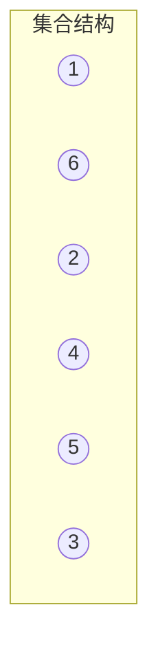
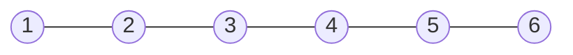
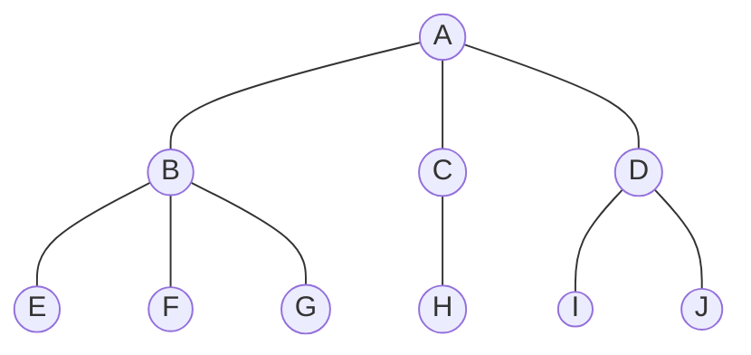
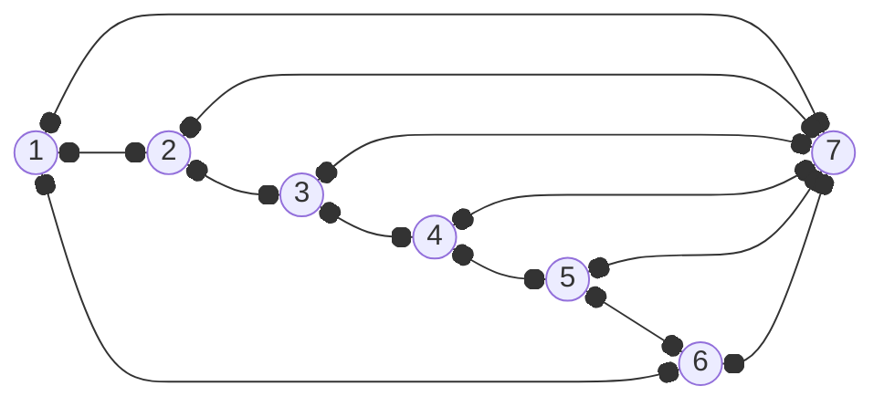
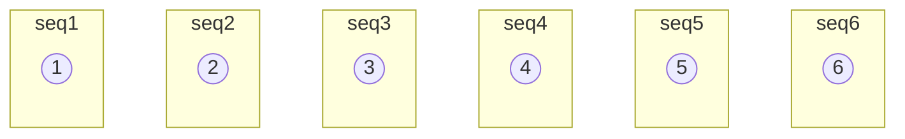
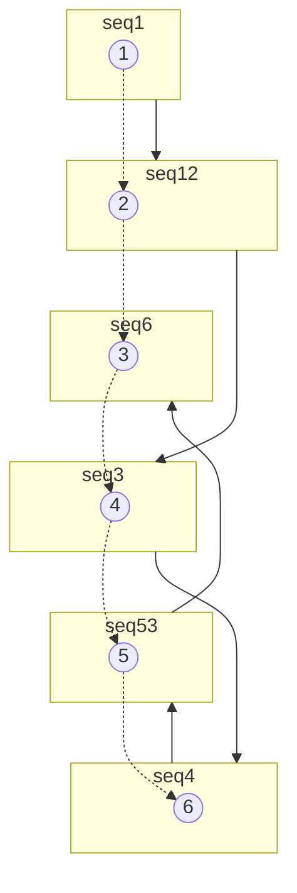

# 1 数据结构绪论

## 1.4 基本概念和术语

### 1.4.1 数据
数据是描述客观事物的符号，是计算机中可以操作的对象，是能被计算机识别并输入给计算机处理的符号合集。

### 1.4.2 数据元素
数据元素是组成数据的、有一定意义的基本单位，在计算机中通常作为整体处理，也被称为记录。

### 1.4.3 数据项
数据项：一个数据元素可以由若干个数据项组成。<br>
人是数据元素，人由眼睛、耳朵、手脚等等这些数据项组成。<br>
数据项是不可分割的最小单位。<br>

### 1.4.4 数据对象
数据对象是性质相同的数据元素的集合，是数据的子集。<br>
人类是数据对象，人类由所有人组成。<br>

### 1.4.5 数据结构
不同数据元素之间不是独立的，而是存在特定的关系，我们将这些关系称为结构。<br>
数据结构：是相互之间存在一种或多种特定关系的数据元素的集合。<br>

## 1.5 逻辑结构和物理结构

逻辑结构面向问题，物理结构面向计算机。<br>

### 1.5.1 逻辑结构

逻辑结构：是指数据对象中数据元素之间的相互关系。<br>

1. **集合结构**<br>
集合结构：集合结构中的数据元素除了同属于一个集合外，他们之间没有其他关系。<br>


2. **线性结构**<br>
线性结构：线性结构中的数据元素之间是一对一的关系。<br>


3. **树形结构**<br>
树形结构：树形结构中的数据元素之间存在一种一对多的层次关系。<br>


4. **图结构**<br>
图结构：图结构的数据元素是多对多的关系。<br>


### 1.5.2 物理结构
物理结构：是指数据的逻辑结构在计算机中的存储形式。<br>

1. **顺序存储结构**<br>

顺序存储结构：是把数据元素存放在任意的存储单元里，这组存储单元可以是连续的，也可以是不连续的。<br>


2. **链式存储结构**<br>

链式存储结构：是把数据元素存放在连续的存储单元里，但数据间的逻辑关系和物理关系不是一致的。<br>


## 1.6 数据类型

数据类型：是指一组性质相同的值的集合及定义在此集合上的一些操作的总称。

### 1.6.1 数据类型的定义

在C语言中，按照取值的不同，数据类型可以分为两类：<br>
- **原子类型**<br>
  不可以再分解的基本类型、包括整型、实型、字符型。

- **结构类型**<br>
  由若干个类型组合而成，是可以再分解的。<br>

抽象是指抽取出事物具有的普遍性的本质。

### 1.6.2 抽象数据类型

抽象数据类型（Abstract Data Type，ADT）：一个数学模型及定义在该模型上的一组操作。<br>

抽象数据类型体现了程序设计中问题分解、抽象和信息隐藏的特性。<br>

```
ADT 抽象数据类型名
Data
  数据元素之间逻辑关系的定义

Operation
  操作1
  ...
  操作n
endADT
```

## 1.7 总结


数据结构是相互之间存在一种或多种特定关系的数据元素的集合。<br>


