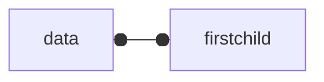
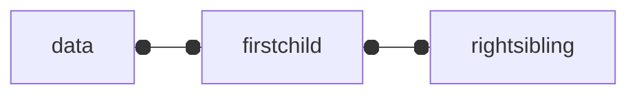
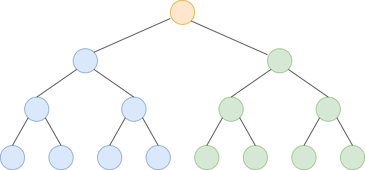

# 6 树

## 6.2 树的定义

树（Tree）是n（n>=0）个节点的有限集。n=0时称为树。在任意一棵非空树中：
- 有且仅有一个特定的称为根（Root）的节点
- 当n>1时，其余节点可被分为m（m>0）干个互不相干的有限集T1,T2...Tm，其中每一个集合本身又是一棵树，并且称为根的子树（SubTree）。

<center>

</center>

### 6.2.1节点的分类

节点拥有的子树数称为节点的度（Degree）。度为0的节点称为叶节点（Leaf Node）或终端节点；度不为0的节点称为非终端节点或分支节点。除根节点之外，分支节点也称为内部节点。树的度是树内个节点的度的最大值。<br>

<center>

</center>

### 6.2.2 节点间的关系

节点的子树的根称为该节点的孩子（Child），相应的，该节点称为孩子节点的双亲（Parent）。同一个双亲的孩子之间互称兄弟（Sibling）。节点的祖先是从根到该节点所经分支上的所有节点。以某节点为根的子树中的任一节点都称为该节点的子孙。

<center>

</center>

### 6.2.3 树的其他概念

节点的层次（Level）从根开始定义起，根为第一层，根的孩子为第二层，以此类推。<br>
双亲节点在同一层次的节点互为堂兄弟。<br>
树中节点的最大层次称为树的深度（Depth）或高度。<br>

<center>

</center>

如果将树种节点的各个子树看成从左至右是有次序的，不能互换的，则称该树为有序树，否则称无序树。<br>
森林（Forest）是m（m>0）个互不相交的有限树的集合。<br>
对树中每个节点而言，其子树的集合即为森林。<br>

线性结构：
- 第一个数据元素：无前驱
- 最后一个数据元素：无后继
- 中间元素：有一个前驱和一个后继

树结构：
- 根节点：无双亲，唯一
- 叶节点：无孩子，可以多个
- 中间节点：一个双亲，多个孩子

## 6.3 树的抽象数据类型

```
ADT 树（tree）
Data
  树是由一个根节点和若干棵子树所构成。树中节点具有相同数据类型及层次关系。

Operation
  InitTree(*T)：初始化，建立一个空树
  DestroyTree(*T)：若树存在，销毁它
  CreateTree(*T, definition)：若树存在，按照definition中给出的树的定义来构造树
  ClearTree(*T)：将树清空
  TreeEmpty(T)：判断树是否为空
  TreeDepth(T)：返回树的深度
  Root(T)：返回根节点
  Parent(T, e)：返回e的双亲节点
  Value(T, e)：e是树中的节点，返回此节点的值
  LeftChild(T, e)：e是树中的节点，返回e的左孩子节点，没有则返回空
  RightChild(T, e)：e是树中的节点，返回e的右孩子节点，没有则返回空
  NextSibling(T, e)：e是树中的节点，返回e的兄弟节点，没有则返回空
  InsertChild(*T, *p, i, c)：p指向树T的某个节点，i为所指节点p的度加上1，非空树c与T不相交，操作结果为插入c为树T中p所指节点的第i棵子树
  DeleteChild(*T, *p, i)：p指向树T的某个节点，i为所指节点p的度，操作结果为删除p所指节点的第i棵子树
```

## 6.4 树的存储结构

### 6.4.1 双亲表示法

以一组连续空间存储树的节点，在每个节点中，附设一个指示器指示其双亲节点在数组中的位置。

双亲表示法的结构定义：
```c
// 树的双亲表示法的结构定义
#define MAXSIZE 100
typedef int ElemType;
typedef struct PTNode {
  // 节点的数据
  ElemType data;
  // 双亲在数组中的下标
  int parent;
}PTNode;

typedef struct {
  PTNode nodes[MAXSIZE];
  // 根节点的位置下标和节点个数
  int r, n;
}PTree;
```

由于根节点没有双亲，他的parent值为-1。下图的树结构可以用表中的树双亲表示。<br>
<center>

</center>

|下标|data|parent|
|:---:|:---:|:---:|
|0|A|-1|
|1|B|0|
|2|C|0|
|3|D|1|
|4|E|2|
|5|F|2|
|6|G|3|
|7|H|3|
|8|I|3|
|9|J|4|

添加一个节点最左边孩子的域，这样很容易找到孩子。如果没有孩子的节点，长子域设为-1.
|下标|data|parent|firstChild|
|:---:|:---:|:---:|:---:|
|0|A|-1|1|
|1|B|0|3|
|2|C|0|4|
|3|D|1|6|
|4|E|2|-1|
|5|F|2|-1|
|6|G|3|-1|
|7|H|3|-1|
|8|I|3|-1|
|9|J|4|-1|

添加右兄弟域，快速找兄弟。如果没有兄弟节点，右兄弟域设为-1。

|下标|data|parent|rightsibling|
|:---:|:---:|:---:|:---:|
|0|A|-1|-1|
|1|B|0|2|
|2|C|0|-1|
|3|D|1|-1|
|4|E|2|-5|
|5|F|2|-1|
|6|G|3|7|
|7|H|3|8|
|8|I|3|-1|
|9|J|4|-1|

存储结构的设计是一个非常灵活的过程。一个存储结构设计的是否合理，取决于基于该存储结构的运算是否合适、是否方便，时间复杂度好不好等。

### 6.4.2 孩子表示法

每个节点有多个指针域，其中每个指针指向一棵子树的根节点，我们把这种方法叫做多重链表表示法。

- 方案一：
  一种是指针域的个数等于树的度。
  ```mermaid
  flowchart TD
  A[data]
  B[child1]
  C[child2]
  D[child3]
  E[...]
  F[childn]
  ```

  缺点：如果各个节点的度相差较大，会浪费空间。

- 方案二：
  每个节点指针域的个数等于该节点的度，专门取一个位置存储节点的指针域个数。
  ```mermaid
  flowchart TD
  A[data]
  D[degree]
  B[child1]
  C[child2]
  E[...]
  F[childn]
  ```
  data为数据域，degree为度域，child1~childn为指针域，指向该节点的各个孩子节点。

  缺点：由于各个节点的链表是不同的结构，加上要维护节点的度的数值，在运算上会带来时间消耗。

为了遍历整棵树，把每个节点放到一个顺序存储结构的数组中是合理的，但每个节点的孩子有多少是不确定的，所以我们再对每个节点的孩子建立一个单链体现他们的关系。这就是**孩子表示法**。

把每个节点的饿孩子节点排列起来，以单链表作存储结构，则n个节点有n个孩子链表，如果是叶子节点则此单链表为空。然后n个头指针又组成一个线性表，采用顺序存储结构，存放进一位数组中。
<center>

</center>

孩子链表的孩子节点：


child是数据域，存放某个节点在表头数组中的下标；next是指针域，用来存放指向某个节点的下一个孩子节点的指针。

表头数组的表头节点：


data为数据域，存放某节点的数据信息；firstchild为头指针域，存放该节点的孩子链表的头指针。

孩子表示法的结构：
```c
#define MAXSIZE 100
typedef int ElemType;
typedef struct CTNode {
  int child;
  struct CTNode *next;
}*ChildPtr;

typedef struct {
  ElemType data;
  ChildPtr firstchild;
}CTBox;

typedef struct {
  CTBox nodes[MAXSIZE];
  // 根节点的位置和节点数
  int r, n;
}
```

为了方便找某节点的双亲节点，可以在节点信息里添加parent域，表示该节点的双亲节点在数组中的位置。没有双亲节点的节点，parent域的值为-1。
<center>

</center>

### 6.4.3 孩子兄弟表示法

任意一棵树，它的节点的第一个孩子如果存在就是唯一的，它的右兄弟如果存在也是唯一的。因此，我们设置两个指针，分别指向该节点的第一个孩子和此节点的右兄弟。



data为数据域，firstchild为孩子节点的指针域，rightsibling为右兄弟节点的指针域。

结构定义：
```c
// 树的孩子兄弟表示法
typedef struct CSNode {
  ElemType data;
  struct CSNode *firstchild, *rightsibling;
}CSNode, *CSNodePtr;
```

<center>

</center>

这个表示法的最大好处是他把一棵复杂的树变成了一棵二叉树。
<center>

</center>

## 6.5 二叉树的定义

二叉树（Binary Tree）是n（n>=0）个结点的有限集合，该集合或者为空集（称为空二叉树），或者由一个根结点和两棵互不相交的左子树和右子树的二叉树组成。<br>

<center>

<div>二叉树</div>
</center>
<br>

<center>

<div>非二叉树</div>
</center>

### 6.5.1 二叉树的特点

二叉树的特点有：
- 每个结点最多有两棵子树，所以二叉树中不存在度大于2的节点。注意不是只有两棵子树，而是最多有。没有子树或者有一棵子树都是可以的。
- 左子树和右子树是有顺序的，次序不能任意颠倒。就像人有双手、双脚，但显然左手、左脚和右手、右脚是不一样的，右手戴左手套、右脚穿左鞋都会极其别扭和难受。
- 即使树中某结点只有一棵子树，也要区分它是左子树还是右子树。

二叉树具有五种基本形态：
- 空二叉树
- 只有一个根结点
- 根结点只有左子树
- 根结点只有右子树
- 根结点既有左子树又有右子树

### 6.5.2 特殊二叉树

- 斜树：<br>
  所有的结点都只有左子树的二叉树左斜树。所有的结点都只有右子树的二叉树叫右斜树。这两者统称为斜树。
- 满二叉树：<br>
  在一棵二叉树中，如果所有分支结点都存在左子树和右子树，并且所有叶子都在同一层上，这样的二叉树称为满二叉树。

  <center>
  
  </center>

  满二叉树的特点：
  - 叶子只能出现在最下一层。
  - 非叶子结点的度一定是2。
  - 在同样深度的二叉树中，满二叉树的结点个数最多，叶子数最多。

- 完全二叉树：<br>
  对一棵具有n个结点的二叉树按层序编号，如果编号i（1<=i<=n）的结点与同样深度的满二叉树中编号为i的结点在二叉树中位置完全相同，则这棵二叉树称为完全二叉树。

  <center>
  
  </center>

  完全二叉树特点：<br>
  - 叶子结点只能出现在最下两层。
  - 最下层的叶子一定集中在左部连续位置。
  - 倒数两层，若有叶子结点，一定都在右部连续位置。
  - 如果结点度为1，则该结点只有左孩子，即不存在只有右子树的情况。
  - 同样结点数的二叉树，完全二叉树的深度最小。

## 6.6 二叉树的性质

### 6.6.1 二叉树的性质一

在二叉树的第i层至多有2^i-1个结点（i >= 1）。

### 6.6.2 二叉树的性质二

深度为k的二叉树至多有2^k-1个结点（k >= 1）。

### 6.6.3 二叉树的性质三

对任何一棵二叉树T，如果其终端结点数为n0，度为2的结点数为n2，则n0 = n2 + 1。<br>

终端结点数其实就是叶子结点数，而一棵二叉树，除了叶子结点外，剩下的就是度为1或2的结点数了，我们设n1为度是1的结点数。则树T结点总数n=n0+n1+n2。<br>

二叉树的连接线数为n-1，因为根结点只有分支出去，没有分支进来，所以分支线总数为结点总数减去1。<br>

n - 1 = n1 + 2*n2，因为刚才我们有等式n = n0 + n1 + n2，所以n0 + n1 + n2 - 1 = n1 + 2*n2，得到结论n0 = n2 + 1。<br>

### 6.6.4 二叉树的性质四

具有n个结点的完全二叉树的深度为（log2n）+ 1，n >= 1，log2n向下取整。

### 6.6.5 二叉树的性质五

如果对一棵有个结点的完全二叉树，其深度为（log2n + 1）的结点按层序编号（从第一层到第log2n + 1层，每层从左到右），对任一结点i（1 =< i <= n）有：<br>
- ①如果i = 1，则结点i是二叉树的根，无双亲；如果j > 1，则其双亲结点为i/2。<br>

- ②如果2*i > n，则结点i无左孩子（结点i为叶子结点）；否则其左孩子是结点2*i。<br>

- ③如果2*i + 1 > n，则结点i无右孩子；否则其右孩子是结点2*i + 1。<br>

## 6.7 二叉树的存储结构

### 6.7.1 二叉树的顺序存储结构

完全二叉树的顺序存储如下图所示。
<center>

</center>

对于一般的二叉树，尽管层序编号不能反映逻辑关系，但是可以将其按完全二叉树编号，只不过，把不存在的结点设置为空。如下图所示。
<center>

</center>

考虑一种极端的情况，一棵深度为k的右斜树，它只有k个结点，却需要分2^k - 1个存储单元空间，这显然是对存储空间的浪费。所以，顺序存储结构一般只用于完全二叉树。

### 6.7.2 二叉链表

二叉树每个结点最多有两个孩子，所以为它设计一个数据域和两个指针域。，我们称这样的链表叫做二叉链表。<br>

二叉链表的结点结构定义代码：
```c
typedef struct BiTNode {
  ElemType data;
  struct BiTNode *lchild, *rchild;
}BiTNode, *BiTree;
```

<center>

</center>

## 6.8 二叉树的遍历

### 6.8.1 二叉树的遍历原理

二叉树的遍历（traversing binary tree）是指从根结点出发，按照某种次序依次访问二叉树中的所有结点，使得每个结点只被访问一次。<br>

### 6.8.2 二叉树的遍历算法

- **1. 先序遍历**<br>
  规则是若二叉树为空，则空操作返回，否则先访问根结点，然后前序遍历左子树，再前序遍历右子树。

- **2. 中序遍历**<br>
  规则是若树为空，则空操作返回，否则中序遍历左子树，访问根结点，再中序遍历右子树。

- **3. 后序遍历**<br>
  规则是若树为空，则空操作返回，否则从左到右先叶子后结点的方式遍历访问左右子树，最后访问根结点。

- **4. 层次遍历**<br>
  规则是若树为空，则空操作返回，否则从树的第一层，也就是根结点开始访问，从上而下逐层遍历，在同一层中，按从左到右的顺序对结点逐个访问。

### 6.8.3 前序遍历算法

二叉树的定义是用递归的方式，实现遍历算法也可以采用递归。前序遍历算法代码如下：
```c
/*二叉树的前序遍历递归算法*/
/*初始条件：二叉树T 非空*/
/*操作结果：前序递归遍历二叉树T*/
void PreOrderTraverse(BiTree T) {
  if (T == NULL) {
    return;
  }
  printf("%c", T->data);
  PreOrderTraverse(T->lchild);
  PreOrderTraverse(T->rchild);
  return;
}
```

### 6.8.4 中序遍历算法

中序遍历算法代码如下：
```c
/*二叉树的中序遍历递归算法*/
/*初始条件：二叉树T 非空*/
/*操作结果：中序递归遍历二叉树T*/
void InOrderTraverse(BiTree T) {
  if (T == NULL) {
    return;
  }
  InOrderTraverse(T->lchild);
  printf("%c", T->data);
  InOrderTraverse(T->rchild);
  return;
}
```

### 6.8.5 后序遍历算法

后序遍历算法代码如下：
```c
/*二叉树的后序遍历递归算法*/
/*初始条件：二叉树T 非空*/
/*操作结果：后序递归遍历二叉树T*/
void PostOrderTraverse(BiTree T) {
  if (T == NULL) {
    return;
  }
  PostOrderTraverse(T->lchild);
  PostOrderTraverse(T->rchild);
  printf("%c", T->data);
  return;
}
```

### 6.8.6 推导遍历结果

二叉树遍历的性质：<br>
- 已知前序遍历和中序遍历序列，可以唯一确定一棵二叉树。<br>
- 已知后序遍历和中序遍历序列，可以唯一确定一棵二叉树。<br>

## 6.9 二叉树的建立

## 6.10 线索二叉树

## 6.11 树、森林与二叉树的转换

## 6.12 赫夫曼树及其应用

## 6.13 总结回顾
