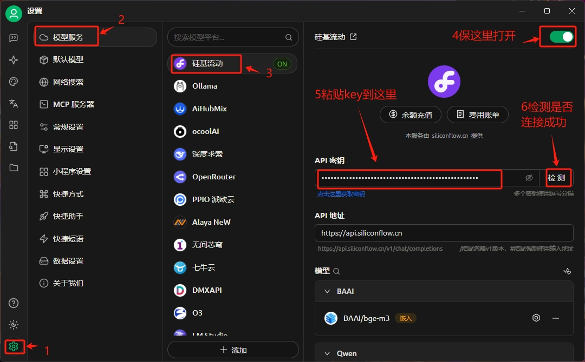

# Cherry Studio傻瓜教程

教程包括Windows10+平台下Cherry Studio的安装，以及如何使用；AI服务平台key的申请。

## Cherry Studio安装

Cherry Studio下载地址：`https://www.cherry-ai.com/download`

①复制上面的链接，打开浏览器，在地址栏输入，进入下载页面

②选择保存位置，并点击**确定**

③在上面保存的地方，打开下载的文件

④在上面软件名上单击鼠标右键，选择**打开**进入安装界面，按照数字提示步骤进行安装

⑤直接点击**安装**，或者点击**浏览**更改目标文件夹，然后点击**安装**

⑥在桌面上查看Cherry Studio快捷方式，双击打开

⑦启动后显示如下界面，说明安装成功

## AI服务平台key的申请

### 硅基流动

平台地址：`https://cloud.siliconflow.cn/i/prd8QeX8`

按下面步骤进行操作

注册成功后，登录平台，按照下面步骤，申请key

申请key成功后如下图

分享自子的邀请链接给别人，让别人注册，自己可以获得更多余额

## Cherry Studio配置

①模型服务配置

②添加模型 
点击**管理**打开模型管理界面

找到`Qwen/Qwen3-235B-A22B`点击该选项后面的`+`

③配置模认模型

④常规设置

⑤添加自己需要的智能体，比如Excel

## 使用

①打开助手页面，选择自己添加的智能体并点击

②点击助手（智能体）后进入话题页面，可以在话题页面输入问题，点击**发送**即可得到答案

