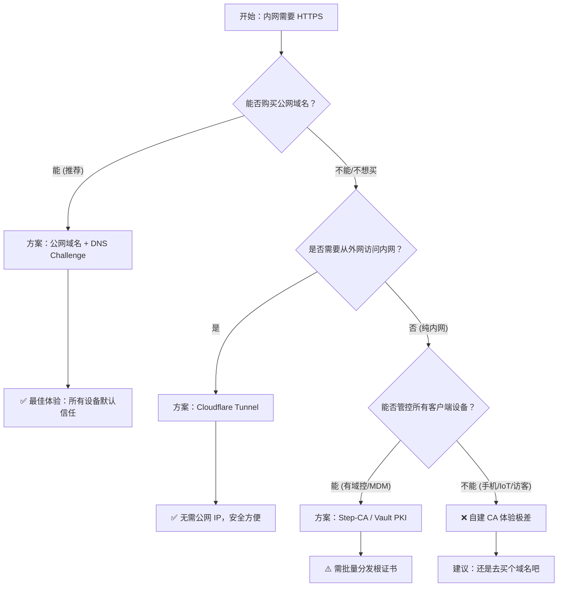

# 内网域名 + SSL + DNS 方案

## 域名 + SSL

### 核心结论 (One-Liner)

*   **绝大多数场景（家庭/企业内网）**：请选择 **公网域名 + DNS Challenge**。花几十块钱买域名，换取所有设备免配置信任，性价比最高。
*   **无公网 IP/不想开放端口**：请选择 **Cloudflare Tunnel**。
*   **物理隔离/高保密/无法联网**：请选择 **Step-CA (私有 ACME)**，但要做好给每台设备手动安装根证书的准备。

---

### 📊 全方案横向对比表

| 方案 | 信任体验 (客户端) | 自动化程度 | 架构复杂度 | 成本 (金钱) | 网络要求 | 推荐指数 |
| :--- | :--- | :--- | :--- | :--- | :--- | :--- |
| **公网域名 + DNS 挑战** | ⭐⭐⭐⭐⭐ (原生信任) | ⭐⭐⭐⭐⭐ (全自动) | ⭐⭐ (中) | 低 (域名费) | 需联网验证 | 🥇 **首选** |
| **Cloudflare Tunnel** | ⭐⭐⭐⭐⭐ (原生信任) | ⭐⭐⭐⭐⭐ (全自动) | ⭐ (低) | 免费 | 需出站联网 | 🥈 **备选** |
| **Step-CA (私有 ACME)** | ⭐⭐ (需手动导入根证书) | ⭐⭐⭐⭐ (全自动) | ⭐⭐⭐ (中) | 免费 | 纯内网 | 🥉 **特定场景** |
| **Vault PKI** | ⭐⭐ (需手动导入根证书) | ⭐⭐⭐ (需配置) | ⭐⭐⭐⭐⭐ (高) | 免费 | 纯内网 | ⭐️ **企业级** |
| **Caddy `tls internal`** | ⭐⭐ (需手动导入根证书) | ⭐⭐⭐⭐⭐ (极简) | ⭐ (极低) | 免费 | 纯内网 | ⭐️ **单机测试** |
| **自签名证书** | ⭐ (浏览器报红) | ⭐ (手动) | ⭐ (极低) | 免费 | 纯内网 | ❌ **不推荐** |

---

### 方案深度解析

#### 1. 公网域名 + DNS Challenge (Let's Encrypt)
*   **原理**：购买真实域名，通过 DNS API 验证所有权，申请公网可信证书。内网 DNS 将域名解析到内网 IP。
*   **优点**：
    *   **零信任配置**：手机、电视、访客设备无需任何设置，直接显示安全锁。
    *   **标准兼容**：所有软件、API 客户端默认支持。
    *   **自动续期**：Traefik 全自动处理。
*   **缺点**：
    *   需要购买域名（约 ¥60/年）。
    *   需要配置内网 DNS 重写（Split Horizon DNS）。
    *   DNS API Key 需妥善保管。
*   **适用**：**90% 的用户**，尤其是家庭实验室、中小企业。

#### 2. Cloudflare Tunnel (Zero Trust)
*   **原理**：通过出站隧道将内网服务代理到 Cloudflare 边缘，使用 Cloudflare 管理的证书。
*   **优点**：
    *   **无需公网 IP/端口映射**：最安全，防火墙无需开放入站端口。
    *   **证书全自动**：无需配置 ACME。
    *   **免费**：个人使用免费。
*   **缺点**：
    *   **流量经过第三方**：数据经过 Cloudflare 节点（虽加密但需注意合规）。
    *   **依赖外网**：隧道建立需要访问互联网。
    *   **延迟**：访问速度受隧道节点影响。
*   **适用**：没有公网 IP、不想配置端口映射、需要外网访问内网的场景。

#### 3. 自建内部 CA (Step-CA / Vault / Caddy)
*   **原理**：自己充当 CA 机构，签发内网域名证书。
*   **优点**：
    *   **完全内网**：无需公网域名，无需联网。
    *   **隐私性最高**：证书请求不流出内网。
    *   **策略灵活**：可自定义证书有效期、权限（尤其是 Vault）。
*   **缺点**：
    *   **信任地狱**：**最大痛点**。必须在每台访问设备（PC/手机/平板）手动安装并信任根证书。iOS/Android 操作繁琐，IoT 设备几乎无法配置。
    *   **维护成本**：需维护 CA 服务本身的安全和备份。
*   **细分对比**：
    *   **Step-CA**：轻量级，支持 ACME，适合配合 Traefik。
    *   **Vault**：重量级，功能最强，适合已有 HashiCorp 栈的企业。
    *   **Caddy**：最简单，但多实例管理困难，适合单机。
*   **适用**：物理隔离网络、高保密单位、能统一管控终端设备（有域控/MDM）的企业。

---

### 决策流程图 (Decision Tree)



---

### 最终建议 (Final Verdict)

1.  **如果不是纯内网**，请选择 **公网域名 + DNS Challenge**。
    *   自建 CA 节省的是金钱，消耗的是**时间**和**用户体验**。给家人的手机、公司的电视、客人的笔记本手动安装根证书是一个无底洞。
    *   **公网域名方案**是“一次配置，永久省心”。

2.  **如果必须自建 CA**：
    *   请选择 **Step-CA** 配合 Traefik 的 ACME 功能。它比 Vault 轻，比 Caddy 灵活，是自建 CA 中的最佳平衡点。

**总结一句话**：
除非你的内网是**物理隔离**的，否则请无条件选择 **公网域名 + DNS Challenge** 方案。这是目前内网 HTTPS 的**工业级最佳实践**。

在 **完全内网方案**（自建 CA + 内网域名）中，DNS 是 **基础设施中的基础设施**。如果 DNS 解析不通，HTTPS 请求根本无法到达 Traefik，证书验证也就无从谈起。

核心原则：**客户端解析的域名必须与 SSL 证书中的域名（CN/SAN）完全一致。**

## 完全内网 DNS 配置方案

以下是完全内网环境下，DNS 解决方案的几种主流方式，按推荐程度排序：

---

### 方案一：路由器/DHCP 服务器托管 (最推荐)

**原理**：
利用内网网关（路由器）作为 DNS 服务器。在路由器上配置 **静态 DNS 记录 (Static DNS / Host Override)**，将内网域名指向内网 IP。所有通过 DHCP 获取 IP 的设备会自动使用路由器作为 DNS。

**适用设备**：
OpenWrt、软路由 (iKuai + OpenWrt)、Ubiquiti (UniFi)、MikroTik、部分高级家用路由 (Asus Merlin)。

**配置示例 (OpenWrt / Dnsmasq)**：
1.  登录路由器后台。
2.  找到 `DHCP/DNS` 设置。
3.  添加 **主机名 (Hostname)** 和 **IP 地址 (IP Address)**。
    *   域名：`app.lan`
    *   IP: `192.168.1.100` (Traefik 所在机器 IP)
4.  保存并重启 DNS 服务。

*   **优点**：
    *   **全覆盖**：所有连接 WiFi/有线的设备（手机、电脑、电视）自动生效，无需单独配置。
    *   **维护低**：改一次路由器，全网生效。
*   **缺点**：
    *   部分运营商赠送的光猫路由一体机功能太弱，不支持自定义 DNS 记录。

---

### 方案二：专用 DNS 服务器 (AdGuard Home / Pi-hole)

**原理**：
在内网部署一台 DNS 服务器（通常也是 Docker 容器），专门负责域名解析和广告过滤。然后将路由器的 **DHCP DNS 设置** 指向这台服务器的 IP。

**适用设备**：
NAS、树莓派、常开的 PC、Docker 环境。

**配置示例 (AdGuard Home)**：
1.  部署 AdGuard Home 容器。
2.  进入管理后台 -> `设置` -> `DNS 重写`。
3.  添加记录：
    *   域名：`*.internal` (支持泛解析)
    *   IP: `192.168.1.100`
4.  **关键步骤**：登录路由器 DHCP 设置，将 **首选 DNS 服务器** 改为 AdGuard Home 的 IP。

*   **优点**：
    *   **功能强**：支持泛解析 (`*.internal`)，支持广告过滤，日志详细。
    *   **独立**：不依赖路由器固件功能。
*   **缺点**：
    *   需要多维护一个服务。
    *   如果这台服务器挂了，全网上不了网（需配置上游 DNS 转发或高可用）。

---

### 方案三：Windows Server DNS (企业环境)

**原理**：
如果内网有 Active Directory (AD) 域环境，直接使用域控的 DNS 服务。

**配置示例**：
1.  打开 DNS 管理器。
2.  新建正向查找区域 (如 `corp.internal`)。
3.  新建 A 记录，指向 Traefik IP。
4.  域内机器加入域后，自动通过组策略下发 DNS 设置。

*   **优点**：企业级标准，与账号权限集成。
*   **缺点**：太重，不适合家庭或小型办公室。

---

### 方案四：本地 Hosts 文件 (仅测试用)

**原理**：
直接在每台访问设备上修改本地 Hosts 文件，强制指定域名解析。

**配置示例**：
*   **Windows**: `C:\Windows\System32\drivers\etc\hosts`
*   **Linux/Mac**: `/etc/hosts`
*   **内容**: `192.168.1.100 app.internal`

*   **优点**：无需任何服务器，立即生效。
*   **缺点**：
    *   **无法扩展**：每台手机、平板、电视都要手动改，iOS/Android 修改极麻烦（需越狱或描述文件）。
    *   **维护灾难**：IP 变了要改所有设备。
*   **结论**：**仅限单台电脑调试使用，不可作为生产方案。**

---

### 关键注意事项 (避坑指南)

#### 1. 域名后缀的选择
*   **推荐**：`.lan`, `.internal`, `.home`, `.localdomain`
*   **不推荐**：`.local`
    *   **原因**：`.local` 是 mDNS (Bonjour/Avahi) 的保留后缀。虽然可以用，但在某些 Linux 发行版、Android 设备或浏览器中，`.local` 会被优先走 multicast 解析而不是单播 DNS，导致解析冲突或 SSL 证书验证失败。
*   **绝对禁止**：`.com`, `.cn`, `.net` 等公网后缀（除非你做 Split-Horizon DNS）。
    *   **原因**：如果你在内网用 `google.com` 指向内网 IP，会导致你无法访问真正的谷歌，且证书会报域名不匹配。

#### 2. DHCP 设置是关键
仅仅搭建 DNS 服务器是不够的，**必须确保客户端获取到的 DNS 服务器地址是你内网 DNS 的 IP**。
*   检查方法：在电脑/手机上运行 `ipconfig /all` 或查看网络详情，确认 **DNS 服务器** 指向的是你的路由器或 AdGuard Home IP，而不是 `8.8.8.8` 或 `114.114.114.114`。

#### 3. 泛解析 (Wildcard DNS)
为了减少配置工作量，建议配置泛解析。
*   **配置**：`*.internal` -> `192.168.1.100`
*   **效果**：`app.internal`, `nas.internal`, `git.internal` 全部自动解析到 Traefik IP。
*   **Traefik 配合**：Traefik 的 Router Rule 可以配合泛域名证书使用。
    ```yaml
    - "traefik.http.routers.app.rule=Host(`app.internal`)"
    - "traefik.http.routers.nas.rule=Host(`nas.internal`)"
    ```
    *注意：自建 CA 签发证书时，也需要签发泛域名证书 (`*.internal`) 或者为每个子域名单独签发。*

#### 4. DNS 缓存问题
修改 DNS 记录后，客户端可能有缓存。
*   **Windows**: `ipconfig /flushdns`
*   **Mac**: `sudo dscacheutil -flushcache; sudo killall -HUP mDNSResponder`
*   **浏览器**: 尝试无痕模式或重启浏览器。

---

### 最终推荐组合 (完全内网版)

| 组件 | 推荐选择 | 理由 |
| :--- | :--- | :--- |
| **域名后缀** | `.lan` 或 `.internal` | 避免与 mDNS 冲突，语义清晰 |
| **DNS 服务** | **AdGuard Home** (Docker) | 界面友好，支持泛解析，顺便去广告 |
| **DHCP 分配** | **路由器** 指向 AdGuard | 确保所有设备自动获取正确 DNS |
| **证书方案** | **Step-CA** (私有 ACME) | 配合内网域名，自动签发自动续期 |
| **反向代理** | **Traefik** | 自动发现 Docker 服务，自动 HTTPS |

**实施步骤总结**：
1.  部署 **AdGuard Home**，配置 DNS 重写 `*.internal` -> `Traefik_IP`。
2.  修改 **路由器 DHCP**，将 DNS 指向 **AdGuard Home_IP**。
3.  部署 **Step-CA**，初始化根证书，并将根证书导入你的电脑/手机信任库。
4.  配置 **Traefik** 连接 Step-CA 的 ACME 接口。
5.  部署业务容器，Label 中指定域名 `xxx.internal`。
6.  访问 `https://xxx.internal`，享受内网 HTTPS。

这样你就拥有了一个 **完全自治、自动续期、安全加密** 的内网环境。