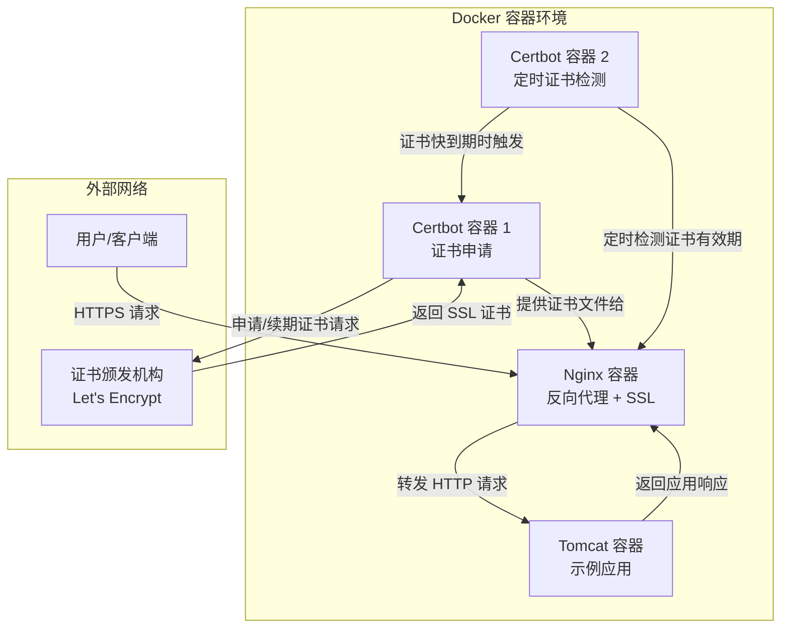

# Let's Encrypt 申请 SSL 证书


项目介绍：一个nginx作反向代理并开启ssl；一个certbot容器做ssl证书申请；一个certbot容器做定时证书有效期检测；一个tomcat容器做被代理的示例。



项目目录结构如下，高亮显示部分为需要自己提供的配置文件，其他为自动生成的。：

```text{2,4,20-21,23-29}
.
├── Makefile
├── .env
├── auto-reload-nginx.sh
├── conf.d
│   └── example.net.conf
├── data
│   └── letsencrypt
│       ├── accounts 
│       ├── archive 
│       ├── cloudflare-credentials.ini
│       ├── live 
│       ├── renewal
│       │   ├── example.net-0001.conf
│       │   └── example.net.conf
│       └── renewal-hooks
│           ├── deploy
│           ├── post
│           └── pre
├── deploy-with-cert.sh
├── docker-compose.yml
├── logs
├── nginx.conf
├── reload-nginx.sh
├── scripts
│   ├── certbot-init.sh
│   ├── certbot-renew.sh
│   └── nginx-entrypoint.sh
├── setup-cloudflare-token.sh
├── ssl
│   └── live
│       └── example.net
│           ├── README
│           ├── cert.pem -> ../../archive/example.net/cert1.pem
│           ├── chain.pem -> ../../archive/example.net/chain1.pem
│           ├── fullchain.pem -> ../../archive/example.net/fullchain1.pem
│           └── privkey.pem -> ../../archive/example.net/privkey1.pem
├── templates
│   └── example.net.conf.template
└── tomcat
    └── webapps
```

## 基础环境

| 名称 | 版本 |
| --- | --- |
| Ubuntu | 24.04 LTS |
| Docker | 29.2.1 |
| Docker-Compose | 5.0.2 |
| Nginx | 1.28.2 |

首先确保Docker相关环境已经安装好。
80 端口是开放的。

## 配置 nginx

### 创建项目文件夹

```bash
$ mkdir nginx_proxy && cd nginx_proxy
```

### 创建 `docker-compose.yml` 文件

我是在windows下创建好然后上传到服务器的。

::: code-group

```yaml [docker-compose.yml]
version: '3.8'

services:
  # Tomcat 后端容器
  tomcat-backend:
    image: tomcat:jdk25-temurin-noble
    container_name: tomcat_backend_${DOMAIN_NAME:-default}
    expose:
      - "8080"
    volumes:
      # 取消注释以挂载应用程序
      - /home/ray/services/nginx_proxy/tomcat/webapps:/usr/local/tomcat/webapps:ro
      # - ./tomcat/conf:/usr/local/tomcat/conf:ro
      # - ./tomcat/logs:/usr/local/tomcat/logs:rw
    environment:
      CATALINA_OPTS: "-Djava.security.egd=file:/dev/./urandom"
      JAVA_OPTS: "-Xmx512m -Xms256m"
      TZ: "${TZ:-Asia/Shanghai}"
    restart: unless-stopped
    networks:
      - proxy-network
    healthcheck:
      test: ["CMD-SHELL", "timeout 10 bash -c 'cat < /dev/null > /dev/tcp/127.0.0.1/8080' 2>/dev/null || exit 1"]
      interval: 30s
      timeout: 10s
      retries: 3
      start_period: 40s
    env_file:
      - .env
      
  nginx-proxy:
    image: nginx:1.28.2-trixie
    container_name: nginx_${DOMAIN_NAME:-default}
    ports:
      - "80:80"
      - "443:443"
    volumes:
      - /home/ray/services/nginx_proxy/nginx.conf:/etc/nginx/nginx.conf:ro
      - /home/ray/services/nginx_proxy/conf.d:/etc/nginx/conf.d:rw
      - /home/ray/services/nginx_proxy/data/letsencrypt:/etc/nginx/ssl:ro
      - /home/ray/services/nginx_proxy/logs:/var/log/nginx:rw
      - /home/ray/services/nginx_proxy/templates:/etc/nginx/templates:ro
      - /home/ray/services/nginx_proxy/scripts/nginx-entrypoint.sh:/scripts/nginx-entrypoint.sh:ro
    environment:
      DOMAIN_NAME: ${DOMAIN_NAME}
      UPSTREAM_HOST: ${UPSTREAM_HOST}
      UPSTREAM_PORT: ${UPSTREAM_PORT}
      UPSTREAM_PROTOCOL: ${UPSTREAM_PROTOCOL}
      DOMAIN_ALIASES: ${DOMAIN_ALIASES}
      TZ: "${TZ:-Asia/Shanghai}"
    command: ["sh", "/scripts/nginx-entrypoint.sh"]
    restart: unless-stopped
    networks:
      - proxy-network
    depends_on:
      - certbot-initializer
      - tomcat-backend
    env_file:
      - .env

  certbot-initializer:
    image: certbot/dns-cloudflare:v5.3.0
    container_name: certbot_cloudflare_init_${DOMAIN_NAME:-default}
    environment:
      TZ: ${TZ:-Asia/Shanghai}
      DOMAIN_NAME: ${DOMAIN_NAME}
      DOMAIN_ALIASES: ${DOMAIN_ALIASES}
      SSL_TEST_CERT: ${SSL_TEST_CERT}
      SSL_EMAIL: ${SSL_EMAIL}
      SSL_RSA_KEY_SIZE: ${SSL_RSA_KEY_SIZE}
    volumes:
      - /home/ray/services/nginx_proxy/data/letsencrypt:/etc/letsencrypt:rw
      - /home/ray/services/nginx_proxy/logs:/var/log:rw
      - /home/ray/services/nginx_proxy/scripts/certbot-init.sh:/scripts/certbot-init.sh:ro
    entrypoint: ["sh", "/scripts/certbot-init.sh"]
    restart: "no"
    networks:
      - proxy-network
    #  env_file:
      #  - .env

  certbot-renew:
    image: certbot/dns-cloudflare:v5.3.0
    container_name: certbot_cloudflare_renew_${DOMAIN_NAME:-default}
    environment:
      TZ: "${TZ:-Asia/Shanghai}"
      DOMAIN_NAME: ${DOMAIN_NAME}
      DOMAIN_ALIASES: ${DOMAIN_ALIASES}
      SSL_TEST_CERT: ${SSL_TEST_CERT}
      RENEWAL_INTERVAL: ${RENEWAL_INTERVAL}
      RENEWAL_THRESHOLD: ${RENEWAL_THRESHOLD}
    volumes:
      - /home/ray/services/nginx_proxy/data/letsencrypt:/etc/letsencrypt:rw
      - /home/ray/services/nginx_proxy/logs:/var/log:rw
      - /home/ray/services/nginx_proxy/scripts/certbot-renew.sh:/scripts/certbot-renew.sh:ro
    entrypoint: ["sh", "/scripts/certbot-renew.sh"]
    restart: unless-stopped
    networks:
      - proxy-network
    #  env_file:
    #  - .env

networks:
  proxy-network:
    driver: bridge


```

:::

### 创建 `setup-cloudflare-token.sh` 文件

`setup-cloudflare-token.sh` 用来配置 Cloudflare 凭证文件和其它初始化选项。

cloudflare 用户 API Token 地址：<https://dash.cloudflare.com/profile/api-tokens>

创建好 API Token 后先在终端测试。

```bash
$ curl "https://api.cloudflare.com/client/v4/user/tokens/verify" \
-H "Authorization: Bearer YOUR_API_TOKEN""

{"result":{"id":"xxxxxxxxxxx","status":"active"},"success":true,"errors":[],"messages":[{"code":10000,"message":"This API Token is valid and active","type":null}]}
```

::: code-group

```bash [setup-cloudflare-token.sh]
#!/bin/bash
# setup-cloudflare-token.sh - Cloudflare 配置向导
# 更新于: 2026-02-09

set -e

# 颜色输出
GREEN='\033[0;32m'
YELLOW='\033[1;33m'
RED='\033[0;31m'
BLUE='\033[0;34m'
NC='\033[0m'

print_info() { echo -e "${BLUE}[ℹ]${NC} $1"; }
print_warn() { echo -e "${YELLOW}[⚠]${NC} $1"; }
print_error() { echo -e "${RED}[✗]${NC} $1"; }
print_success() { echo -e "${GREEN}[✓]${NC} $1"; }

echo "=== Cloudflare API Token 设置向导 ==="
echo "📌 提示：此脚本仅配置 Cloudflare 凭证"
echo "      完整部署请运行: ./deploy-with-cert.sh"
echo ""

# 如果已有 .env，备份并加载
if [ -f .env ]; then
    print_info "检测到现有配置，将保留其他设置..."
    cp .env .env.backup.$(date +%s)
    grep -v -E "^(CF_API_|DOMAIN_NAME=|SSL_EMAIL=)" .env > .env.tmp 2>/dev/null || true
else
    touch .env.tmp
fi

# 检查现有 Token
if [ -f cloudflare-credentials.ini ] && grep -q "cloudflare_api_token" cloudflare-credentials.ini 2>/dev/null; then
    print_warn "检测到现有的 Cloudflare 凭证文件"
    read -p "是否重新配置？(y/N): " -n 1 -r
    echo ""
    if [[ ! $REPLY =~ ^[Yy]$ ]]; then
        print_success "使用现有配置"
        rm -f .env.tmp
        exit 0
    fi
fi

echo "=== 步骤 1/3: Cloudflare API Token配置 ==="
echo ""
echo "1. 访问: https://dash.cloudflare.com/profile/api-tokens"
echo "2. 创建 Token，使用 'Edit zone DNS' 模板"
echo "3. 权限设置: Zone.Zone:Read + Zone.DNS:Edit"
echo "4. 资源范围: Include -> All zones"
echo ""

read -p "请输入您的 Cloudflare 邮箱地址: " CF_EMAIL
read -s -p "请输入 Cloudflare API Token: " CF_TOKEN
echo ""

# 验证Token格式
if [ ${#CF_TOKEN} -lt 32 ] || [ ${#CF_TOKEN} -gt 50 ]; then
    print_warn "警告: API Token 长度不在预期范围内（您输入了 ${#CF_TOKEN} 个字符）"
    read -p "是否继续？(y/N): " -n 1 -r
    echo ""
    if [[ ! $REPLY =~ ^[Yy]$ ]]; then
        print_error "配置已取消"
        rm -f .env.tmp
        exit 1
    fi
fi

echo ""
echo "=== 步骤 2/3: 域名配置 ==="
echo ""

read -p "请输入主域名 (如 example.net): " DOMAIN_NAME
DOMAIN_NAME=${DOMAIN_NAME// /}  # 移除空格

# 设置合理的默认值
DOMAIN_NAME=$(echo "$DOMAIN_NAME" | xargs)  # 移除空格
if [ -z "$DOMAIN_NAME" ]; then
    print_error "域名不能为空"
    rm -f .env.tmp
    exit 1
fi

# 自动添加www别名
DOMAIN_ALIASES="www.${DOMAIN_NAME}"
read -p "请输入其他别名 (逗号分隔，回车使用默认: ${DOMAIN_ALIASES}): " INPUT_ALIASES
if [ -n "$INPUT_ALIASES" ]; then
    DOMAIN_ALIASES="${INPUT_ALIASES}"
fi

echo ""
echo "=== 步骤 3/3: SSL证书配置 ==="
echo ""

SSL_EMAIL="${CF_EMAIL}"
read -p "请输入SSL证书接收邮箱 [默认: ${SSL_EMAIL}]: " INPUT_SSL_EMAIL
if [ -n "$INPUT_SSL_EMAIL" ]; then
    SSL_EMAIL="${INPUT_SSL_EMAIL}"
fi

echo ""
echo "首次部署建议使用测试服务器（避免触发频率限制）"
echo "✅ 生产环境下请将 SSL_TEST_CERT 设为 false"

# 生成完整的 .env 文件
cat > .env << EOF
# =================================
# Nginx + Tomcat + SSL 自动化部署配置
# 生成时间: $(date +"%Y-%m-%d %H:%M:%S")
# =================================

# ===== Cloudflare API 配置 =====
CF_API_EMAIL=${CF_EMAIL}
CF_API_TOKEN=${CF_TOKEN}

# ===== 域名配置 =====
DOMAIN_NAME=${DOMAIN_NAME}
DOMAIN_ALIASES=${DOMAIN_ALIASES}

# ===== 后端服务配置 =====
UPSTREAM_HOST=tomcat-backend
UPSTREAM_PORT=8080
UPSTREAM_PROTOCOL=http

# ===== SSL 证书配置 =====
SSL_EMAIL=${SSL_EMAIL}
SSL_RSA_KEY_SIZE=4096
SSL_TEST_CERT=true  # 首次使用测试服务器

# ===== 证书续期配置 =====
RENEWAL_INTERVAL=172800     # 48小时检查一次
RENEWAL_THRESHOLD=30        # 过期前30天续期（推荐）

# ===== Nginx 配置 =====
NGINX_WORKER_PROCESSES=auto
CLIENT_MAX_BODY_SIZE=100M
PROXY_CONNECT_TIMEOUT=30s
PROXY_SEND_TIMEOUT=60s
PROXY_READ_TIMEOUT=60s

# ===== 功能开关 =====
ENABLE_HSTS=true
ENABLE_HTTP2=true
ENABLE_CORS=false
ENABLE_COMPRESSION=true

# ===== 时区配置 =====
TZ=Asia/Shanghai
EOF

# 追加原有配置中不需要覆盖的部分
if [ -f .env.tmp ]; then
    echo "" >> .env
    echo "# ===== 原有其他配置 =====" >> .env
    cat .env.tmp >> .env
    rm .env.tmp
fi

# 创建必需目录
mkdir -p data/letsencrypt ssl/live logs conf.d templates

# 创建 Cloudflare 凭证文件
cat > data/letsencrypt/cloudflare-credentials.ini << EOF
# Cloudflare API Token
# 自动生成于 $(date)
# ⚠️  安全警告：不要共享此文件！

dns_cloudflare_api_token = ${CF_TOKEN}
EOF

# 设置权限
chmod 600 data/letsencrypt/cloudflare-credentials.ini
chmod 640 .env

print_success "=== 配置完成 ==="
echo ""
echo "📁 生成的文件:"
echo "   • .env              - 主配置文件"
echo "   • cloudflare-credentials.ini - Cloudflare凭证"
echo ""
echo "📋 配置摘要:"
echo "   • 主域名: ${DOMAIN_NAME}"
echo "   • 别名: ${DOMAIN_ALIASES}"
echo "   • SSL邮箱: ${SSL_EMAIL}"
echo "   • 后端服务: http://tomcat-backend:8080"
echo ""
echo "🚀 下一步操作:"
echo "   1. 检查配置: cat .env"
echo "   2. 启动服务: make deploy"
echo "   3. 生产环境: 编辑 .env 将 SSL_TEST_CERT 改为 false"
echo ""

# 清理临时文件
rm -f .env.tmp

```

:::

### 创建 `deploy-with-cert.sh` 文件

`deploy-with-cert.sh` 用来启动容器并生成证书。

::: code-group

```bash [deploy-with-cert.sh]
#!/bin/bash
# deploy-with-cert.sh - 优化版部署脚本
# 支持 docker-compose 和 docker compose 命令

set -e

# 颜色输出
RED='\033[0;31m'
GREEN='\033[0;32m'
YELLOW='\033[1;33m'
BLUE='\033[0;34m'
NC='\033[0m' # No Color

print_info() { echo -e "${GREEN}[ℹ]${NC} $1"; }
print_warn() { echo -e "${YELLOW}[⚠]${NC} $1"; }
print_error() { echo -e "${RED}[✗]${NC} $1"; }
print_success() { echo -e "${GREEN}[✓]${NC} $1"; }
print_step() { echo -e "${BLUE}[→]${NC} $1"; }

echo "🚀 === Nginx + Tomcat + Cloudflare SSL 自动化部署 ==="
echo ""

# 1. 检查前置条件
check_prerequisites() {
    print_info "检查前置条件..."
    
    # 检查必要文件
    if [ ! -f .env ]; then
        print_error ".env 文件不存在"
        echo "请先运行: ./setup-cloudflare-token.sh"
        exit 1
    fi
    
    if [ ! -f data/letsencrypt/cloudflare-credentials.ini ]; then
        print_error "Cloudflare 凭证文件不存在"
        echo "请先运行: ./setup-cloudflare-token.sh"
        exit 1
    fi
    
    # 检查Docker
    if ! command -v docker &> /dev/null; then
        print_error "Docker 未安装"
        exit 1
    fi
    
    if ! sudo docker info &> /dev/null; then
        print_error "Docker 服务未运行或无权限"
        echo "尝试: sudo systemctl start docker"
        exit 1
    fi
    
    # 检查Docker Compose命令
    if sudo docker compose version &> /dev/null 2>&1; then
        DOCKER_COMPOSE_CMD="sudo docker compose"
        print_success "使用 docker compose (Docker Compose v2)"
    elif command -v docker-compose &> /dev/null; then
        DOCKER_COMPOSE_CMD="sudo docker-compose"
        print_success "使用 docker-compose (Docker Compose v1)"
    else
        print_error "Docker Compose 未安装"
        echo "请安装 Docker Compose: https://docs.docker.com/compose/install/"
        exit 1
    fi
    
    print_success "前置条件检查通过"
}

# 2. 准备部署环境
prepare_environment() {
    print_info "准备部署环境..."
    
    # 加载环境变量
    source .env
    
    # 显示配置
    echo ""
    echo "📋 部署配置"
    echo "──────────"
    echo "• 主域名: ${DOMAIN_NAME}"
    echo "• 别名域名: ${DOMAIN_ALIASES}"
    echo "• Tomcat服务: ${UPSTREAM_PROTOCOL}://${UPSTREAM_HOST}:${UPSTREAM_PORT}"
    echo "• 证书模式: $([ "$SSL_TEST_CERT" = "true" ] && echo "测试" || echo "生产")"
    echo "• SSL邮箱: ${SSL_EMAIL}"
    echo ""
    
    # 确认部署
    read -p "是否继续部署？(y/N): " -n 1 -r
    echo ""
    if [[ ! $REPLY =~ ^[Yy]$ ]]; then
        print_info "部署已取消"
        exit 0
    fi
    
    
    # 创建模板文件（如果不存在）
    if [ ! -f templates/example.net.conf.template ]; then
        print_warn "Nginx模板不存在，创建默认模板..."
        create_nginx_template
    fi

}

# 3. 创建Nginx模板
create_nginx_template() {
    print_step "创建 Nginx 配置模板..."
    cat > templates/example.net.conf.template << 'EOF'
server {
    listen 80;
    server_name ${DOMAIN_NAME} ${DOMAIN_ALIASES};
    return 301 https://$server_name$request_uri;
}

server {
    listen 443 ssl;
    http2 on;
    server_name ${DOMAIN_NAME} ${DOMAIN_ALIASES};
    
    ssl_certificate /etc/nginx/ssl/live/${DOMAIN_NAME}/fullchain.pem;
    ssl_certificate_key /etc/nginx/ssl/live/${DOMAIN_NAME}/privkey.pem;
    
    # SSL基础配置
    ssl_protocols TLSv1.2 TLSv1.3;
    ssl_ciphers ECDHE-ECDSA-AES128-GCM-SHA256:ECDHE-RSA-AES128-GCM-SHA256:ECDHE-ECDSA-AES256-GCM-SHA384:ECDHE-RSA-AES256-GCM-SHA384;
    ssl_prefer_server_ciphers off;
    ssl_session_cache shared:SSL:10m;
    ssl_session_timeout 10m;
    
    # 安全头
    add_header X-Frame-Options "SAMEORIGIN" always;
    add_header X-Content-Type-Options "nosniff" always;
    add_header X-XSS-Protection "1; mode=block" always;
    add_header Strict-Transport-Security "max-age=31536000; includeSubDomains" always;
    
    # Tomcat代理配置
    location / {
        proxy_pass ${UPSTREAM_PROTOCOL}://${UPSTREAM_HOST}:${UPSTREAM_PORT};
        proxy_set_header Host $host;
        proxy_set_header X-Real-IP $remote_addr;
        proxy_set_header X-Forwarded-For $proxy_add_x_forwarded_for;
        proxy_set_header X-Forwarded-Proto $scheme;
        
        # 超时设置
        proxy_connect_timeout 30s;
        proxy_send_timeout 60s;
        proxy_read_timeout 60s;
        
        # 缓冲设置
        proxy_buffering on;
        proxy_buffer_size 4k;
        proxy_buffers 8 4k;
    }
    
    # 健康检查
    location /health {
        proxy_pass ${UPSTREAM_PROTOCOL}://${UPSTREAM_HOST}:${UPSTREAM_PORT};
        access_log off;
    }
}
EOF
    print_success "Nginx模板已创建"
}

# 4. 申请SSL证书
obtain_ssl_certificate() {
    print_info "申请SSL证书..."
    
    local cert_mode="$([ "$SSL_TEST_CERT" = "true" ] && echo "测试" || echo "生产")"
    print_info "使用 $cert_mode 模式申请证书"
    
    # 停止可能冲突的容器
    $DOCKER_COMPOSE_CMD down certbot-initializer 2>/dev/null || true
    
    # 启动证书初始化容器
    print_info "启动证书初始化服务..."
    if ! $DOCKER_COMPOSE_CMD up -d certbot-initializer; then
        print_error "证书初始化服务启动失败"
        exit 1
    fi
    
    # 等待并检查日志
    print_info "等待证书申请完成..."
    local max_wait=60
    local waited=0
    local cert_success=false
    local container_name="certbot_cloudflare_init_${DOMAIN_NAME}"
    
    while [ $waited -lt $max_wait ]; do
	sudo docker logs "$container_name" 2>&1 | tail -50 || true
        if sudo docker logs "$container_name" 2>&1 | tail -20 | grep -q "证书申请成功\|Saving debug log"; then
            if sudo docker logs "$container_name" 2>&1 | grep -q "证书申请成功\|Certificate not yet due for renewal"; then
                cert_success=true
                break
            fi
        fi
        
        waited=$((waited + 5))
        echo "  等待中... (${waited}/${max_wait}秒)"
        sleep 5
    done
    
    if [ "$cert_success" = true ]; then
        print_success "SSL证书申请成功"
        
        # 检查证书文件
        if [ -f "./ssl/live/${DOMAIN_NAME}/fullchain.pem" ]; then
            print_success "证书文件已生成: ssl/live/${DOMAIN_NAME}/"
        else
            print_warn "证书文件未找到，但服务报告成功"
        fi
    else
        print_error "证书申请可能失败"
        echo "查看详细日志:"
        sudo docker logs "$container_name"
        print_warn "继续部署，证书可能使用测试版本"
    fi
    
    # 停止初始化容器（一次性任务）
    $DOCKER_COMPOSE_CMD stop certbot-initializer 2>/dev/null || true
}

# 5. 启动主服务
start_main_services() {
    print_info "启动主服务..."
    
    # 启动Tomcat和Nginx
    print_info "启动Tomcat后端服务..."
    if ! $DOCKER_COMPOSE_CMD up -d tomcat-backend; then
        print_error "Tomcat启动失败"
        exit 1
    fi
    
    # 等待Tomcat启动
    print_info "等待Tomcat启动..."
    local max_tries=30
    local tried=0
    
    while [ $tried -lt $max_tries ]; do
        if $DOCKER_COMPOSE_CMD exec -T tomcat-backend curl -f http://localhost:8080 &> /dev/null 2>&1; then
            print_success "Tomcat服务已就绪"
            break
        fi
        tried=$((tried + 1))
        echo "  等待Tomcat... (${tried}/${max_tries})"
        sleep 2
    done
    
    if [ $tried -ge $max_tries ]; then
        print_warn "Tomcat启动较慢，继续部署..."
    fi
    
    # 启动Nginx
    print_info "启动Nginx代理..."
    if ! $DOCKER_COMPOSE_CMD up -d nginx-proxy; then
        print_error "Nginx启动失败"
        exit 1
    fi
    
    # 启动证书续期服务
    print_info "启动证书续期服务..."
    if ! $DOCKER_COMPOSE_CMD up -d certbot-renew; then
        print_warn "证书续期服务启动失败，请手动检查"
    fi
}

# 6. 验证部署
verify_deployment() {
    print_info "验证部署..."
    
    echo ""
    echo "📊 服务状态"
    echo "──────────"
    $DOCKER_COMPOSE_CMD ps
    
    echo ""
    echo "🌐 访问地址"
    echo "──────────"
    echo "• HTTPS: https://${DOMAIN_NAME}"
    for alias in ${DOMAIN_ALIASES//,/ }; do
        echo "          https://${alias}"
    done
    
    echo ""
    echo "🔧 管理命令"
    echo "──────────"
    echo "• 查看日志: $DOCKER_COMPOSE_CMD logs -f"
    echo "• 重启服务: $DOCKER_COMPOSE_CMD restart"
    echo "• 停止服务: $DOCKER_COMPOSE_CMD down"
    echo "• 进入容器: $DOCKER_COMPOSE_CMD exec tomcat-backend bash"
    
    echo ""
    echo "📁 重要文件位置"
    echo "──────────────"
    echo "• 配置文件: .env"
    echo "• SSL证书: ssl/live/${DOMAIN_NAME}/"
    echo "• Nginx日志: logs/"
    echo "• Tomcat日志: docker-compose logs tomcat-backend"
    
    # 测试HTTPS连接
    echo ""
    print_info "测试HTTPS连接..."
    if command -v curl &> /dev/null; then
        if curl -s -o /dev/null -w "%{http_code}" https://${DOMAIN_NAME} --connect-timeout 10 | grep -q "200\|301\|302"; then
            print_success "HTTPS连接测试成功 ✓"
        else
            print_warn "HTTPS连接测试失败，请稍后重试"
        fi
    fi
    
    # 重要提醒
    echo ""
    if [ "$SSL_TEST_CERT" = "true" ]; then
        print_warn "⚠️  重要提醒！"
        echo "当前使用Let's Encrypt测试服务器"
        echo "请按以下步骤切换到生产环境："
        echo "1. 编辑 .env 文件"
        echo "2. 将 SSL_TEST_CERT=true 改为 false"
        echo "3. 重新启动服务:"
        echo "   $DOCKER_COMPOSE_CMD down"
        echo "   $DOCKER_COMPOSE_CMD up -d"
    else
        print_success "✅ 生产环境部署完成！"
        echo "您的Tomcat应用现在可以通过HTTPS访问"
    fi
}

# 主函数
main() {
    echo ""
    check_prerequisites
    prepare_environment
    obtain_ssl_certificate
    start_main_services
    verify_deployment
    
    echo ""
    print_success "✨ 部署流程完成！"
    echo ""
    echo "💡 提示："
    echo "• 上传WAR文件到: tomcat/webapps/ 目录"
    echo "• 重启Tomcat: $DOCKER_COMPOSE_CMD restart tomcat-backend"
    echo "• 查看实时日志: $DOCKER_COMPOSE_CMD logs -f --tail=50"
}

# 异常处理
trap 'print_error "脚本执行被中断"; exit 1' INT TERM

# 运行主函数
main "$@"

```

:::

### 创建 `certbot-init.sh` 脚本

申请 Let's Encrypt SSL 证书（一次性任务）

::: code-group

```bash [certbot-init.sh] 
#!/bin/sh
# certbot-init.sh - SSL 证书初始化脚本
# 功能：申请 Let's Encrypt SSL 证书（一次性任务）

 set -e

echo "[TZ: $TZ] === 初始化证书生成环境 ==="

# 检查 Cloudflare 凭证文件
if [ ! -f /etc/letsencrypt/cloudflare-credentials.ini ]; then
  echo "错误: Cloudflare 凭证文件不存在" >&2
  exit 1
fi

echo "检查 Cloudflare 凭证文件..."
if [ -r /etc/letsencrypt/cloudflare-credentials.ini ]; then
  echo "凭证文件可读，权限：$(ls -la /etc/letsencrypt/cloudflare-credentials.ini)"
else
  echo "错误: Cloudflare 凭证文件不可读" >&2
  exit 1
fi

#if [ -w /etc/letsencrypt/cloudflare-credentials.ini ]; then
  chmod 600 /etc/letsencrypt/cloudflare-credentials.ini
#else
#  echo "警告: 无法更改 /etc/letsencrypt/cloudflare-credentials.ini 权限（只读挂载）。请在宿主机上将该文件权限设置为 600" >&2
#fi

# 检查环境变量
if [ -z "$DOMAIN_NAME" ]; then
  echo "错误: DOMAIN_NAME 未设置" >&2
  exit 1
fi
echo "$DOMAIN_NAME"
# 构造域名参数
DOMAINS_ARG="-d $DOMAIN_NAME"
if [ -n "$DOMAIN_ALIASES" ]; then
  # 处理逗号分隔的别名
  OLD_IFS=$IFS
  IFS=','
  for alias in $DOMAIN_ALIASES; do
    alias_trimmed=$(echo "$alias" | xargs)
    if [ -n "$alias_trimmed" ]; then
      DOMAINS_ARG="$DOMAINS_ARG -d $alias_trimmed"
    fi
  done
  IFS=$OLD_IFS
fi

echo "域名参数: $DOMAINS_ARG"

# 选择 Let's Encrypt 服务器
if [ "$SSL_TEST_CERT" = "true" ]; then
  SERVER_ARG="--staging"
  echo "使用 Let's Encrypt 测试服务器"
else
  SERVER_ARG=""
  echo "使用 Let's Encrypt 生产服务器"
fi

#TOKEN=$(grep -i "^dns_cloudflare_api_token" /etc/letsencrypt/cloudflare-credentials.ini | head -n1 | cut -d"=" -f2- | sed "s/^[[:space:]]*//;s/[[:space:]]*$//;s/\r$//");
#echo "token len=${#TOKEN}";

# 检查证书目录是否存在
CERT_DIR="/etc/letsencrypt/live/$DOMAIN_NAME"
if [ ! -d "$CERT_DIR" ] || [ ! -f "$CERT_DIR/fullchain.pem" ]; then
  echo "申请新的 SSL 证书..."
  set -x  # 开启调试模式

  certbot certonly \
    --dns-cloudflare \
    --dns-cloudflare-credentials /etc/letsencrypt/cloudflare-credentials.ini \
    $SERVER_ARG \
    --email "$SSL_EMAIL" \
    --agree-tos \
    --no-eff-email \
    --rsa-key-size $SSL_RSA_KEY_SIZE \
    $DOMAINS_ARG \
    --non-interactive \
    --keep-until-expiring \
    || { echo "证书申请失败" >&2; exit 1; }
  
  set +x  # 关闭调试模式

#  if [ -f "/var/log/letsencrypt/letsencrypt.log" ]; then
#    echo "=== certbot 日志 ==="
#    tail -50 /var/log/letsencrypt/letsencrypt.log
#  fi
  echo "证书申请成功！"
else
  echo "证书已存在，跳过申请"
fi

# 复制证书到共享目录
#echo "复制证书文件..."
#mkdir -p /ssl/live/$DOMAIN_NAME
#cp -r $CERT_DIR/* /ssl/live/$DOMAIN_NAME/ 2>/dev/null || true
#chmod -R 644 /ssl/live/$DOMAIN_NAME/*

echo "=== 初始化完成 ==="
```

:::

### 创建 `certbot-renew.sh` 脚本

定期检查并续期即将过期的证书

::: code-group

```bash [certbot-renew.sh] 
#!/bin/sh
# certbot-renew.sh - SSL 证书自动续期脚本
# 功能：定期检查并续期即将过期的证书

set -e

echo "[INFO] 证书续期服务启动"
echo "[INFO] 时区: $TZ"

# 设置凭证文件权限
chmod 600 /etc/letsencrypt/cloudflare-credentials.ini

# 选择服务器（测试或生产）
if [ "$SSL_TEST_CERT" = "true" ]; then
  SERVER_ARG="--staging"
  echo "[INFO] 使用测试服务器"
else
  SERVER_ARG=""
  echo "[INFO] 使用生产服务器"
fi

# 构造域名列表用于日志
DOMAINS_LOG="$DOMAIN_NAME"
if [ -n "$DOMAIN_ALIASES" ]; then
  DOMAINS_LOG="$DOMAINS_LOG + $(echo "$DOMAIN_ALIASES" | tr ',' ' ')"
fi

echo "[INFO] 监控域名: $DOMAINS_LOG"
echo "[INFO] 续期间隔: $RENEWAL_INTERVAL 秒"
echo "[INFO] 续期阈值: $RENEWAL_THRESHOLD 天前"

while true; do
  NOW=$(date '+%Y-%m-%d %H:%M:%S %Z')
  echo "[$NOW] 检查证书状态..."
  
  # 检查证书是否存在
  if certbot certificates 2>/dev/null | grep -q "$DOMAIN_NAME"; then
    # 获取证书过期天数
    DAYS=$(certbot certificates 2>/dev/null \
      | grep -A 4 "$DOMAIN_NAME" \
      | grep "VALID" \
      | grep -oE '[0-9]+' \
      | head -1)

    if [ -n "$DAYS" ] && [ "$DAYS" -lt "$RENEWAL_THRESHOLD" ]; then
      echo "[WARN] 证书剩余 $DAYS 天，开始续期..."

      # 构造域名参数
      DOMAINS_ARG="-d $DOMAIN_NAME"
      if [ -n "$DOMAIN_ALIASES" ]; then
	OLD_IFS=$IFS
        IFS=','
        for alias in $DOMAIN_ALIASES; do
          alias_trimmed=$(echo "$alias" | xargs)
          if [ -n "$alias_trimmed" ]; then
            DOMAINS_ARG="$DOMAINS_ARG -d $alias_trimmed"
          fi
        done
	IFS=$OLD_IFS
      fi

      echo "[INFO] 续期域名: $DOMAINS_ARG"

      # 执行续期
      certbot renew \
        --dns-cloudflare \
        --dns-cloudflare-credentials /etc/letsencrypt/cloudflare-credentials.ini \
        $SERVER_ARG \
        --non-interactive

      if [ $? -eq 0 ]; then
        echo "[SUCCESS] 证书续期成功"

        # 复制更新后的证书到共享目录
       # CERT_DIR="/etc/letsencrypt/live/$DOMAIN_NAME"
       # if [ -d "$CERT_DIR" ]; then
       #   mkdir -p /ssl/live/$DOMAIN_NAME
       #   cp -r $CERT_DIR/* /ssl/live/$DOMAIN_NAME/ 2>/dev/null || true
       #   echo "[INFO] 证书已更新到 /ssl/live/$DOMAIN_NAME/"
       #   echo "[INFO] 证书已更新，请手动重载 Nginx: docker exec nginx_$DOMAIN_NAME nginx -s reload"
       # fi
      else
        echo "[ERROR] 证书续期失败"
      fi
    else
      echo "[INFO] 证书有效 (剩余 ${DAYS:-?} 天，阈值: $RENEWAL_THRESHOLD 天)"
    fi
  else
    echo "[WARN] 未找到 $DOMAIN_NAME 的证书"
  fi

  # 计算下次检查时间（秒转小时）
  HOURS=$((RENEWAL_INTERVAL / 3600))
  echo "[INFO] 下次检查将在 $HOURS 小时后"

  # 等待下次检查
  sleep $RENEWAL_INTERVAL

done
```

:::

### 创建 `nginx-entrypoint.sh` 脚本

生成配置、验证、启动 Nginx

::: code-group

```bash [nginx-entrypoint.sh] 
#!/bin/sh
# nginx-entrypoint.sh - Nginx 容器启动脚本
# 功能：生成配置、验证、启动 Nginx

set -e

echo "生成 Nginx 配置..."
envsubst '$DOMAIN_NAME $DOMAIN_ALIASES $UPSTREAM_HOST $UPSTREAM_PORT $UPSTREAM_PROTOCOL' \
  < /etc/nginx/templates/example.net.conf.template \
  > /etc/nginx/conf.d/example.net.conf

echo "验证 Nginx 配置..."
nginx -t

echo "启动 Nginx..."
exec nginx -g 'daemon off;'
```

:::

### 使用 vim 转换文件格式

这步可选，如果在windows下创建的文件，然后上传到linux系统上需要这步。案例如下述的脚本，在Linux系统下，需要将脚本的格式转换为unix格式。

```bash
# test.sh换为自己的脚本文件名
$ vim test.sh
:set ff=unix
:wq
```

### 添加执行权限

```bash
# 给所有脚本文件添加执行权限
$ chmod +x *.sh

# 或者逐个设置
$ chmod +x setup-cloudflare-token.sh
$ chmod +x deploy-with-cert.sh
```

### 添加 nginx 主配置文件

```bash
$ vim nginx.conf
```

::: code-group

```text [nginx.conf]
user nginx;
worker_processes auto;
error_log /var/log/nginx/error.log warn;
pid /var/run/nginx.pid;
events {
    worker_connections 1024;
    use epoll;
    multi_accept on;
}

http {
    server_names_hash_bucket_size 64;
    server_names_hash_max_size 2048;

    include /etc/nginx/mime.types;
    default_type application/octet-stream;

    log_format main '$remote_addr - $remote_user [$time_local] "$request" '
                    '$status $body_bytes_sent "$http_referer" '
                    '"$http_user_agent" "$http_x_forwarded_for"';

    access_log /var/log/nginx/access.log main;

    # 基础优化
    sendfile on;
    tcp_nopush on;
    tcp_nodelay on;
    keepalive_timeout 65;
    types_hash_max_size 2048;
    client_max_body_size 100M;

    # SSL 优化
    ssl_protocols TLSv1.2 TLSv1.3;
    ssl_ciphers ECDHE-ECDSA-AES128-GCM-SHA256:ECDHE-RSA-AES128-GCM-SHA256:ECDHE-ECDSA-AES256-GCM-SHA384:ECDHE-RSA-AES256-GCM-SHA384;
    ssl_prefer_server_ciphers off;
    ssl_session_cache shared:SSL:10m;
    ssl_session_timeout 10m;

    # Gzip 压缩
    gzip on;
    gzip_vary on;
    gzip_comp_level 6;
    gzip_min_length 1024;
    gzip_types text/plain text/css text/xml text/javascript application/javascript application/xml+rss application/json;

    # 包含站点配置
    include /etc/nginx/conf.d/*.conf;
}

```

:::

### 创建 Makefile 简化操作

::: code-group

```makefile [Makefile]
# Makefile - 部署命令简化
.PHONY: help setup deploy stop logs clean status test restart reload auto-reload

# 自动检测 docker compose 命令
DOCKER_COMPOSE_CMD := $(shell docker compose version > /dev/null 2>&1 && echo "compose" || echo "-compose")

help:
	@echo "可用命令:"
	@echo "  make setup        - 配置 Cloudflare API Token"
	@echo "  make deploy       - 部署所有服务（Nginx+Tomcat+SSL）"
	@echo "  make stop         - 停止所有服务"
	@echo "  make restart      - 重启所有服务"
	@echo "  make reload       - 重新加载 Nginx 配置（无停机）"
	@echo "  make auto-reload  - 检测证书更新并自动重载 Nginx"
	@echo "  make logs         - 查看所有日志"
	@echo "  make status       - 查看服务状态"
	@echo "  make test         - 测试 HTTPS 连接"
	@echo "  make clean        - 清理证书和配置（危险！）"

setup:
	@chmod +x setup-cloudflare-token.sh
	@./setup-cloudflare-token.sh

deploy:
	@chmod +x deploy-with-cert.sh
	@./deploy-with-cert.sh

stop:
	sudo docker $(DOCKER_COMPOSE_CMD) down

logs:
	sudo docker $(DOCKER_COMPOSE_CMD) logs --tail=100

logs-follow:
	sudo docker $(DOCKER_COMPOSE_CMD) logs --follow --tail=100

status:
	sudo docker $(DOCKER_COMPOSE_CMD) ps

restart:
	sudo docker $(DOCKER_COMPOSE_CMD) restart

reload:
	@chmod +x reload-nginx.sh
	@./reload-nginx.sh

auto-reload:
	@chmod +x auto-reload-nginx.sh
	@./auto-reload-nginx.sh

test:
	@if [ -f .env ]; then \
		. ./.env; \
		echo "测试连接: https://$$DOMAIN_NAME"; \
		curl -I "https://$$DOMAIN_NAME" --connect-timeout 10 || echo "❌ 连接失败"; \
	else \
		echo "❌ 请先运行: make setup"; \
	fi

clean:
	@echo "⚠️  危险操作：将删除所有证书和配置"
	@read -p "确认删除？(输入 yes 继续): " confirm && [ "$$confirm" = "yes" ]
	sudo docker $(DOCKER_COMPOSE_CMD) down -v
	sudo rm -rf data/letsencrypt ssl logs conf.d
	sudo rm -f cloudflare-credentials.ini .env
	@echo "✅ 清理完成"

```

:::

### 部署流程

配置与部署

```bash
# 1. 配置Cloudflare Token
./setup-cloudflare-token.sh

# 2. 一键部署
./deploy-with-cert.sh

# 或者使用make命令代替上述的脚本
make setup
make deploy
make status
```

管理命令

```bash
# 使用make简化
make logs      # 查看日志
make stop      # 停止服务
make restart   # 重启服务
make test      # 测试连接

# 或者直接使用
docker compose logs -f
docker compose restart
docker compose ps
```

> [!CAUTION]
>
> 确保dns不存在解析错误，如果执行 `docker` 命令前需要加 `sudo`，可以将当前用户添加到docker组中，俱体操作如下自行搜索。
。


## 参考

[Let's Encrypt](https://letsencrypt.org/)
[certbot](https://certbot.eff.org/instructions?ws=nginx&os=snap&tab=wildcard)
[certbot-dns-cloudflare](https://certbot-dns-cloudflare.readthedocs.io/en/stable/)