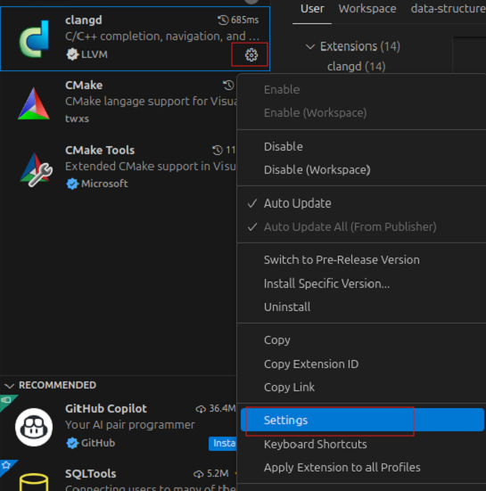

# clangd安装配置

树莓派4B，Ubuntu24.04 LTS安装clangd-19。

##  安装clangd

通过 `apt search clangd` 搜索，找到可用的clangd版本，这里选择 `clangd-19`。
```sh
$ sudo apt-get install clangd-19
```

验证安装：
```sh
$ clangd-19 --version
Ubuntu clangd version 19.1.1 (1ubuntu1~24.04.2)
Features: linux+grpc
Platform: aarch64-unknown-linux-gnu
```

## 配置编辑器插件

clangd 通过[语言服务器协议](https://microsoft.github.io/language-server-protocol/)运行，支持 LSP 的编辑器可与 `clangd` 通信，以提供代码补全、诊断、转到定义等功能。原则上，`clangd` 应能与任何一种编辑器协同工作，但功能集和界面可能会有所不同。

### VSCode

#### 安装插件

依次选择View –> Extensions，在MARKETPLACE搜索框中输入 `clangd`，点击安装。

> [!WARNING]
> 确保微软C/C++插件未安装，否则可能会导致clangd无法启动。

#### 配置clangd插件

如果安装clangd后没有 `sudo update-alternatives --install /usr/bin/clangd clangd /usr/bin/clangd-12 100` 修改软连接，则需要vscode中clangd插件的配置。

点击clangd插件边上的齿轮按钮，选择Setting，打开设置页面，找到`clangd:Path`选项，输入 `/usr/bin/clangd-19`。


重新vscode启动后，您应该能看到错误下方的红色下划线，并获得丰富的代码补全信息，包括函数参数等。

### Vim

占坑中...

### Neovim

占坑中...

## 项目配置

为了理解您的源代码，`clangd` 需要知道您的编译标记。（这只是 C++ 中的一个事实，源文件并不是自包含的）。

默认情况下，`clangd` 会假定你的代码是以 `clang some_file.cc` 的形式编译的，你可能会得到一些关于缺少 `#included` 文件等的虚假错误。有几种方法可以解决这个问题。

`compile_commands.json` 该文件为项目中的每个源文件提供编译命令。它通常由工具生成。

clangd会在编辑文件的父目录和名为 `build/` 的子目录中查找它。例如，如果编辑 `$SRC/gui/window.cpp`，我们会在 `$SRC/gui/`、`$SRC/gui/build/`、`$SRC/`、`$SRC/build/`、...

### 基于CMake

执行 `cmake -DCMAKE_EXPORT_COMPILE_COMMANDS=1` 生成 `compile_commands.json` 文件。

`compile_commands.json` 将被写入你的执行构建时的目录。如果编译目录是 `$SRC` 或 `$SRC/build`，clangd 会找到它。否则，请将其链接或复制到源代码树的根目录 `$SRC`。
```sh
$ ln -s ~/myproject-build/compile_commands.json ~/myproject/
```

### 其他构建系统使用Bear

Bear 是一个构建系统分析工具，它可以将构建系统生成的命令行输出为 `compile_commands.json` 文件。<br>

对于基于 `make` 的构建，可以运行 `make clean; bear -- make` 生成文件。<br>

> [!TIP]
> 在windows下，可以使用与Bear类似的工具 [compiledb](https://github.com/nickdiego/compiledb)。

如果项目中的所有文件都使用相同的编译标志，可以将这些标志一行一行地放入源代码根目录下的 `compile_flags.txt` 。

Clangd 会假定编译命令是 `clang $FLAGS some_file.cc`。

如果你的项目非常简单，手工创建该文件是一个合理的起点。不过，后台索引将不起作用，因为 Clangd 无法确定哪些文件是项目源代码。

如果存在 `compile_commands.json`，该文件将被忽略。

# 参考
* [官方文档](https://clangd.llvm.org/installation)
